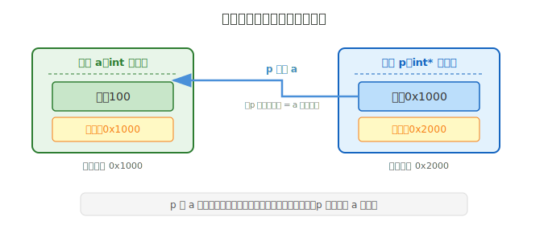
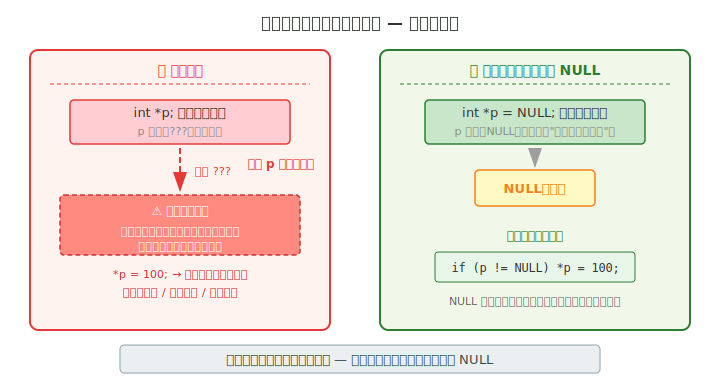
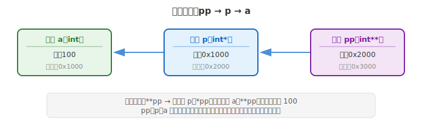

# 第七章 指针

## 本章要点

指针是 C 语言中最具标志性、也最需要静下心来仔细理解的概念之一。

此前各章中，我们使用的变量都是直接存储数据值——整数、小数、字符——程序通过变量名来读取或修改这些值。但 C 语言提供了更底层的视角：每一个变量在内存中都占据着一块空间，拥有一个独一无二的地址。**指针，正是用来存储和操作这些地址的特殊类型。**

本章内容安排：

- 从地址的存储问题出发，引出指针的基本概念
- 指针变量的声明、指针类型（`int*`、`char*` 等）、取地址运算（`&`）、解引用运算（`*`）
- 指针的几个关键特性——指针与地址的关系、指针的运算规则
- 指针安全：空指针与野指针
- 初步介绍二级指针

理解指针，是理解 C 语言内存模型的关键。数组的遍历、函数参数的传递、动态内存的分配，无一不建立在指针之上。扎实地掌握本章的内容，是学好后续各章的前提。

---

## 一、指针基础

### 1. 从一个问题出发：地址怎么存？

C 语言中有一个专门的运算符 `&`，叫做**取地址运算符**。把它写在一个变量的前面，就能拿到这个变量在内存中的地址：

```c
int a = 100;
? p = &a;    // ? 应该是什么类型？
```

`&a` 取出了变量 `a` 的地址。现在的问题是：用什么类型来接收这个地址？`a` 是 `int` 类型，用 `int` 来声明。`100` 是 `int` 类型，也可以直接赋给 `int` 变量。那 `&a`——一个变量的地址——它是什么类型？

答案是 `int*`，读作"int-star"。这就是 C 语言中的**指针类型**。把 `?` 换成 `int*`，就得到了正确的代码：

```c
#include <stdio.h>

int main(void)
{
    int  a = 100;
    int* p = &a;      // p 是 int* 类型，用来存 a 的地址

    printf("a 的值是：%d\n", a);
    printf("a 的地址是：%p\n", (void *)p);

    return 0;
}
```

程序运行后，屏幕上会输出类似这样的结果：

```
a 的值是：100
a 的地址是：000000BFCB5FFBBC
```

第一行是变量 `a` 中存储的值，第二行那个十六进制数就是变量 `a` 在内存中的地址——操作系统为 `a` 分配的存储位置的门牌号。`&` 做的事情很简单：你告诉它一个变量名，它就把这个变量在内存中的地址返回给你。`int*` 做的事情也很明确：作为指针类型，专门用来存储这种地址。

---

### 2. 指针类型

`int*` 这个类型是怎么来的？它不是凭空出现的——它是**基于已有的类型 `int`，加上 `*` 组合而成**的。`*` 的含义是"指向……的指针"：

- `int` + `*` → `int*`　　（指向 `int` 的指针类型）
- `char` + `*` → `char*`　（指向 `char` 的指针类型）
- `float` + `*` → `float*`（指向 `float` 的指针类型）

前面的是基本类型，后面学到结构体之后，也一样可以组合——比如 `struct Student` + `*` → `struct Student*`。**任何已有类型，加上 `*`，就得到对应的指针类型。**

声明指针类型变量的基本格式为：

```
数据类型 *指针变量名;
```

```c
int *p;       // p 是 int*  类型，专门用来存 int 变量的地址
float *q;     // q 是 float* 类型，专门用来存 float 变量的地址
char *r;      // r 是 char*  类型，专门用来存 char 变量的地址
```

`int *p;` 应当读作"p 是 int 的指针"——如果顺着 p 里存的地址去找，会在那个地址上找到一个 `int` 类型的值。

那么，为什么指针需要区分类型？简单说：**编译器需要知道顺着地址找到数据后，该按什么规则来解读它。**

`int *p` 告诉编译器两件事：

1. 从 p 中取出地址
2. 从那个地址开始，按 `int` 的格式读取和解释数据

至于具体读几个字节、各类型占多大空间，我们放到下一节用 `sizeof` 实测来看。

---

### 3. 指针变量

指针变量到底占多大空间？在你自己的机器上运行下面这段程序，直接看结果：

```c
#include <stdio.h>

int main(void)
{
    int    a = 100;
    int*   p = &a;
    char*  r;
    double* q;

    printf("int     占 %zu 字节\n", sizeof(a));
    printf("int*    占 %zu 字节\n", sizeof(p));
    printf("char*   占 %zu 字节\n", sizeof(r));
    printf("double* 占 %zu 字节\n", sizeof(q));

    return 0;
}
```

64 位系统上的典型输出：

```
int     占 4 字节
int*    占 8 字节
char*   占 8 字节
double* 占 8 字节
```

从这几行输出中，可以得出三个重要结论：

**① 指针变量本身占用内存空间，它是一个实实在在的变量。** 你看，`int*` 打印出来占了 8 字节——它和 `int`、`char` 一样，在内存里有自己的位置，有自己独立的地址（用 `&p` 可以取到）。它不是一个"标签"或"别名"，而是一个正儿八经的变量。

**② 指针是一种独立的类型。** `int` 和 `int*` 是不同的类型——一个存整数，一个存地址。即使在同一平台上 `int` 和 `int*` 碰巧大小相同，它们也仍然是截然不同的类型，编译器会对它们进行不同的类型检查。

**③ 常见平台上的对象指针通常大小相同，但这不是 C 标准的普遍保证。** 在本机示例中，`int *`、`char *`、`double *` 都是 8 字节，这是当前 ABI 的选择。可移植代码应以各自的 `sizeof` 结果为准，尤其不能进一步推断函数指针也一定具有相同表示。

> **注意区分**：这里打印的是指针变量**本身**的大小；`sizeof(*p)` 才是被指向类型的大小。两者属于不同层面。教程展示的 8 字节只是当前 64 位环境中的典型结果，不应写进依赖可移植性的程序逻辑。

---

搞清楚了指针变量占多大空间，下一个问题是：它和被指向的变量之间是什么关系？仍然用比喻来理解——

一个普通变量（比如 `int a = 100`）的盒子里装的是具体的数据值 `100`。而一个指针变量（比如 `int* p = &a`）的盒子里装的不是数据本身，而是另一个变量的地址——一张写着"你要找的数据在某某位置"的纸条：

```c
int  a = 100;    // 普通变量：盒子里装的是 100
int* p = &a;     // 指针变量：盒子里装的是 a 的地址
```

在内存中，这种关系如下。注意两个关键事实：

1. **`p` 和 `a` 是两个独立的变量**，各自占据不同的内存空间（`a` 在 0x1000，`p` 在 0x2000）
2. **`p` 里面存的是 `a` 的地址**（0x1000），顺着这个地址就能找到 `a`，进而拿到 `100`



从上面的图和代码中，可以再确认两个根本认识：

- **指针变量和它指向的变量是两个独立的东西。** `p` 和 `a` 住在不同的内存地址，各自有各自的值。只不过 `p` 的值恰好是 `a` 的地址，通过这个地址可以间接找到 `a`。
- **指针变量里存的是地址，不是普通数据。** 普通变量装数据值，指针变量装门牌号——这就是指针和普通变量最根本的区别。

要让一个指针变量指向某个变量，先用 `&` 获取那个变量的地址，再把这个地址赋值给指针变量：

```c
int a = 100;     // 声明普通变量 a
int *p;          // 声明指针变量 p

p = &a;          // 把 a 的地址赋值给 p（p 现在"指向"了 a）
```

也可以将声明和赋值合并为一步：

```c
int a = 100;
int *p = &a;     // 声明并初始化：p 指向 a
```

这里需要特别注意一个初学者最容易混淆的地方：**声明中的 `*` 和表达式中的 `*` 含义不同**。

```c
int *p;       // ① 这里的 * 是类型声明的一部分——表示 p 是指针变量
p = &a;       //    赋值时 p 前面没有 *——把地址直接赋给 p 本身
*p = 100;     // ② 这里的 * 是解引用运算符——表示"p 指向的那个变量"
```

关键区别：

- **声明语句中的 `*`**：是**类型标记**，读作"p 是 int 的指针"。指针变量的名字就是 `p`，不是 `*p`。
- **执行语句中的 `*`**：是**解引用运算符**，意思是"顺着 p 里的地址找到那个变量"。

关于书写风格：`int* p;`（星号贴近类型）和 `int *p;`（星号贴近变量名）两种写法语法上都正确，选择哪一种只是风格问题。C 语言惯用写法是将星号贴近变量名，但本书采用贴近类型名的写法，更能体现"int* 是一个整体类型"的含义。

---

## 二、指针操作

理解了指针变量的声明和取地址操作之后，下一个自然的问题是：既然指针变量里装的是地址，我们该如何通过这个地址去访问它所指向的数据？答案是解引用运算，这是指针操作中最核心的一步。掌握了它，才算真正理解了指针的作用。

### 1. 解引用运算符 `*`——通过指针访问数据

指针变量存储了地址。如果你拿到了地址，怎么获取那个地址上存放的数据呢？这就需要用到**解引用运算符 `*`**（也叫"间接访问运算符"）。它的基本规则为：

```
*指针变量名   // 获取这个指针所指向的变量的值
```

这里的 `*` 是一个运算符，表示"顺着这个地址，去找到那个盒子里的内容"。`*p` 的意思就是"p 指向的那个变量"。

```c
#include <stdio.h>

int main(void)
{
    int a = 100;
    int *p = &a;    // p 指向 a

    printf("a 的值：%d\n", a);         // 100
    printf("*p 的值：%d\n", *p);       // 100（通过 p 找到 a 的值）

    // 通过 *p 也可以修改 a 的值
    *p = 200;

    printf("--- 通过 *p 修改后 ---\n");
    printf("a 的值：%d\n", a);         // 200
    printf("*p 的值：%d\n", *p);       // 200

    return 0;
}
```

**输出**：

```
a 的值：100
*p 的值：100
--- 通过 *p 修改后 ---
a 的值：200
*p 的值：200
```

`*p = 200;` 这行代码的含义是：顺着 p 里存的地址，找到那个变量，把它的值改成 200。因为 p 指向的是 a，所以实际上就是把 a 改成了 200。解引用让指针不止于"看一看"——通过它，我们可以间接地读取、甚至修改另一个变量的值，这正是指针强大之处的直接体现。

#### `*` 的两种角色

在 C 语言中，`*` 符号在不同的上下文中承担着不同的含义，理解这两种角色的区别，是指针学习的关键一步：

```c
int *p;       // ① 声明语句中的 *：表示"p 是指针类型"
p = &a;       // 把 a 的地址赋值给 p
*p = 100;     // ② 执行语句中的 *：解引用，"p 指向的那个变量"
```

| 出现位置               | 符号  | 含义                       |
| ---------------------- | ----- | -------------------------- |
| 声明语句：`int *p;`  | `*` | 类型标记：p 是指针         |
| 执行语句：`*p = 10;` | `*` | 解引用运算符：p 指向的变量 |
| 执行语句：`&a`       | `&` | 取地址运算符：a 的地址     |

你可以这样记忆：声明里的 `*` 是"招牌"——它告诉编译器 p 是哪种变量；执行语句里的 `*` 是"开门"——顺着门牌号找到对应的盒子，打开它，取东西或者放东西。

---

### 2. 指针的几个特性

理解了指针变量的声明和解引用之后，有必要进一步了解指针变量本身所具备的几个基本特性。这些特性决定了指针变量在实际编程中的行为方式。

#### 特性一：指针变量和被指向的变量是两个独立的东西

```c
int a = 100;
int *p = &a;

// p 和 a 是两个不同的变量，有各自的地址
printf("a 的地址：%p\n", (void *)&a);
printf("p 的地址：%p\n", (void *)&p);  // p 自己也有地址！

// p 的值 等于 a 的地址
printf("p 的值（即 a 的地址）：%p\n", (void *)p);
```

`p` 本身也是一个变量，住在内存的某个位置，所以 `p` 也有自己的地址。`&p` 得到的是 p 自己的门牌号，这和 p 里面存的值（a 的门牌号）是完全不同的两回事。明确这一点，对于后续理解二级指针和指针的指针运算至关重要。

#### 特性二：一个指针可以先后指向不同的变量

```c
int a = 10, b = 20;
int *p;

p = &a;
printf("*p = %d\n", *p);  // 10

p = &b;                    // p 改为指向 b
printf("*p = %d\n", *p);  // 20
```

指针变量也是变量，它里面存的值（地址）可以像普通变量一样被重新赋值。这一特性使得指针在遍历数组或处理链表等数据结构时非常灵活。

#### 特性三：多个指针可以指向同一个变量

```c
int a = 100;
int *p1 = &a;
int *p2 = &a;

*p1 = 200;                // 通过 p1 修改 a
printf("*p2 = %d\n", *p2); // 200，通过 p2 也能看到修改后的值
```

因为 p1 和 p2 都指向同一个变量 a，通过任意一个指向它的指针修改它的值，另一个指针也能"看到"变化。就像同一间房子挂了两把钥匙，不管用哪一把开门，进去的都是同一间房。

---

## 三、指针安全与进阶

理解了指针变量的基本声明和操作之后，还有两个话题需要在深入学习之前弄清楚：

1. **指针安全**：空指针和野指针——帮你避免程序中最常见的一类运行时错误
2. **指针进阶**：二级指针——为后续指针与数组、指针与函数的组合使用打开一扇门

### 1. 空指针和野指针

#### 空指针（NULL）

如果你声明了一个指针变量但暂时不知道让它指向谁，正确的做法是给它赋一个 `NULL` 值：

```c
int *p = NULL;  // p 现在不指向任何变量
```

`NULL` 是空指针常量，表示“不指向任何对象或函数”。判空可以排除空指针，但**不能证明一个非空指针仍然有效**：它还可能已经悬空、越界，或来自错误的地址计算。

```c
if (p != NULL)
{
    *p = 100;  // 仅当程序还能保证 p 指向一个存活的 int 对象时才安全
}
```

`NULL` 需要包含头文件 `<stddef.h>` 或 `<stdio.h>` 或 `<stdlib.h>` 才能使用（实际上三者都会间接引入它）。

#### 野指针

未初始化的自动指针对象具有不确定值。不要把它理解成一个可观察、可利用的“随机地址”——读取这个不确定指针并拿去解引用，本身就会进入未定义行为。常见错误如下：

```c
int *p;        // 声明了指针但没有初始化
*p = 100;      // 危险！p 未初始化，读取并解引用会产生未定义行为
```

这有多危险？不妨打个比方：

> 你随手拿了一张便签，上面原来就写着某个门牌号。你以为上面写的是"第 3 号文件柜"，但它其实是别人留下的废旧便签，上面写的可能是"总经理保险柜 888 号"。

你顺着这个地址去存东西，就等于把数据写到了完全不该碰的地方。可能的后果：

- **轻则**：修改了系统关键数据，程序直接崩溃
- **重则**：被攻击者利用，引入安全漏洞



避免野指针的方法很明确：声明指针变量时必须初始化。如果暂时不想让它指向某个具体的变量，就初始化为 `NULL`。

```c
int *p = NULL;  // 好习惯：明确表示现在不指向任何地方
```

---

### 2. 指向指针的指针——初步了解

既然指针变量本身也有地址，那么能不能用一个指针来指向另一个指针呢？当然可以，这就是**二级指针**。

```c
int a = 100;
int *p = &a;       // p 指向 a
int **pp = &p;     // pp 指向 p（pp 是二级指针）
```

在内存中：



访问方式：

```c
printf("%d\n", a);      // 100
printf("%d\n", *p);     // 100（一次解引用：找到 a）
printf("%d\n", **pp);   // 100（两次解引用：先找到 p，再找到 a）
```

二级指针目前只需要知道"存在这个东西"即可，不必深究。后续学习指针与数组、指针与函数之间的关系时，会自然地用到它。

---

## 四、动手练习

```c
#include <stdio.h>

int main(void)
{
    // 练习1：基本的指针操作
    int x = 42;
    int *p = &x;

    printf("=== 练习1：基本操作 ===\n");
    printf("x 的值：%d\n", x);
    printf("p 的值（x 的地址）：%p\n", (void *)p);
    printf("*p 的值：%d\n", *p);

    // 通过指针修改 x
    *p = 99;
    printf("\n通过 *p = 99 修改后：\n");
    printf("x 的值：%d\n", x);
    printf("*p 的值：%d\n\n", *p);

    // 练习2：指针自己的地址
    printf("=== 练习2：指针自己的地址 ===\n");
    printf("x 的地址：%p\n", (void *)&x);
    printf("p 的地址：%p\n", (void *)&p);
    printf("p 自己的地址和它存的值是不同的！\n\n");

    // 练习3：一个指针先后指向不同变量
    int a = 10, b = 20;
    int *ptr;

    printf("=== 练习3：改变指针的指向 ===\n");
    ptr = &a;
    printf("ptr 指向 a 时，*ptr = %d\n", *ptr);

    ptr = &b;
    printf("ptr 指向 b 时，*ptr = %d\n\n", *ptr);

    // 练习4：二级指针简单演示
    int num = 5;
    int *p1 = &num;
    int **p2 = &p1;

    printf("=== 练习4：二级指针 ===\n");
    printf("num = %d\n", num);
    printf("*p1 = %d\n", *p1);
    printf("**p2 = %d\n", **p2);

    return 0;
}
```
