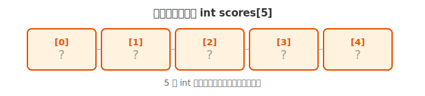
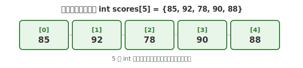
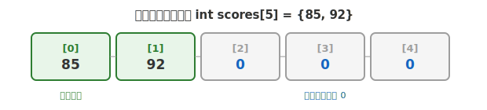

# 第三章 数组

## 本章要点

第一章介绍了如何用单个变量存储一个数据——一个整数、一个小数、一个字符。但在实际编程中，我们面对的往往不是孤立的数据点，而是一组具有相同性质的数据：一个班级 30 名学生的成绩、一页传感器在 24 小时内每小时记录的温度值、一段文本中的所有字符。如果为每一个数据都单独定义一个变量，程序会迅速膨胀到无法管理的程度。

数组正是为解决这一问题而设计的。本章将系统学习 C 语言中的数组，具体涵盖以下内容：

- 一维数组的声明、初始化和元素访问
- 数组与循环的配合使用——遍历、累加、输入输出
- 数组越界的原因、后果与规避方法
- 一维数组的经典应用：查找最大值与最小值
- 二维数组的定义、初始化与遍历
- 用嵌套循环处理表格型数据

数组是 C 语言中最基础的数据结构。后续学习字符串（第四章）、指针（第七章）以及动态内存分配（第十章）时，数组的概念和用法将不断被延续和深化。建议读者在阅读本章时，每学完一节就动手编写并运行对应的练习代码。

---

## 一、数组基础

### 1. 同一类型数据的集合

在开始学习数组的语法之前，不妨先思考一个具体的问题：假设老师让你记录班上 5 名同学的数学成绩——小明 85 分，小红 92 分，小刚 78 分，小丽 90 分，小华 88 分。如果用第一章学过的变量来存储，你很自然地会写出如下代码：

```c
int score1 = 85;
int score2 = 92;
int score3 = 78;
int score4 = 90;
int score5 = 88;
```

5 名同学尚且可以应付，但如果是 50 名同学呢？500 名呢？你需要定义 500 个互不重名的变量，写 500 行声明和赋值代码——这显然不可行。问题的根源在于，这里的每一个数据在逻辑上属于同一类别（都是"数学成绩"），但我们却被迫用彼此孤立的变量去管理它们。

数组的解决方案简洁而直观：将这组数据放进一个**带编号的容器**中。你可以把数组想象成一排紧挨着的储物柜，整排柜子有一个统一的名字（比如 `scores`），每个小格子有一个编号（0 号、1 号、2 号……），通过编号即可定位到具体的格子，往里面存入数据或从中取出数据。

在 C 语言中，**数组**就是一组**相同类型**变量的集合，它们在内存中连续存放，共用一个名字，通过**下标**（即格子的编号）来区分和访问每一个元素。

---

### 2. 一维数组的定义

数组在 C 语言中是一种**复合数据类型**，它可以一次性容纳多个同类型的数据。和普通变量一样，使用数组之前必须先**声明**它。

声明一维数组的基本语法如下：

```
数据类型 数组名[数组大小];
```

各部分含义：

- **数据类型**：数组中每个元素的数据类型（`int`、`float`、`char` 等），数组中所有元素类型必须一致。
- **数组名**：给这个数组起的名字，命名规则与普通变量相同。
- **方括号 `[ ]`**：标志"这是一个数组"。
- **数组大小**：这个数组能存放多少个元素。为保证示例在所有 C17 编译器上都可用，本章统一使用正整数常量（如 `5`、`10`、`26`）。C99 引入了块作用域的变长数组（VLA），允许在支持该可选特性的实现中写 `int arr[n];`，但 C11 起编译器可以不支持 VLA，而且 VLA 不能改变已经创建的数组长度，因此入门代码不依赖它。

以下是几个合法的数组声明：

```c
int scores[5];      // 声明一个能存放 5 个 int 类型数据的数组
float heights[10];  // 声明一个能存放 10 个 float 类型数据的数组
char letters[26];   // 声明一个能存放 26 个 char 类型数据的数组
```

当编译器处理 `int scores[5];` 时，它会在内存中分配出**连续**的 5 个 `int` 大小的存储空间，就像一排紧挨着的储物柜格子：



这里有一个需要从一开始就牢记的规则：**数组下标从 0 开始，而不是 1**。一个大小为 5 的数组，有效下标范围是 **0 到 4**，不存在下标 5。这个"差 1"的规则是 C 语言数组的基础约定，后续所有关于数组的操作都建立在这一约定之上。

> **💡 提示：数组在内存中是怎样存放的？**
>
> 数组的所有元素在内存中是**紧挨着、一个接一个**连续存放的。比如 `int scores[5]`，`scores[0]` 挨着 `scores[1]`，`scores[1]` 挨着 `scores[2]`……就像一排首尾相连的储物柜格子。正是因为这种连续排列，程序才能通过"首地址 + 偏移量"的方式，用下标 `[i]` 一步到位地计算出任意元素的准确位置。
>
> 如果你现在对"内存中连续存放"这个概念还比较模糊，完全没关系。目前只需要记住一个形象的理解：**数组就是一排紧挨着的格子**。至于"首地址"、"偏移量"这些名词背后的原理，将在第六章内存模型和第七章指针中详细展开。先会用，再理解。

---

### 3. 一维数组的初始化

声明数组的同时，也可以给它赋予初始值。C 语言提供了几种初始化方式，各自适用于不同的场景。

**方式一：完全初始化。** 在声明时用花括号 `{ }` 列出所有元素的值，用逗号分隔：

```c
int scores[5] = {85, 92, 78, 90, 88};
```

执行后，5 个格子的内容就全部确定了：



**方式二：部分初始化。** 如果只给出了部分值，剩余的元素会被编译器自动初始化为 **0**：

```c
int scores[5] = {85, 92};  // 只给了前两个值
```

结果：



**方式三：省略大小的初始化。** 如果在初始化时给出了所有元素的值，可以省略方括号中的大小，编译器会自动根据初始值的个数推断数组的大小：

```c
int scores[] = {85, 92, 78, 90, 88};  // 编译器自动推断大小为 5
```

注意，只有在**声明的同时初始化**才可以省略大小。如果先声明再赋值，必须明确指定大小。

**方式四：逐个赋值。** 也可以先声明数组，再逐个给每个元素赋值：

```c
int scores[5];
scores[0] = 85;
scores[1] = 92;
scores[2] = 78;
scores[3] = 90;
scores[4] = 88;
```

这种方式下有一处需要特别留意：具有自动存储期且未初始化的数组元素具有**不确定值**，读取它可能产生未定义行为，不能把它当成某个可观察的“随机垃圾数”。这与部分初始化不同——使用初始化列表时，未明确给出的剩余元素会按规则初始化为零。

**补充：两个实用工具——sizeof 和 memset。** 在操作数组时，有两个常用的工具值得提前认识一下。

`sizeof` 是一个**运算符**（不是函数），它可以告诉你一个变量或类型在内存中占多少字节。对于数组，`sizeof(数组名)` 返回整个数组占用的总字节数。用它除以单个元素的大小，就能算出数组的元素个数：

```c
int scores[5] = {85, 92, 78, 90, 88};
int totalBytes = sizeof(scores);          // 整个数组占多少字节（通常 5 × 4 = 20）
int elementBytes = sizeof(scores[0]);     // 单个元素占多少字节（通常 4）
int count = sizeof(scores) / sizeof(scores[0]);  // 数组的元素个数 = 20 / 4 = 5
```

用 `sizeof` 计算数组长度有一个很重要的好处：当你修改了数组的大小，不需要手动去修改所有用到数组长度的循环条件——代码自己会算。后续在函数中传递数组时，`sizeof` 的行为会有所不同，这一点将在函数与数组章节中说明。

`memset` 是一个标准库函数（需要 `#include <string.h>`），它能将数组的**每个字节**都设置为同一个值。最常见的用法是把整个数组快速清零：

```c
#include <string.h>

int scores[5];
memset(scores, 0, sizeof(scores));  // 将 scores 的每个字节都设为 0
// 执行后：scores = {0, 0, 0, 0, 0}
```

`memset` 的三个参数依次是：数组名（目标内存）、要填入的值（0）、要填充的字节数（用 `sizeof` 算）。

> **注意**：`memset` 是按**字节**填充的，所以它最适合用来清零（填 0）。填其他值时行为可能不符合直觉，目前只需要知道用它来清零数组即可。关于 `memset` 的深层原理，将在指针章节中进一步讨论。现阶段会用就够了，不必深究。

---

### 4. 访问数组元素

要访问数组中的某个元素，使用**下标运算符** `[ ]`：

```
数组名[下标]
```

- 下标从 **0** 开始。
- 大小为 N 的数组，有效下标范围是 **0 到 N-1**。

读取和赋值的写法与普通变量完全一致，只是变量名变成了"数组名加下标"的形式：

```c
数组名[下标] = 值;    // 给某个元素赋值
变量 = 数组名[下标];  // 读取某个元素的值
```

下面的程序演示了数组元素的读取和修改：

```c
#include <stdio.h>

int main(void)
{
    int scores[5] = {85, 92, 78, 90, 88};

    // 读取数组元素
    printf("第一个同学的成绩：%d\n", scores[0]);  // 85
    printf("第三个同学的成绩：%d\n", scores[2]);  // 78
    printf("第五个同学的成绩：%d\n", scores[4]);  // 88

    // 修改数组元素
    scores[2] = 95;  // 把第三个同学的成绩改成 95
    printf("修改后第三个同学的成绩：%d\n", scores[2]);  // 95

    return 0;
}
```

输出：

```
第一个同学的成绩：85
第三个同学的成绩：78
第五个同学的成绩：88
修改后第三个同学的成绩：95
```

代码中 `scores[0]` 访问的是第一个元素，`scores[1]` 是第二个。数组的下标编号与日常生活中的顺序编号相差 1——这一习惯需要在持续的练习中逐渐内化，直到它成为你的第二本能。

---

## 二、数组操作

掌握了数组的声明、初始化和元素访问之后，你已经能够创建和使用数组了。但数组真正的威力并不在于单个元素的存取，而在于它能够与**循环**结合，用极少的代码批量处理大量数据。从本节开始，我们将探索数组在实际编程中的典型操作模式。

### 1. 数组与循环

#### 1.1 用 for 循环遍历数组

```c
#include <stdio.h>

int main(void)
{
    int scores[5] = {85, 92, 78, 90, 88};

    // 遍历数组：逐个输出每个元素
    for (int i = 0; i < 5; i++)
    {
        printf("第 %d 个同学的成绩：%d\n", i + 1, scores[i]);
    }

    return 0;
}
```

输出：

```
第 1 个同学的成绩：85
第 2 个同学的成绩：92
第 3 个同学的成绩：78
第 4 个同学的成绩：90
第 5 个同学的成绩：88
```

循环变量 `i` 从 0 递增到 4，恰好覆盖了数组的全部有效下标。这一执行过程可以按轮次拆解如下：

| 循环轮次 | i 的值 | i < 5? | 输出的 scores[i] | 实际元素 |
| -------- | ------ | ------ | ---------------- | -------- |
| 第1次    | 0      | 真     | scores[0] = 85   | 第一个   |
| 第2次    | 1      | 真     | scores[1] = 92   | 第二个   |
| 第3次    | 2      | 真     | scores[2] = 78   | 第三个   |
| 第4次    | 3      | 真     | scores[3] = 90   | 第四个   |
| 第5次    | 4      | 真     | scores[4] = 88   | 第五个   |
| 第6次    | 5      | 假     | —               | 退出循环 |

`for (int i = 0; i < 数组大小; i++)` 是遍历数组的**标准写法**。这里的 `<`（而非 `<=`）是关键——因为下标最大值为 `数组大小 - 1`，用 `<` 恰好保证不会越界。建议将这一模式牢记为遍历数组的固定范式。

#### 1.2 用循环计算总和与平均值

循环遍历不仅是输出的手段，更是对数组进行聚合计算的基础。下面的程序计算了一组成绩的总分与平均分：

```c
#include <stdio.h>

int main(void)
{
    int scores[5] = {85, 92, 78, 90, 88};
    int sum = 0;
    float average;

    for (int i = 0; i < 5; i++)
    {
        sum = sum + scores[i];  // 累加每个成绩
    }

    average = (float)sum / 5;  // 注意：转成 float 避免整数除法

    printf("总分：%d\n", sum);       // 433
    printf("平均分：%.2f\n", average); // 86.60

    return 0;
}
```

其中 `(float)sum / 5` 中的 `(float)` 是**类型转换**——它告诉编译器，在除法执行之前将 `sum` 的值从 `int` 转为 `float`，从而触发浮点除法。如果写成 `sum / 5`，两个 `int` 相除会执行整数除法，小数部分将被丢弃，得到的结果是 86 而非 86.60。

#### 1.3 用循环从键盘输入数组元素

将循环与 `scanf` 结合，可以让用户在程序运行时动态地填充数组内容：

```c
#include <stdio.h>

int main(void)
{
    int scores[5];

    printf("请输入 5 个同学的成绩：\n");
    for (int i = 0; i < 5; i++)
    {
        printf("第 %d 个：", i + 1);
        if (scanf("%d", &scores[i]) != 1)
        {
            fprintf(stderr, "第 %d 个成绩不是有效整数。\n", i + 1);
            return 1;
        }
    }

    printf("\n你输入的成绩是：\n");
    for (int i = 0; i < 5; i++)
    {
        printf("%d ", scores[i]);
    }
    printf("\n");

    return 0;
}
```

运行示例：

```
请输入 5 个同学的成绩：
第 1 个：85
第 2 个：92
第 3 个：78
第 4 个：90
第 5 个：88

你输入的成绩是：
85 92 78 90 88
```

`scanf("%d", &scores[i])` 中，`scores[i]` 是一个普通的 `int` 变量，因此前面需要加 `&` 取地址，与给普通变量输入时的写法完全一致。

---

### 2. 数组越界

数组越界，指的是**访问了数组有效下标范围之外的位置**。例如，声明了 `int arr[5];`，有效下标是 0 到 4，如果写了 `arr[5]` 或 `arr[-1]`，就发生了越界。

下面展示越界写法，但用 `#if 0` 阻止危险语句进入可执行程序：

```c
#include <stdio.h>

int main(void)
{
    int scores[5] = {85, 92, 78, 90, 88};

    printf("最后一个有效元素：%d\n", scores[4]);

#if 0
    // 错误示范：取消保护后会产生未定义行为
    printf("scores[5] = %d\n", scores[5]);   // 越界！
    printf("scores[100] = %d\n", scores[100]); // 严重越界！
#endif

    return 0;
}
```

若取消 `#if 0` 保护，编译器可能给出告警，但 C 语言不会在每次数组访问时自动检查边界。真正执行越界访问会产生未定义行为：

- **越界读取**：读到其他变量正在使用的内存，得到一个毫无意义的数值
- **越界写入**：不经意间修改了其他变量的值，导致程序行为异常
- **访问受保护区域**：操作系统直接终止程序（崩溃）

无论哪种结果，都不是你想要的。

防止数组越界的方法并不复杂，但需要持续的纪律：

1. 始终记住：大小为 N 的数组，下标范围是 **0 到 N-1**。
2. 遍历数组时使用 `for (int i = 0; i < N; i++)` 而非 `i <= N`。
3. 用**常量**定义数组大小，避免在代码中散布含义不明的"魔法数字"：

```c
#define SIZE 5  // 用宏定义数组大小

int scores[SIZE];
for (int i = 0; i < SIZE; i++)  // 使用常量，不容易写错
{
    // ...
}
```

将数组大小集中定义为一处常量，一旦需要修改只需改一个地方，循环条件也会自动保持一致——这是一种低成本、高收益的编程习惯。

---

### 3. 查找最大值和最小值

在理解数组与循环的基本配合模式之后，本节通过一个经典的算法问题——查找一组数据中的最大值和最小值——来展示如何将这种配合模式应用于实际的逻辑判断。以下是完整的程序：

```c
#include <stdio.h>

int main(void)
{
    int numbers[8] = {34, 17, 89, 5, 72, 41, 60, 23};
    int max, min;

    // 假设第一个元素既是最大值又是最小值
    max = numbers[0];
    min = numbers[0];

    // 从第二个元素开始，逐个比较
    for (int i = 1; i < 8; i++)
    {
        if (numbers[i] > max)
        {
            max = numbers[i];  // 发现更大的，更新最大值
        }
        if (numbers[i] < min)
        {
            min = numbers[i];  // 发现更小的，更新最小值
        }
    }

    printf("数组内容：");
    for (int i = 0; i < 8; i++)
    {
        printf("%d ", numbers[i]);
    }
    printf("\n");

    printf("最大值：%d\n", max);  // 89
    printf("最小值：%d\n", min);  // 5

    return 0;
}
```

输出：

```
数组内容：34 17 89 5 72 41 60 23
最大值：89
最小值：5
```

算法思路可以概括为三步：

1. **假设**：将第一个元素设为当前的最大值和最小值
2. **遍历**：从第二个元素开始，逐个与当前最大值、最小值比较
3. **更新**：发现更大就更新最大值，发现更小就更新最小值

遍历完整个数组之后，`max` 和 `min` 中保留的就是真正的最大值和最小值。这个**"假设 → 遍历 → 更新"**的模式在数组处理中非常普遍，后续查找、统计类的问题都会用到相似的思路。

---

## 三、二维数组

### 1. 从列表到表格

到目前为止，我们处理的数组都是一维的——一条线性的数据序列。

但在许多实际问题中，数据天然具有**行列结构**。例如，5 名学生每人有 3 门课的成绩，这个数据模型本身就包含两个维度：学生（行）和科目（列）。用 5 个独立的一维数组虽然也能表达，但操作起来笨重且容易出错。

二维数组正是为这类"表格型"数据设计的。你可以把二维数组想象成一个有行有列的表格，或者一个多层储物柜——每个格子需要两个编号来定位：行号和列号。

声明二维数组的语法与一维数组类似，只是多了一对方括号用于指定列数：

```
数据类型 数组名[行数][列数];
```

```c
int scores[5][3];  // 5 行 3 列的二维数组（5个学生，每人3门课）
```

初始化二维数组有两种等效的方式。第一种按行组织，结构清晰、便于阅读：

```c
int scores[5][3] = {
    {85, 92, 78},  // 第 0 行（第一个学生的 3 门课）
    {90, 88, 95},  // 第 1 行
    {76, 82, 89},  // 第 2 行
    {93, 87, 91},  // 第 3 行
    {80, 85, 84}   // 第 4 行
};
```

第二种按内存顺序线性列出所有值：

```c
int scores[5][3] = {85, 92, 78, 90, 88, 95, 76, 82, 89, 93, 87, 91, 80, 85, 84};
```

两种写法在内存中的效果完全相同——二维数组在内存中仍然是连续存放的，先存第 0 行的所有列，再存第 1 行的所有列，以此类推。第一种按行分组的写法更直观，推荐使用。

访问二维数组元素时，需要同时指定行下标和列下标：

```c
数组名[行下标][列下标]
```

```c
#include <stdio.h>

int main(void)
{
    int scores[5][3] = {
        {85, 92, 78},
        {90, 88, 95},
        {76, 82, 89},
        {93, 87, 91},
        {80, 85, 84}
    };

    // 访问第 1 个学生的第 2 门课成绩（下标从 0 开始）
    printf("第1个学生第2门课：%d\n", scores[0][1]);  // 92

    // 访问第 3 个学生的第 1 门课成绩
    printf("第3个学生第1门课：%d\n", scores[2][0]);  // 76

    return 0;
}
```

遍历二维数组需要使用**嵌套循环**——外层循环控制行，内层循环控制列。下面的程序展示了如何用嵌套循环输出一个整齐的成绩表：

```c
#include <stdio.h>

int main(void)
{
    int scores[5][3] = {
        {85, 92, 78},
        {90, 88, 95},
        {76, 82, 89},
        {93, 87, 91},
        {80, 85, 84}
    };

    printf("学生成绩表：\n");
    printf("学号\t语文\t数学\t英语\n");

    for (int i = 0; i < 5; i++)        // 外层循环控制行（学生）
    {
        printf("%d\t", i + 1);         // 输出学号
        for (int j = 0; j < 3; j++)    // 内层循环控制列（科目）
        {
            printf("%d\t", scores[i][j]);
        }
        printf("\n");
    }

    return 0;
}
```

输出：

```
学生成绩表：
学号    语文    数学    英语
1       85      92      78
2       90      88      95
3       76      82      89
4       93      87      91
5       80      85      84
```

执行过程可以按行列展开：

| 外层 i | 内层 j | 访问的元素        | 含义            |
| ------ | ------ | ----------------- | --------------- |
| 0      | 0      | scores[0][0] = 85 | 第1个学生，语文 |
| 0      | 1      | scores[0][1] = 92 | 第1个学生，数学 |
| 0      | 2      | scores[0][2] = 78 | 第1个学生，英语 |
| 1      | 0      | scores[1][0] = 90 | 第2个学生，语文 |
| 1      | 1      | scores[1][1] = 88 | 第2个学生，数学 |
| ...    | ...    | ...               | ...             |

内层循环完整地遍历完一行的所有列之后，外层循环才推进到下一行。`\t` 是制表符，使输出按列对齐。嵌套循环——外层管行、内层管列——是处理二维数组的标准模式，后续学习矩阵运算和图像处理时同样会用到。

#### 计算每个学生的总分

在嵌套循环的基础上稍作变通，就可以实现更具体的计算。以下程序计算每位学生三门课的总分与平均分：

```c
#include <stdio.h>

int main(void)
{
    int scores[5][3] = {
        {85, 92, 78},
        {90, 88, 95},
        {76, 82, 89},
        {93, 87, 91},
        {80, 85, 84}
    };

    for (int i = 0; i < 5; i++)
    {
        int sum = 0;
        for (int j = 0; j < 3; j++)
        {
            sum = sum + scores[i][j];  // 累加当前学生的各科成绩
        }
        float avg = (float)sum / 3;
        printf("学生 %d：总分 = %d，平均分 = %.2f\n", i + 1, sum, avg);
    }

    return 0;
}
```

输出：

```
学生 1：总分 = 255，平均分 = 85.00
学生 2：总分 = 273，平均分 = 91.00
学生 3：总分 = 247，平均分 = 82.33
学生 4：总分 = 271，平均分 = 90.33
学生 5：总分 = 249，平均分 = 83.00
```

这里的关键在于 `sum` 变量必须在外层循环内部（每处理一个新学生时）重置为 0——如果放在外层循环外面，`sum` 会一直累积，到第二个学生时就已经包含了第一个学生的成绩，结果也就失去了意义。

---

## 四、动手练习

```c
#include <stdio.h>

int main(void)
{
    // 练习1：逆序输出数组
    int arr[6] = {1, 2, 3, 4, 5, 6};
    printf("原数组：");
    for (int i = 0; i < 6; i++)
    {
        printf("%d ", arr[i]);
    }
    printf("\n");

    printf("逆序输出：");
    for (int i = 5; i >= 0; i--)  // 从最后一个元素开始往前
    {
        printf("%d ", arr[i]);
    }
    printf("\n\n");

    // 练习2：统计数组中奇数和偶数的个数
    int numbers[10] = {12, 7, 33, 8, 15, 24, 9, 40, 3, 18};
    int oddCount = 0;   // 奇数个数
    int evenCount = 0;  // 偶数个数

    for (int i = 0; i < 10; i++)
    {
        if (numbers[i] % 2 == 0)
        {
            evenCount++;
        }
        else
        {
            oddCount++;
        }
    }
    printf("数组中有 %d 个偶数，%d 个奇数\n\n", evenCount, oddCount);

    // 练习3：二维数组——矩阵转置
    int matrix[3][3] = {
        {1, 2, 3},
        {4, 5, 6},
        {7, 8, 9}
    };

    printf("原矩阵：\n");
    for (int i = 0; i < 3; i++)
    {
        for (int j = 0; j < 3; j++)
        {
            printf("%d ", matrix[i][j]);
        }
        printf("\n");
    }

    printf("转置矩阵：\n");
    for (int i = 0; i < 3; i++)
    {
        for (int j = 0; j < 3; j++)
        {
            printf("%d ", matrix[j][i]);  // 交换行和列
        }
        printf("\n");
    }

    return 0;
}
```
