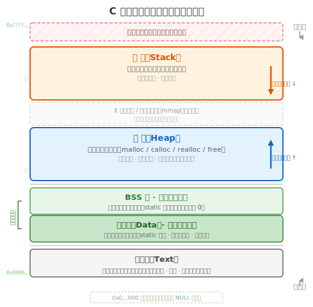

# 第六章 C语言的内存模型

提起 C 语言，很多人的第一反应就是"指针"——它既是 C 语言最强大的武器，也是让无数初学者头疼的难题。你可能已经听说过指针的大名，甚至隐隐有些畏惧。但请放心：指针并没有那么神秘，它本质上操作的不过是**内存地址**而已。要真正理解指针，你首先需要理解一个更基础的问题——变量到底是"放"在哪里的。

回顾此前各章的学习，我们一直在和变量打交道：声明一个 `int x`，给变量赋值，把变量传给函数……当时我们反复提到"存储"这个词——变量是用来存储数据的容器。但你有没有想过这些更底层的问题：

- 变量究竟存储在计算机的什么地方？
- 为什么有的变量出了花括号就消失，有的却能一直存在？
- `scanf("%d", &x)` 里的 `&` 符号到底在做什么？
- 既然所有变量都存在内存里，那它们之间不会互相打架吗？

这些问题的答案，都指向同一个核心主题——**C 语言的内存模型**。

理解内存模型，是你从"会写 C 代码"走向"真正理解 C 语言"的关键一步。本章将依次讲解：

- **内存地址直觉**：把地址理解为一排编号格子——这是理解一切的基础
- **物理内存**：程序运行的物理空间——以及操作系统面临的难题
- **虚拟内存**：密室逃脱店的故事——操作系统如何用"逻辑编号映射"的思路解决冲突
- **典型进程内存布局**：栈、动态分配区、静态数据和代码映射——理解常见实现，同时区分语言标准与平台细节
- **局部变量与全局变量**：比较作用域、链接和存储期，而不是死记某个物理地址
- **`static` 关键字**：如何改变对象的存储期或标识符的链接属性

当你学完这一章，指针就不再是凭空出现的魔法——它只不过是一个存着地址的变量，而你已经知道了地址通向哪里。

---

## 一、内存概念

### 1. 内存地址——送外卖得知道门牌号

从第一章开始，你就在用 `&` 这个符号了。`scanf("%d", &x)` 里的 `&x`——它的意思是"取 x 的地址"。你可能记住这条规则用到了现在，但心里始终有个疑问：**地址，到底是什么？**

打个比方：你给客人送外卖，得知道客人住在哪——几号楼、几单元、几零几。这个门牌号，就是客人家的**地址**。没有地址，外卖送不到。

CPU 访问对象时也需要定位信息。在 C 语言抽象机中，指针可以表示对象或函数的位置；在常见机器上，它通常对应进程虚拟地址空间中的地址表示。门牌号是有用的直觉，但不要把 C 指针简单等同于未经转换的物理内存编号。

---

### 2. 物理内存——程序赖以运行的硬件

上一节说的那些位置，物理上就存在于电脑主板上的**内存条**里。

**什么是物理内存。** 你买电脑或手机时，配置单上一定见过这样的写法：笔记本 **"16GB + 512GB"**，手机 **"12GB + 256GB"**。前面的 16GB、12GB 就是**物理内存**（Physical Memory），后面的 512GB、256GB 是硬盘。

这里所说的物理内存通常指系统 RAM（Random Access Memory，随机存取存储器）。运行中的代码和数据会通过缓存、内存控制器和虚拟内存映射等机制被处理器访问。磁盘或闪存主要负责持久化存储，程序通常通过操作系统 I/O 或内存映射来访问其中的数据。

物理内存有四个关键特点：

- **延迟低、带宽高**：RAM 通常比持久化存储更适合作为程序运行时工作区，但具体差距随硬件而变
- **容量相对有限**：个人设备的 RAM 通常少于其持久化存储；具体容量没有固定范围
- **掉电就没了**：关机之后，内存里的数据全部清空——因此代码要"保存到文件"，文件存在硬盘上，断电不丢
- **由系统统一管理**：多个进程共享机器的内存资源，但通常通过各自的虚拟地址空间进行隔离

> **💡 内存（RAM） vs 硬盘（Storage）**
>
> |        | 内存（RAM）              | 硬盘 / 闪存              |
> | ------ | ------------------------ | ------------------------ |
> | 作用   | 程序运行时的临时工作空间 | 长期保存文件、照片、软件 |
> | 速度   | 极快（CPU 可直接读写）   | 较慢（需要 I/O 操作）    |
> | 断电后 | 数据**全部消失**   | 数据**依然保留**   |
> | 容量   | 通常相对较小             | 通常相对较大             |

**物理内存带来的管理难题。** 这么多程序共用一条物理内存——如果不加管理，程序 A 往某个格子写了数据，程序 B 不知道，也往同一个格子写，程序 A 的数据就被踩掉了。一个程序崩溃时乱写的垃圾数据可能搞坏另一个程序的内存，恶意程序甚至可以翻看公共格子偷走你的密码。

操作系统必须解决这个问题：**怎么让多个程序安全、高效地共用同一块物理内存？**

---

### 以密室逃脱店为例来理解

假如你开了一家密室逃脱店。你租了一层楼——就这么大，多一平米都没有。

你的密室主题很火，每天来好几批客人。最简单的想法：**整层打通，做成一个大密室，所有客人都进这一个房间。**

你很快发现了问题：

- 一批客人翻箱倒柜——打开柜子拿线索 A，顺手把线索 B 塞进另一个抽屉。这批人走了，下一批进来，**看到的不是初始状态，是上一批留下的烂摊子。** 道具位置全乱了，抽屉里多了一堆不该出现的东西
- 两批客人同时挤在里面——你翻你的柜子，我翻我的抽屉。A 队刚找到的关键道具被 B 队当成垃圾扔了。一个队把柜子弄坏了，另一个队要用的线索恰好锁在那个柜子里

> **同一个空间，所有人直接共享 = 互相干扰、互相破坏。一次只接待一批？后面的客人全堵门口排队。**

这跟操作系统面对的问题，结构上一模一样：

| 密室逃脱店                     | 计算机                                             |
| ------------------------------ | -------------------------------------------------- |
| 一层楼的物理空间，所有客人共用 | **物理内存**——所有程序共用一条内存条       |
| 一批客人                       | **一个程序**                                 |
| 客人翻道具、解谜、改布局       | **程序读写内存格子里的数据**                 |
| 大房间里互相踩踏               | 程序直接操作物理内存 → 踩数据、崩溃传播、隐私泄露 |

不加管理，直接让程序操作物理内存，就像让所有客人挤在一间密室里——谁也玩不好。

操作系统的答案和密室老板一样：**给每组客人一套独立的编号体系。** 让每个程序只看自己的道具编号，背后由一张总平面图负责把编号翻译到实际的物理位置——这就是**虚拟内存**。

### 3. 虚拟内存——每个程序都有自己的独立空间

#### 什么是虚拟内存

**虚拟内存**（Virtual Memory）是现代操作系统常见的一种内存管理机制。它让每个进程面对一套自己的**虚拟地址空间**。这个空间在编号上覆盖一个很大的范围，但并非其中每个地址都有效：零地址附近通常故意不映射，中间也可能存在空洞，代码、共享库和动态内存的位置还可能受 ASLR 影响。

对普通程序来说，它主要操作虚拟地址，不需要知道数据当前对应哪一页物理内存。有效的虚拟地址区间可以在程序看来连续，即使其背后的物理页并不连续；没有建立映射的虚拟地址则不能访问。

#### 虚拟内存如何工作

程序读写数据时，给出的是一个**虚拟地址**。但数据实际存放在物理内存条上的某个**物理地址**。虚拟地址到物理地址的翻译，由 CPU 内部的一个专用硬件自动完成——**MMU**（Memory Management Unit，内存管理单元）。

MMU 翻译的依据是操作系统维护的一张**页表**（Page Table）。页表记录了"程序 A 的虚拟地址 X → 物理地址 Y"这样的映射关系。翻译过程如下：

1. 程序给出虚拟地址："我要读写 100 号"
2. MMU 查页表，把 100 翻译成物理地址 38492
3. CPU 去物理内存条上真正读写 38492 号位置
4. 程序从头到尾不知道 38492 的存在

几个关键术语：

- **虚拟地址**（Virtual Address）：程序看到的地址编号
- **物理地址**（Physical Address）：内存条上的真实位置编号
- **MMU**：CPU 内部的硬件翻译器，自动完成地址转换
- **页表**（Page Table）：操作系统维护的映射表，记录每个虚拟地址对应的物理地址

#### 虚拟内存的设计目的

虚拟内存要达成两个核心目标：

- **隔离**：不同进程默认拥有不同的地址映射，同一个虚拟地址在两个进程中通常对应不同的物理位置。操作系统也可以显式建立共享内存映射，所以“隔离”是默认机制，不是绝对禁止共享。
- **简化**：程序使用统一的虚拟地址模型，不必自行协调物理内存位置。具体布局由操作系统、加载器、ABI 和编译工具链共同决定，并不保证“代码固定在低地址、栈固定在高地址”。

> **💡 交换（Swap）**
>
> 支持交换或分页文件的操作系统，可以把部分暂时不用的内存页写入持久化存储，腾出 RAM 给活跃页面。虚拟地址通常保持不变，但再次访问可能触发缺页并产生明显延迟。具体是否启用、如何实现由操作系统配置决定。

#### 虚拟地址空间的大小

32 位指针若使用完整的 32 位地址表示，理论上可区分 2³² 个字节地址，但单个进程真正可用的范围还会受操作系统划分和 ABI 限制。64 位架构的理论编号空间更大，实际硬件和操作系统通常只实现其中一部分。可移植 C 程序不应依赖某个固定的虚拟地址空间大小。

---

#### 以密室逃脱店为例来理解

还记得密室逃脱店老板的困境吗？他的解决方案——**给每组客人一套独立的道具编号体系**——就是虚拟内存的核心思路。

老板给每个房间放进了**完全相同的一套密室主题**。同样外观的道具、同样的线索摆放方式、同样的陈设布局。关键设计是：每个房间里的道具都有**本地编号**——"1号抽屉""2号柜子""3号暗门"……每个房间的编号体系完全一致，但所有这些编号都是**逻辑上的**，只在这间房里有效。

现在分别从两个视角来看：

**玩家视角——程序的视角：**

- 每批客人走进房间，看到标准初始状态——道具在原位，线索没被动过
- 客人按线索操作时只看本地编号："打开 3 号暗门"——他**不知道也不需要知道**，这条指令最终落在大楼的哪面墙、哪块地砖上
- 隔壁有没有客人弄坏道具、有没有客人提前走了——**完全无关**
- 通关离开后，老板重置房间状态，给下一批客人使用（内存回收）

**老板视角——操作系统的视角：**

- 老板手里有一张**楼层总平面图**（页表）。A 房的"3 号暗门"实际对应大楼北侧第 5 块区域，B 房的"3 号暗门"实际对应大楼南侧第 11 块区域。**同样编号，物理位置完全不同**
- 客人说"开 3 号暗门" → 老板查平面图找到真实位置 → 告诉客人去哪操作（MMU 翻译）
- 客人来了 → 给一套干净编号体系。客人走了 → 回收编号，重置对应区域（内存回收）
- 某间房客人暴力破坏（程序崩溃）→ 没事，不影响其他房间
- 道具太多摆不下 → 暂时不用的搬进地下仓库（swap）

映射回计算机：

| 密室逃脱店 | 计算机 |
|---|---|
| 房间内的本地编号（1号抽屉、2号柜子……） | **虚拟地址**——程序看到的编号 |
| 大楼实际的墙、地砖位置 | **物理地址**——内存条上的真实位置 |
| 老板手里的楼层总平面图 | **页表** |
| 老板查图，把房间编号翻译成实际位置 | **MMU** 翻译虚拟地址 → 物理地址 |
| 各组客人互不干扰 | **隔离**——不同进程的地址空间相互独立 |
| 客人通关后老板重置房间 | 程序结束，操作系统**回收内存** |
| 搬道具进地下仓库 | **Swap**——交换到硬盘 |

> ⚠️ **比喻的局限——请务必注意**
>
> 密室逃脱店用房间来隔离客人，每个房间的物理面积必然**小于**整层楼。但计算机中的虚拟地址范围可以大于实际安装的 RAM，而且大量地址可以暂时不映射到任何物理页。
>
> 这不是比喻的失误，而是**现实世界里任何物理比喻都绕不开的限制**——你不可能隔出一间比整层楼还大的房间。虚拟内存的本质不是物理切割，而是**逻辑映射**：你程序里看到的地址永远是逻辑编号，MMU + 页表在背后默默把它翻译成物理内存上的真实位置。记住这一点就好——比喻只是帮你建立直觉，不代表物理世界的约束同样适用于计算机。

> **串起来：`int score = 95;` ——它到底在哪？**
>
> - **对象大小**：`score` 占 `sizeof(int)` 个字节；这个值由实现决定，不固定假设为 4
> - **程序视角**：`&score` 取得指向该对象的指针，常见实现把它表示为虚拟地址
> - **平台映射**：操作系统与硬件负责把有效虚拟页映射到物理存储，程序不应依赖具体物理位置
>
> 一句话：**让每个程序以为自己独占整台电脑的内存——这就是虚拟内存的设计初衷。**

在具有进程和虚拟内存的常见宿主系统上，每个进程通常拥有自己的虚拟地址空间。裸机和部分嵌入式环境可能没有这种机制，因此它不是 C 语言本身提供的保证。

在常见桌面和服务器系统上，编译器、链接器、加载器与运行库会按照平台 ABI 组织代码和数据。下面介绍的是**典型实现中的进程内存布局**，它很有助于理解程序运行，但不是 C 语言标准强制要求的物理分区。

---

### 4. C 程序的典型内存布局——四类常见区域

虚拟地址空间可以看作一个很大的编号范围，其中可能存在未映射空洞和受保护区域。编译器、链接器、加载器、运行库与操作系统共同组织代码和数据；下面的四区模型是常见教学抽象，不是 C 标准规定的固定切割方式。

为什么要分区域？因为你程序里的数据，性格各不相同：

- **临时的数据**：函数里算个中间结果，算完就不需要了。这类数据应该**自动清理**，不能一直占着空间
- **持久的数据**：记录"程序总共被打开了几次"的计数器，从启动到退出都不能丢
- **大小未知的数据**：用户输入了一行文字，多长事先不知道。编译时没法预留——你不可能猜"用户大概输入 100 个字"然后留 100 个格子。必须**运行时按需分配**
- **代码本身**：编译好的机器指令，运行时不应该被意外修改——否则程序逻辑就乱了

如果把这些性格迥异的数据全混在一起管理，要么浪费空间，要么互相干扰。**不同的需求，推动了不同的分区。**

常见实现通常可以用以下四类区域来建立直观模型：

| 区域                     | 比喻     | 存放的内容                            | 特点                                      |
| ------------------------ | -------- | ------------------------------------- | ----------------------------------------- |
| **调用栈（Stack）** | 便签纸   | 常见实现中的栈帧、部分局部状态和返回信息 | 通常后进先出，容量由平台和运行环境决定 |
| **堆区（Heap）**   | 储物仓库 | 动态分配的内存（`malloc`/`free`） | 手动管理，空间较大，按需申请              |
| **静态数据映射**   | 铭牌     | 具有静态存储期的对象                  | 生命周期贯穿程序执行，未显式初始化时零初始化 |
| **代码/只读映射**  | 工作手册 | 机器指令、部分只读数据                | 权限和布局由平台决定                      |

在这种典型模型中，四种需求大致对应四类区域：

- **临时数据** → 栈区（便签纸，用完就撕）
- **持久数据** → 静态存储区（铭牌，一直钉在那）
- **运行时决定大小或生命周期的数据** → 常考虑动态分配，也可按问题选择流式处理或固定上限缓冲区
- **代码本身** → 代码区（工作手册，只读不写）

下面的示意图以典型的地址空间布局展示了这四个区域的位置关系（真实布局会受操作系统、编译器和安全机制的影响，但整体结构是相似的）：



下面分别来看每个区域。

#### 栈区（Stack）—— 自动管理的"叠积木"

栈的管理方式，跟叠积木一模一样。想象你在桌上叠一堆积木：

- **函数调用形成嵌套关系**：A 调用 B 时，B 通常获得新的栈帧；B 返回后才继续执行 A
- **栈帧通常按后进先出回收**：这与函数调用和返回的嵌套顺序一致
- **局部对象不必都在栈上**：优化器可能将其放入寄存器、合并存储，或完全消去

这种"叠积木"式管理带来了几个直接后果：

- **自动管理**：自动存储期对象会在进入和离开相应执行范围时开始和结束生命周期。常见实现把许多局部对象放入调用栈，但优化器也可能把它们放在寄存器中，甚至完全消去
- **管理开销通常较低**：常见调用约定可通过调整栈指针管理栈帧，但实际函数调用还可能保存寄存器、对齐空间等
- **容量有限**：具体上限由平台、线程配置和链接选项决定；过深递归或过大的自动数组可能导致栈耗尽

调用栈是常见实现中非常重要的运行时结构。为了学习可以先把普通局部变量理解为“通常位于栈帧中”，同时记住这不是语言层面的硬性保证。

#### 堆区（Heap）—— 按需申请的"储物仓库"

动态分配区域通常被称为“堆”。C 标准规定 `malloc`/`free` 等函数及其分配对象的生命周期，但不要求实现内部必须采用某一种名为“堆”的数据结构。

- **手动管理**：通过 `malloc` 申请，通过 `free` 结束分配对象的生命周期。若丢失最后一个指针而未释放，就会形成内存泄漏，直到进程结束前无法再回收该块
- **空间大**：可以利用几乎整个虚拟地址空间，远比栈大得多
- **灵活**：申请大小可以在运行时决定，适合容量或生命周期需要动态控制的对象；它不是处理未知输入的唯一方法

堆的详细用法在第十章展开，现在先知道它跟栈的区别即可。

#### 静态存储区 —— 贯穿始终的"铭牌"

具有静态存储期的对象包括文件作用域对象和 `static` 对象；它们的生命周期贯穿程序执行。字符串字面量也具有静态存储期，但具体被放入哪个只读或数据映射区由实现决定。

- **生命周期最长**：从程序启动到结束，始终存在
- **零初始化**：未显式初始化的静态存储期对象会按语言规则零初始化；未初始化的自动对象具有不确定值，读取它可能产生未定义行为
- **编译时确定大小**：编译器在编译时就知道需要多少空间

#### 代码区（Text）—— 只读的"工作手册"

代码区存放编译后的机器指令——就是你写的 C 代码被翻译成的二进制指令。

- **常见权限**：现代系统通常把代码页映射为不可写，以降低误写和攻击风险；具体行为属于平台约定
- **布局稳定**：映像中的代码由构建结果确定，但动态链接、即时装载和地址随机化仍会影响运行时映射

---

现阶段最重要的是先掌握语言层面的存储期：普通块内对象通常具有自动存储期，文件作用域对象和 `static` 对象具有静态存储期，`malloc` 创建的分配对象由程序显式释放。栈、数据段等术语用于解释常见实现，但不应取代这些标准概念。

接下来，就从你最常打交道的两种变量——局部变量和全局变量——入手，深入理解它们和内存分区的关系。

---

## 二、局部变量与全局变量

### 1. 作用域 —— 决定了你能看到谁

在讲局部变量和全局变量之前，必须先理解一个更基础的概念：**作用域**（scope）。

C 语言里的一对 `{ }`，不仅仅是"函数体的边界"——它定义了一个**作用域**。在 `{ }` 内部声明的变量，只在这个 `{ }` 内部可见。出了这个 `{ }`，外面就看不到里面的变量了。

```c
#include <stdio.h>

void func(void)
{
    int a = 10;   // a 的作用域就是这个 { } 内部
    printf("%d\n", a); // 使用 a，避免示例只声明不用
}                  // 离开这里后，自动对象 a 的生命周期结束

int main(void)
{
    func();
    // 这里无法访问 a——a 的作用域只在 func 的 { } 里面
    return 0;
}
```

嵌套的 `{ }` 也遵循同样的规则：**内层可以看到外层的变量，外层看不到内层的变量。**

```c
#include <stdio.h>

int main(void)
{
    int x = 1;        // x 的作用域是整个 main 的 { }

    {                 // 嵌套的代码块
        int y = 2;    // y 的作用域只在这个内层 { } 里
        printf("%d %d", x, y);  // ✅ 内层可以访问外层的 x 和自己的 y
    }

    // printf("%d", y);  // 错误示范：y 已超出作用域，取消注释会编译失败
    return 0;
}
```

> **💡 作用域 vs 生命周期**
>
> **作用域**决定名字在源代码中的可见范围，**存储期**和执行流程共同决定对象的生命周期。普通自动对象通常在离开相应块时结束生命周期，但 `static` 局部变量即使名字离开作用域，对象仍然存活。第十二章会系统区分这些概念。

### 2. 局部变量——栈区的居民

回顾你到目前为止写过的所有 C 程序，你声明变量时一定是在某个函数内部写的：

```c
void func(void)
{
    int a = 10;      // 写在函数 func 的内部
    double b = 3.14;
}
```

像这样定义在函数或嵌套块内部的标识符具有块作用域，通常称为**局部变量**。离开块后，这个名字不可见；若对象具有自动存储期，其生命周期也会结束，而 `static` 局部对象则继续存活。

局部自动对象在常见未优化实现中经常位于调用栈，也可能被放进寄存器或被优化掉。下面先用“栈帧”模型建立直觉，再牢记它不是 C 标准规定的唯一实现方式。

```c
#include <stdio.h>

void func(void)
{
    int a = 10;      // func 被调用 → a、b、c 叠到栈顶
    double b = 3.14;
    char c = 'X';
    printf("%d %.2f %c\n", a, b, c); // 读取三个对象，展示其值
}  // func 结束 → a、b、c 从栈顶拿走，全部销毁

int main(void)
{
    func();
    // 到这里，a、b、c 已经不存在了
    // 如果再次调用 func()，会在栈顶重新叠三块全新的变量
    return 0;
}
```

从这个例子可以看出栈上局部变量的几个关键行为：

- **进入块时开始、离开块时结束**：这里的自动对象无需手动释放；编译器负责实现其存储管理
- **每次调用对应新的对象实例**：连续调用两次 `func()`，两次调用中的 `a`、`b`、`c` 不是同一生命周期的对象
- **避免巨型自动数组**：调用栈容量有限且因环境而异，过大的自动对象可能导致栈耗尽

---

### 3. 全局变量——静态存储区的居民

到目前为止，你声明的所有变量都写在函数内部（局部变量）。但 C 语言允许你在所有函数之外定义变量——这种变量叫做**全局变量**（global variable）。全局变量不归任何一个函数私有，而是整个程序的"公共财产"。

与局部变量不同，全局变量住在**静态存储区**。它们就像刻着名字的铭牌，从程序启动的那一刻起就钉在那里，直到程序结束才会被取下。

```c
#include <stdio.h>

int globalCounter = 0;  // 在所有函数外面定义 → 全局变量，在静态存储区

void count(void)
{
    globalCounter++;    // 任何函数都可以访问它
    printf("count = %d\n", globalCounter);
}

int main(void)
{
    count();  // count = 1
    count();  // count = 2
    count();  // count = 3
    return 0;
}
```

注意 `globalCounter` 只初始化了一次（`= 0`），之后每次 `count()` 调用修改的都是同一个变量，所以它从 1 一直累加到 3。如果它是局部变量，每次调用 `count()` 都会重新创建一个新的、从 0 开始的变量——这就是存储位置不同带来的行为差异。

文件作用域变量的名字从声明处开始在相应作用域内可见。非 `static` 的文件作用域定义通常具有外部链接，其他翻译单元可通过兼容的 `extern` 声明引用；这并不意味着无需声明就能被任意函数直接使用。

---

### 4. 局部变量与全局变量对照

|                          | **局部变量**              | **全局变量**             |
| ------------------------ | ------------------------------- | ------------------------------ |
| **定义位置**       | 函数 /`{ }` 内部              | 所有函数之外                   |
| **典型实现位置**   | 常见于栈帧，也可能在寄存器中    | 常见于数据段或 BSS 类映射      |
| **生命周期**       | 自动对象通常随块执行开始和结束  | 贯穿整个程序执行               |
| **名字的可见性**   | 从声明处到所在块末尾            | 从声明处到文件作用域末尾；跨文件需链接与声明 |
| **未初始化时**     | 值不确定，读取可能是未定义行为  | 按规则零初始化                 |
| **管理方式**       | 自动管理（编译器）              | 自动管理（编译器）             |

这张表真正要揭示的是：应先从声明方式判断对象的**存储期**，再理解常见实现如何安排存储。不要反过来仅凭某次打印出的地址猜测标准语义。

---

## 三、static 关键字——改变存储位置的"开关"

通过上一节的对照表，你可能会产生一个疑问：如果我想让一个局部变量也拥有全局变量那样的"长寿命"——在多次函数调用之间保持它的值——但又不想让它变成全局变量被所有函数访问，有没有办法？

C 语言提供了 `static` 关键字来满足这种需求。用于块作用域对象时，它把对象的存储期改为静态存储期，但名字仍保持块作用域。

### 1. static 局部变量——住在静态区的"局外人"

在局部变量前面加上 `static`，会把它从自动存储期改为静态存储期。这带来的关键行为变化是：**对象只初始化一次，之后每次函数调用都沿用上一次结束时的值。** 至于它在可执行文件和内存中的具体区域，由实现决定。

```c
#include <stdio.h>

void count(void)
{
    static int counter = 0;  // 静态存储期：只初始化一次，值在调用间保留
    counter++;
    printf("counter = %d\n", counter);
}

int main(void)
{
    count();  // counter = 1
    count();  // counter = 2
    count();  // counter = 3
    return 0;
}
```

对比普通局部变量和 `static` 局部变量：

|                        | **普通局部变量**          | **static 局部变量**      |
| ---------------------- | ------------------------------- | ------------------------------ |
| **存储期**       | 自动存储期（通常在栈帧中实现） | 静态存储期                     |
| **初始化时机**   | 每次执行到声明时进行初始化      | 程序启动前完成静态初始化       |
| **值在调用之间** | 不保留（每次都是新的）          | 保留（沿用上次的值）           |
| **作用域**       | 定义它的 `{ }` 内             | 定义它的 `{ }` 内（不变）    |
| **生命周期**     | 进入 `{ }` 时创建，离开时销毁 | 程序启动时创建，程序结束时销毁 |

这里有一个非常重要的概念需要格外注意：变量的**作用域**（在哪里能访问它）和**生命周期**（它能活多久）是两个不同且相互独立的概念。`static` 局部变量就是最典型的例子——它的作用域仅限于函数内部，出了函数就无法直接访问它，但它的生命周期却贯穿整个程序。

此外，和全局变量一样，`static` 局部变量如果没有显式初始化，也会被自动初始化为 **0**。

---

### 2. static 全局变量——限制可见范围

`static` 关键字也可以用在全局变量上，但它的作用完全不同：它不是改变存储位置（全局变量本来就在静态存储区），而是**限制可见范围**。

普通的全局变量可以被程序中的所有文件访问（前提是其他文件用 `extern` 声明）。但如果给全局变量加上 `static`，它就变成了**文件内部私有**——只有当前 `.c` 文件中的函数能够访问它，其他文件看不到。

```c
// file1.c
static int internalCounter = 0;  // 只能在本文件内访问

void increment(void)
{
    internalCounter++;
}
```

```c
// file2.c
// extern int internalCounter; // 错误示范：无法引用 file1.c 中具有内部链接的对象
```

这个特性对于大型项目的模块化开发非常重要：它让你可以把只在当前文件内部使用的数据隐藏起来，避免被其他文件意外修改。这称为**信息隐藏**，是编写可靠、可维护的 C 代码的重要实践。

---

### 3. static 总结

`static` 关键字在不同语境下有不同的含义，但核心思想是一致的——**限制与持久化**：

| 用法                | 作用                                           | 关键词           |
| ------------------- | ---------------------------------------------- | ---------------- |
| `static` 局部变量 | 赋予静态存储期，值在调用之间保持             | **持久化** |
| `static` 全局变量 | 可见范围从"所有文件"缩小到"当前文件"           | **限制**   |

记忆时应按语境区分：块作用域对象上的 `static` 改变存储期；文件作用域声明上的 `static` 赋予内部链接。二者都不等价于“地址固定”，也不应从英文名称反推更多语言保证。
