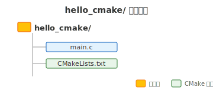
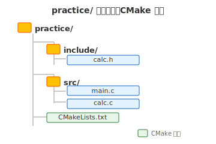

# 第十七章 C语言统一项目构建系统——CMake初识

## 本章要点

本章配套项目位于仓库的 `src/ch17-cmake/`。它是教程第一次正式引入 `CMakeLists.txt`；此前章节除第十六章必须演示的头文件/源文件拆分外，都只需用 Clang 直接编译源码，不需要创建 Visual Studio 工程或 CMake 项目。

第十六章学会了把代码拆分到 `src/` 和 `include/` 目录，用一行 `clang` 命令编译多个源文件。两个文件时还好，但项目一旦有几十上百个源文件、需要链接外部库、需要跨平台编译——手动敲命令就不再可行。

这就需要**构建系统**。本章介绍 C/C++ 生态中最主流的构建系统——**CMake**。具体涵盖以下内容：

- 为什么需要构建系统——从手动编译的痛点出发
- CMake 项目的核心文件：`CMakeLists.txt`
- 第一个 CMake 项目——从单文件开始
- 配置、生成、编译三步工作流
- 多文件项目：加入头文件目录
- CMake 核心语法规则总结

学完本章，你将能用 CMake 管理自己的多文件 C 项目，也为阅读开源 C/C++ 项目的构建配置打下基础。

---

### 1.1 手动编译的完整过程

在第十六章里，我们学会了把代码拆分到 `src/` 和 `include/` 目录，然后用 Clang 一次性编译所有源文件：

```bash
clang src/main.c src/mathutils.c -Iinclude -o program.exe
```

两个源文件时，这行命令看起来还好。但在这行命令背后，编译器实际上做了四件事：

1. **预处理**：展开 `#include` 和 `#define`，将头文件内容插入源文件
2. **编译**：将每个 `.c` 文件分别翻译为汇编代码
3. **汇编**：将汇编代码转换为机器指令，生成目标文件（`.o`）
4. **链接**：将多个目标文件和库文件合并为最终的可执行文件

当项目只有一个 `main.c` 时，一条命令全部搞定。但当源文件多起来之后，手动输入编译命令的缺陷就暴露了。

### 1.2 手动编译为什么不行

**源文件多了，命令不可维护。** 假如项目有 10 个 `.c` 文件，你每次编译都要把它们全部列出来。漏掉一个，编译时不会报错——链接器会报"未定义的引用"——你需要从报错信息倒推漏了哪个文件。

**头文件路径越来越长。** 真实项目可能有多个头文件目录：`include/`、`include/utils`、`include/network`……相应的 `-I` 参数写成一长串。

**每次都全量编译，浪费时间。** 如果你只修改了一个 `.c` 文件，按道理只需要重新编译这一个文件，再把所有目标文件链接一次。但手动命令无法自动判断哪些文件需要重新编译、哪些文件没改过可以直接复用——你只能全部重来。一个大型项目全量编译可能需要几分钟甚至几十分钟，而增量编译可能只需几秒。

**跨平台编译需要不同的命令。** Windows 上的编译器叫 `clang`，生成的产物叫 `xxx.exe`；Linux/macOS 上产物没有 `.exe` 后缀，某些系统下数学库还要额外加 `-lm`。手写命令意味着你需要为每个平台维护一套编译指令。

**多人协作不可行。** 如果每个人都在自己的机器上手动输入编译命令，每个人的命令可能略有不同——有人用 `-O2` 开了优化，有人没开；有人用 Clang，有人用 GCC。程序在某些机器上能跑，在另一些机器上不能跑，排查起来无从下手。

### 1.3 构建系统做什么

构建系统要解决的，就是上面这些问题。它提供了一套机制，让你**描述**项目结构，然后由它去**执行**编译。具体而言，一个构建系统负责：

- **依赖管理**：自动判断哪些源文件被修改过，只重新编译改动的部分
- **并行编译**：同时编译多个互不依赖的源文件，充分利用多核 CPU
- **构建隔离**：中间产物（`.o` 文件）和最终产物（`.exe`）放在独立目录，不和源代码混在一起
- **可复现**：任何人拿到项目，用相同的构建命令，得到相同的构建结果

---

## 二、跨平台与通用构建器的三个角色

### 跨平台是什么

**跨平台**，简单说就是同一份代码能在不同操作系统上编译和运行。Windows、Linux、macOS 是三种不同的操作系统，它们各有各的编译器、各有各的系统库、各有各的可执行文件格式。一份 C 代码要在这三种系统上都能工作，就需要解决这些差异。

但为什么我们需要关心跨平台？一个初学者写的小程序，在自己电脑上能跑不就行了？这个问题先放在这里——读完本章，尤其是 3.3 节之后，你会有清晰的答案。

现在回到构建这件事本身。一个完整的 C/C++ 构建体系由三个角色组成：**编译器**负责翻译代码，**基础构建工具**负责调度编译过程，**构建系统生成器**负责将项目描述转换为构建规则。三个角色各司其职，下面逐一厘清。

### 2.1 角色一：编译器

**编译器是将单个源文件翻译为机器指令的命令行程序。**

- **输入与输出**：给它一个 `.c` 文件，它输出一个 `.o` 目标文件。你告诉它源文件在哪、头文件在哪、输出什么名字，它执行翻译，然后退出。
- **不关心全局**：编译器不关心项目中有多少其他源文件，不关心文件之间的依赖关系——它只翻译你递给它的那一个文件。
- **这是唯一真正生成代码的角色**：后续所有角色都是在调度或生成规则，只有编译器实际产出机器指令。

---

### 2.2 角色二：基础构建工具

**基础构建工具是驱动整个编译过程的调度程序。它有自己的脚本语法，你可以直接编写脚本让它构建项目。**

- **它有自己的构建脚本语法**：每种基础构建工具定义了一套脚本规则。你按照它的语法编写构建脚本，描述清楚源文件、依赖关系和编译选项，然后运行它，它就会依次调用编译器完成翻译，最终调用链接器生成可执行文件。

  以 Make 为例，它的脚本叫 `Makefile`。一个最简的单文件项目可以这样写：

  ```makefile
  hello: main.c
      clang main.c -o hello
  ```

  将这份文件保存为 `Makefile`，运行 `make`，Make 就会执行 `clang main.c -o hello`。注意：**Make 在 Windows 上默认不可用**——它是 Unix/Linux 生态的标配工具，Windows 用户需要额外通过 MSYS2 或 Cygwin 安装才能使用。

  另一个常用的基础构建工具是 **Ninja**。它的设计目标就是快，脚本叫 `build.ninja`。同一个单文件项目，手写 `build.ninja` 大概长这样：

  ```ninja
  rule cc
    command = clang $in -o $out

  build hello: cc main.c
  ```

  和 Makefile 一样，`build.ninja` 也是手写脚本——只是语法不同。
- **它负责调度整个编译过程**：基础构建工具读取构建脚本，根据其中描述的依赖关系决定编译先后顺序；通过比较文件时间戳，跳过未改动的文件，只重新编译修改过的部分；将互不依赖的文件并行编译，充分利用多核 CPU；任一步骤出错立即停止，报告失败原因。
- **它的局限**：有了基础构建工具，你从"每次手动输入编译命令"升级到了"写一次脚本，一键构建"。但它有两个局限：第一，脚本绑定平台和编译器——上面的 `Makefile` 写死了 `clang`，在只有 GCC 的 Linux 服务器或只有 MSVC 的 Windows 上无法直接使用；第二，语法面向机器而非面向项目——你写的是"每一步怎么编译"，而不是"项目由什么组成"。这两个局限，正是下一个角色要解决的。

---

### 2.3 角色三：构建系统生成器

**构建系统生成器负责读取项目描述并生成基础构建工具需要的规则。** 它本身不充当 C 编译器；真正执行各条编译命令的仍是 Ninja、Make、MSBuild 等底层构建工具。

- **它生成的是一份构建脚本**：你用一种面向项目的描述语言，告诉构建系统生成器项目的组成——有哪些源文件、头文件在哪里、要生成什么产物。构建系统生成器读取这份描述，探测当前系统上的编译器和可用的基础构建工具，然后生成一份完整的基础构建工具脚本。接下来你运行基础构建工具，由它接手调度编译。
- **"描述项目" vs "描述步骤"**：手写的 `Makefile` 或 `build.ninja` 写的是"每一步怎么编译"（`clang -c src/main.c -o main.o`……），而构建系统生成器的输入文件写的是"项目由什么组成"（源文件在 `src/`，头文件在 `include/`，编成可执行文件 `mycalc`）。构建系统生成器负责把面向项目的描述翻译成面向机器的构建步骤——这正是它被称为"构建系统生成器"的原因。
- **跨平台的关键**：构建系统生成器在生成构建脚本时，会根据当前系统自动选择合适的编译器、编译选项和链接方式，从而用同一份项目描述在不同平台上生成适配的构建规则。这是它区别于直接手写构建脚本的核心价值。

C/C++ 生态中最主流的构建系统生成器是 **CMake**，下一节将正式介绍它。

---

## 三、CMake 正式介绍

### 3.1 完整的构建流水线

把三个角色串起来，以 CMake + Ninja + Clang 为例，完整的构建流水线如下：

```
CMakeLists.txt        ← 你写的项目描述
      │
      ▼
   [cmake]            ← CMake：读取描述，生成规则
      │
      ▼
  build.ninja         ← 基础构建工具需要的规则文件
      │
      ▼
   [ninja]            ← 基础构建工具：读取规则，调度编译
      │
      ▼
    [clang]           ← 编译器：实际翻译每个 .c 文件
      │
      ▼
  hello.exe           ← 最终的可执行文件
```

核心要点：**CMake 生成并维护构建规则，Ninja 按规则执行编译。** `cmake --build` 是统一入口，它会调用当前构建目录对应的底层工具；必要时，生成的规则还会先触发 CMake 自动重新配置。

> 打个比方：**CMake** 是翻译官，把你的项目描述（`CMakeLists.txt`）翻译成施工图纸（`build.ninja`）；**Ninja** 是工头，拿着图纸指挥工人（`clang`）按顺序施工。

### 3.2 CMake 是什么

**CMake 是一个跨平台的构建系统生成器。** 它让你用相对统一的语言描述目标、源文件、依赖和构建要求，再把这些信息转换为特定生成器能够执行的工程或规则文件。编译器负责翻译 C 源码，底层构建工具负责执行具体命令，而 CMake 负责组织目标关系、探测工具链并生成规则。

这一定位解释了 CMake 的几个关键行为：

- **为什么需要写 `CMakeLists.txt`？** 因为 CMake 需要你告诉它"项目长什么样"——有哪些源文件、头文件在哪、要生成什么产物。它不能自动推断你的意图。
- **为什么 `-G` 可以切换基础构建工具？** 因为 CMake 的设计将"描述项目"和"执行构建"彻底分离了。同一份 `CMakeLists.txt`，在 Windows 上可以生成 Ninja 规则，在 Linux 上可以生成 Make 规则，在 macOS 上可以生成 Xcode 工程——项目的描述不变，只改变输出目标。
- **为什么修改 `CMakeLists.txt` 会触发重新生成？** 因为项目描述变化后，构建规则也需要更新。常见生成器会把 `CMakeLists.txt` 登记为构建依赖，因此执行 `cmake --build build` 时通常会先自动重新运行 CMake，再继续编译；你也可以手动执行配置命令，让这一步更加明确。

理解了这三点，你就不是在"记 CMake 命令"，而是在用 CMake 的思维模型去组织项目。

### 3.3 为什么不直接手写构建脚本？

现在可以回答一个自然的问题了：既然基础构建工具只缺一份规则文件，而 CMake 只是一个"生成规则"的中间层，那我直接手写 `Makefile` 或 `build.ninja`，跳过 CMake，行不行？

技术上可以。CMake 不是编译 C 代码的必要环节。但直接手写构建脚本会面临一个根本难题和两个衍生问题。

**根本难题：跨平台。** 这里的"跨平台"需要从两个维度来理解。

第一个维度是**编译器的差异**。Windows 上通常用 MSVC 或 Clang，Linux 上用 GCC 或 Clang，macOS 上默认是 Apple Clang。三家的命令行参数不完全相同：MSVC 的编译器叫 `cl.exe`，参数风格是 `/O2` 而非 `-O2`；可执行文件后缀不同（Windows 有 `.exe`，Linux/macOS 没有）；系统库的链接方式也不同。一份直接写死 `clang` 命令的构建脚本，放到只有 GCC 的 Linux 服务器上根本跑不起来。

第二个维度是**基础构建工具本身的差异**。不同平台上可用的基础构建工具通常不同：Linux 上 Make 几乎是标配，Windows 上默认只有 MSBuild，Ninja 虽然跨平台但需要额外安装。更关键的是，每个基础构建工具的脚本语法互不兼容——`Makefile` 的写法和 `build.ninja` 没有任何共同之处。手写构建脚本意味着你不仅在绑定平台，还在绑定一个特定的基础构建工具。

把两个维度乘起来：N 种编译器 × M 种基础构建工具 = N×M 套构建脚本需要维护。这还不算同一个编译器的不同版本。CMake 的价值就在于把这两个维度一起解决——同一份 `CMakeLists.txt` 可以搭配不同生成器和工具链。CMake 会使用你通过 `-G`、工具链文件、环境变量或平台默认值选定的环境进行探测；它不会替开发者判断哪一种工具链“最适合”项目。**描述一次，多处构建。** 你写的不是"怎么编译"的指令，而是"项目长什么样"的描述。

**衍生问题：构建脚本的语法是面向机器的，不是面向项目的。** `Makefile` 和 `build.ninja` 的设计目标是让基础构建工具高效解析和执行，而不是让人容易阅读和编写。一个中等规模的 `Makefile` 很快会变成充斥着变量、通配符、条件判断的脚本——它描述的是"每一步怎么编译"，而不是"项目由什么组成"。维护这种指令序列的成本随项目规模快速增长，而 `CMakeLists.txt` 用 `add_executable`、`include_directories` 这种面向项目的语义，维护成本随规模线性增长，远低于手写构建脚本。

---

## 四、第一个 CMake 项目：单文件

从一个最简单的 Hello World 项目开始。先看完整的项目结构——包括你编写的文件，以及 CMake 和编译器生成的文件：



这张图里包含了 CMake 项目的全部组成部分，下面逐一认识。

### 4.1 项目的三个基本元素

一个 CMake 项目由三个基本元素组成：

1. **源码文件** — 你要编译的 C 代码（`.c` / `.h`）
2. **CMakeLists.txt** — CMake 项目的入口，描述项目的构建需求
3. **构建目录** — CMake 和编译器产生的所有文件（通常命名为 `build/`）

**元素一：源码文件**

新建目录 `hello_cmake/`，创建 `main.c`：

```c
#include <stdio.h>

int main(void)
{
    printf("Hello, CMake!\n");
    return 0;
}
```

和前几章写的 C 代码没有任何区别——CMake 并不要求特殊的代码写法。

**元素二：CMakeLists.txt**

在同一个目录下创建 `CMakeLists.txt`：

```cmake
cmake_minimum_required(VERSION 3.16)
project(HelloCMake LANGUAGES C)
add_executable(hello main.c)
```

`CMakeLists.txt` 是 CMake 项目的入口文件。它描述三件事：项目叫什么、用什么语言、要编译哪些源文件。注意，这里写的是"项目里有什么"，而不是"怎么编译"——这和手写 Makefile 有本质区别。具体语法留到 4.4 节解读。

**元素三：构建目录**

构建目录是 CMake 的工作区——存放所有构建过程中产生的文件。当前目录结构还是最简单的样子：

```
hello_cmake/
├── CMakeLists.txt
└── main.c
```

`build/` 目录还没有出现——它由 CMake 在构建时自动创建。接着往下看。

### 4.2 构建与编译

有了 `main.c` 和 `CMakeLists.txt`，怎么把它们变成可执行文件？和 clang 一样，CMake 提供了命令行工具。

**第一步：生成构建规则**

打开终端，进入 `hello_cmake/` 目录，执行：

```bash
cmake -S . -B build -G Ninja
```

| 参数 | 含义 |
|------|------|
| `-S .` | 指定源码目录为当前目录。CMake 在这里寻找 `CMakeLists.txt` |
| `-B build` | 指定构建目录为 `build`。所有生成物都放在这里，不污染源码 |
| `-G Ninja` | 指定基础构建工具为 Ninja。CMake 据此生成 `build.ninja` 规则文件。想换成 Make 则写 `"Unix Makefiles"` |

执行后，CMake 会依次完成三件事：

1. 检测当前系统上的 C 编译器（Clang / GCC / MSVC），验证其是否可用
2. 解析 `CMakeLists.txt`，理解项目的组成
3. 在 `build/` 目录下生成构建规则文件及辅助文件

**第二步：编译**

```bash
cmake --build build
```

`cmake --build` 是 CMake 提供的统一编译入口。它会自动调用构建目录中的基础构建工具——本例中是 Ninja——由 Ninja 读取 `build.ninja` 中的规则，逐个编译源文件并链接，最终生成可执行文件。

编译过程的输出大致如下：

```
[2/2] Linking C executable hello.exe
```

**第三步：运行**

```bash
build\hello.exe    # Windows
# 或
./build/hello      # Linux / macOS
```

输出：

```
Hello, CMake!
```

**日常工作流**：只改了 `.c` 文件 → 执行 `cmake --build build`，Ninja 自动识别改动，只重编译需要更新的文件。修改了 `CMakeLists.txt` → 可以直接构建并让生成规则自动触发重新配置，也可以先手动运行 `cmake -S . -B build`。新增 `.c` 文件时，还必须把它加入 `add_executable` 等目标的源文件列表。

### 4.3 构建目录里有什么

上面两步跑完之后，`build/` 里到底多了什么？现在回头看。

执行 `cmake -S . -B build -G Ninja`（第一步）之后：

```
hello_cmake/
├── CMakeLists.txt
├── main.c
└── build/
    ├── build.ninja       ← 构建规则文件（"施工图纸"）
    ├── CMakeCache.txt    ← 配置缓存（编译器路径、探测结果等）
    └── CMakeFiles/       ← CMake 内部辅助目录
```

执行 `cmake --build build`（第二步）之后，又多了编译产物：

```
build/
├── build.ninja
├── CMakeCache.txt
├── CMakeFiles/
│   └── hello.dir/
│       └── main.c.o       ← 编译器生成的中间目标文件
└── hello.exe               ← 最终可执行文件
```

逐个认识这些文件：

- **`build.ninja`**：CMake 生成的核心产物。它记录了每个源文件的编译选项、`.o` 文件的链接方式、头文件搜索路径——Ninja 严格按这份规则调度编译。由 CMake 自动维护，你不需要看懂或手动修改它。
- **`CMakeCache.txt`**：CMake 首次探测系统时（编译器路径、标准库位置等），将结果缓存于此。之后重新生成时直接读取缓存。切换编译器或构建工具时，建议删除整个 `build/` 目录重新配置，或使用 `cmake --fresh` 参数，仅删除 `CMakeCache.txt` 可能不够稳妥。
- **`CMakeFiles/`**：CMake 内部辅助文件，无需关心。
- **`main.c.o`**：编译器将 `main.c` 翻译成的中间目标文件。
- **`hello.exe`**：链接器合并 `main.c.o` 和系统库生成的最终可执行文件。

这里体现了一条核心原则：**源码目录和构建目录彻底分离**。你写的代码留在 `hello_cmake/`，CMake 和编译器产生的所有文件全部进入 `build/`：

1. **清理简单**：删除 `build/` 目录就等于彻底清理，源码不受影响
2. **源码整洁**：不会被 `.o`、`.exe` 等中间产物污染
3. **版本控制友好**：`.gitignore` 中只需写一行 `build/`

### 4.4 CMakeLists.txt 语法解读

理清了项目结构和构建流程，现在回过头来逐行理解 `CMakeLists.txt` 中的三条命令。

**`cmake_minimum_required(VERSION 3.16)`**
声明此项目至少需要 CMake 3.16。版本过低时配置会直接报错；同时，这条命令会设置相关策略的兼容基线。它不能保证所有协作者使用完全相同的 CMake 版本或所有行为绝对一致。

**`project(HelloCMake LANGUAGES C)`**
定义项目名称为 `HelloCMake`，语言是 C。CMake 据此启用 C 编译器检测和相关默认设置。每个 CMake 项目必须有这一条——它相当于项目的"身份证"，后续命令都在它的上下文中工作。

**`add_executable(hello main.c)`**
用 `main.c` 生成一个可执行文件，名为 `hello`（Windows 上自动加 `.exe`）。这是最核心的一条——告诉 CMake"我要一个可执行文件，拿这些源文件去编译"。多个源文件时依次列出即可，例如 `add_executable(hello main.c utils.c math.c)`。

三条命令，四行代码，完整描述了一个 C 项目。对比 2.2 节手写的 `Makefile` 和 `build.ninja`，`CMakeLists.txt` 面向项目的优势一目了然——你不需要写"怎么编译"，只需要写"项目里有什么"。

---

## 五、CMake 命令行使用

第四节用到了 CMake 的两条核心命令，这一节系统讲解 CMake 命令行的完整用法。

### 5.1 两个阶段

CMake 的构建分为两个独立的阶段：

| 阶段 | 命令 | 做什么 | 由谁执行 |
|------|------|--------|----------|
| 配置与生成 | `cmake -S ... -B ...` | 读取 CMakeLists.txt，生成构建规则 | CMake |
| 编译 | `cmake --build ...` | 调用基础构建工具，执行编译和链接 | Ninja / Make / MSBuild |

概念上这两个阶段是分离的。修改 `.c` 文件后只需构建；修改 `CMakeLists.txt` 后需要重新生成规则，但常见生成器会在构建时自动完成这一步。新增源文件还需要修改目标的源文件列表，除非项目明确采用了带重新扫描机制的其他写法。

### 5.2 cmake 配置与生成

完整命令格式：

```bash
cmake -S <源码目录> -B <构建目录> -G <生成器>
```

**`-S <path>`** — 指定源码目录，即 `CMakeLists.txt` 所在的目录。CMake 在此寻找入口文件。通常用 `.` 表示当前目录。

**`-B <path>`** — 指定构建目录。所有生成物（构建规则、中间文件、最终产物）全部放入这个目录。目录不存在时 CMake 自动创建。名称可自定义，但业界约定俗成用 `build/`。

**`-G <generator>`** — 指定基础构建工具。CMake 据此生成对应格式的构建规则文件。常用生成器：

| `-G` 参数值 | 基础构建工具 | 产物文件 | 适用平台 |
|-------------|-------------|----------|----------|
| `Ninja` | Ninja | `build.ninja` | 跨平台（需安装 Ninja） |
| `"Unix Makefiles"` | Make | `Makefile` | Linux / macOS（系统自带） |
| `"Visual Studio 17 2022"` | MSBuild | `.sln` 工程 | Windows |

如果不指定 `-G`，CMake 会选择系统当前可用的默认生成器。

**首次配置**时，CMake 还会自动探测编译环境——检测可用的 C/C++ 编译器、验证标准库、确定目标平台——并将结果缓存到 `build/CMakeCache.txt`。之后的配置会复用缓存，加速执行。

### 5.3 cmake --build 编译

完整命令格式：

```bash
cmake --build <构建目录> [选项]
```

`cmake --build` 是一个统一的编译入口——你不必知道构建目录里用的是 Ninja 还是 Make，CMake 会自动识别并调用正确的工具。常用选项：

| 选项 | 含义 |
|------|------|
| `--config Release` | 为 Visual Studio、Xcode、Ninja Multi-Config 等**多配置生成器**选择 Release |
| `--config Debug` | 为多配置生成器选择 Debug |
| `-j <N>` | 并行编译任务数，例如 `-j 8` 使用 8 个并行任务 |
| `--target <name>` | 只编译指定目标（例如 `--target hello`） |
| `--clean-first` | 编译前先清理旧的构建产物 |

### 5.4 常用操作速查

```bash
# 首次构建（或修改了 CMakeLists.txt / 新增了源文件）
cmake -S . -B build -G Ninja
cmake --build build

# 日常修改 .c 文件后，只需编译
cmake --build build

# 切换基础构建工具（Ninja → Make）时使用新的构建目录
cmake -S . -B build-make -G "Unix Makefiles"
cmake --build build-make

# Ninja 是单配置生成器：在配置阶段选择 Release
cmake -S . -B build-release -G Ninja -DCMAKE_BUILD_TYPE=Release
cmake --build build-release

# 彻底清理重建
# 删除 build/ 目录，重新配置和编译
cmake -S . -B build -G Ninja
cmake --build build
```

> **注意**：同一个构建目录不能随意更换生成器；切换 Ninja、Make、Visual Studio 等生成器时，请使用新的构建目录，或显式清理/刷新原构建目录。对于已经配置好的工程，常见生成器会在发现 `CMakeLists.txt` 变化时自动重新运行 CMake。

---

## 六、CMakeLists.txt 基本语法

学完第一个 CMake 项目，现在系统回顾 `CMakeLists.txt` 中最核心的三条命令。

### 6.1 cmake_minimum_required

```cmake
cmake_minimum_required(VERSION x.y)
```

声明项目所需的最低 CMake 版本，通常放在顶层 `CMakeLists.txt` 开头。版本过低时配置阶段直接报错，并建立 CMake 策略的兼容基线；它减少版本差异，却不等于锁定了所有人的实际版本。

### 6.2 project

```cmake
project(项目名 LANGUAGES C)
```

定义项目名称和语言。CMake 据此启用 C 编译器检测并设置项目相关变量。顶层工程通常调用一次 `project()`；子项目也可以在自己的 `CMakeLists.txt` 中再次调用，因此并不存在“每个文件必须且只能有一条”的规则。

### 6.3 add_executable

```cmake
add_executable(可执行文件名 源文件1 源文件2 ...)
```

将列出的源文件编译并链接为一个可执行文件。这是最核心的构建命令。源文件可以写在一行，多个文件时建议分行：

```cmake
add_executable(mycalc
    src/main.c
    src/calc.c
)
```

### 6.4 命令速查表

| 命令 | 作用 |
|------|------|
| `cmake_minimum_required(VERSION x.y)` | 指定 CMake 最低版本要求 |
| `project(项目名 LANGUAGES C)` | 定义项目名称和语言 |
| `add_executable(目标名 源文件...)` | 将源文件编译成可执行文件 |

掌握了这三条命令，你已经能构建任意纯 C 的单文件或多文件项目。下一节引入头文件搜索路径，需要一条新命令——`include_directories`。

---

## 七、加入头文件目录：多文件项目

回到第十六章"头文件与代码文件组织"的实践项目，用 CMake 来构建。

**目录结构：**



`calc.h` 和 `calc.c` 内容不变，`main.c` 也不变。

**编写 `CMakeLists.txt`：**

```cmake
cmake_minimum_required(VERSION 3.16)
project(MyCalc LANGUAGES C)

add_executable(mycalc
    src/main.c
    src/calc.c
)

# 只给 mycalc 目标添加头文件搜索路径
target_include_directories(mycalc PRIVATE include)
```

这里出现了一条新命令——`target_include_directories(mycalc PRIVATE include)`。它把 `include/` 添加到 **mycalc 目标**的头文件搜索路径中，相当于此前手写的 `clang -Iinclude ...`。CMake 会把该信息写进生成的构建规则，源文件中的 `#include "calc.h"` 就能被找到。

### 7.1 target_include_directories

```cmake
target_include_directories(目标名 PRIVATE 路径1 路径2 ...)
```

为指定目标添加头文件搜索路径，相当于编译器的 `-I` 参数。`PRIVATE` 表示这些路径只用于构建该目标；以后创建库时还会接触 `PUBLIC` 和 `INTERFACE`。将配置绑定到具体目标，可以避免无意影响同一目录中的其他目标：

```cmake
target_include_directories(mycalc PRIVATE
    include
    include/utils
    include/network
)
```

**构建过程：**

```bash
cd practice
cmake -S . -B build -G Ninja
cmake --build build
build\mycalc.exe
```

输出：

```
5 的平方 = 25
5 的立方 = 125
```

和之前手写命令的结果完全一致，但构建配置清晰地记录在 `CMakeLists.txt` 中——任何人拿到项目都能用两条命令编译，不需要记住 `-I` 参数和文件列表。

---

**三个角色的职责回顾**：

| 角色 | 代表 | 做什么 |
|------|------|--------|
| 构建系统生成器 | CMake | 读取 `CMakeLists.txt`，生成构建规则文件（`build.ninja`） |
| 基础构建工具 | Ninja | 读取构建规则，调度编译器、管理依赖、并行编译 |
| 编译器 | Clang | 将每个 `.c` 文件翻译为机器指令 |
