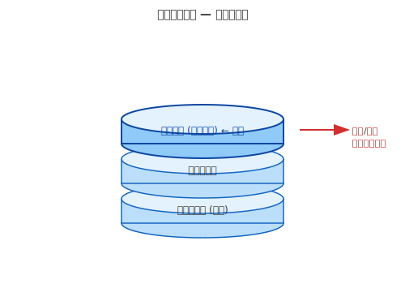
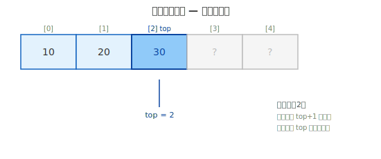
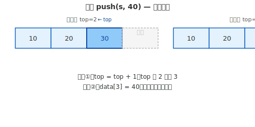
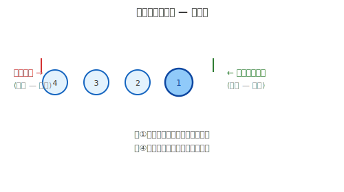
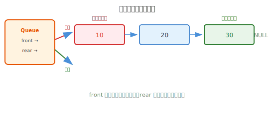
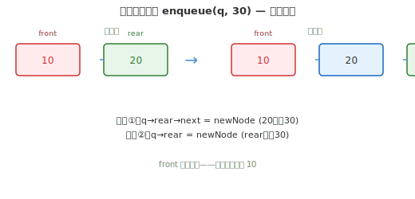
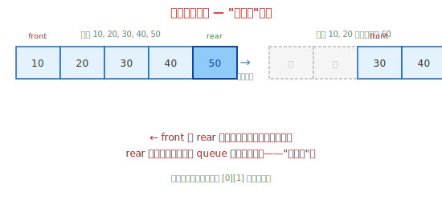
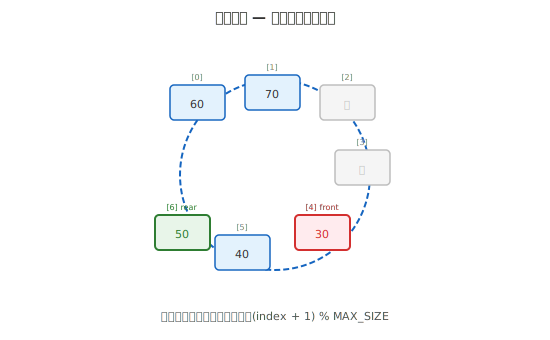
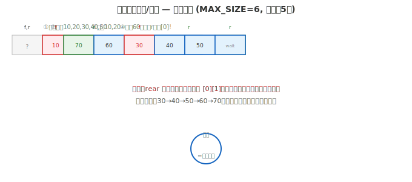

# 第十九章 通用抽象数据结构

## 本章要点

在[第十八章](第十八章-数据存储结构.md)中，我们深入学习了两种最基础的物理存储方式——数组（连续存储）和链表（分散存储）。本章聚焦**逻辑规则层**：给基础存储加上规则，构造出功能各异的抽象数据结构。

回顾[数据结构总览](数据结构总览.md)中的核心框架：**数据结构 = 物理存储方式 + 逻辑组织规则。** 数组和链式节点是本书线性结构中采用的两类基础存储方式；加上不同的访问规则之后，就能实现栈、队列等结构。规则不同，行为不同，但地基相通。

> **📌 入门阶段范围说明**：通用抽象数据结构在数学上分为**线性结构**和**非线性结构**两大类。本章（入门阶段）只覆盖最基础的**线性抽象数据结构**——栈和队列。非线性结构（树、图等）将在进阶篇中继续学习。

具体涵盖：

- **线性与非线性数据结构**：从数据元素之间关系的角度，理解两类抽象数据结构的本质区别
- **栈**（基于数组）：后进先出（LIFO），只能从一端进出
- **链式队列**（基于链表）：先进先出（FIFO），维护队首队尾双指针
- **环形队列**（基于数组）：用取模运算让数组首尾相接，解决"假溢出"
- **总结与对比**：物理存储 × 逻辑规则的总览表，以及全部结构的操作效率综合对比

学完本章，你将理解"同一存储 + 不同规则 = 不同行为"——这正是数据结构设计的精髓。

---

## 一、线性数据结构与非线性数据结构

### 1.1 从数据元素之间的关系分类

在[数据结构总览](数据结构总览.md)中，我们把数据结构分为两层——**物理存储**（数组/链表）和**逻辑规则**。本章聚焦逻辑规则层，也就是"通用抽象数据结构"。

抽象数据结构按照**数据元素之间的关系**，可以分为两大类：

| 分类                     | 定义                                                 | 特征                             |
| ------------------------ | ---------------------------------------------------- | -------------------------------- |
| **线性数据结构**   | 元素之间存在**一对一**的前后关系               | 每个元素最多有一个前驱和一个后继 |
| **非线性数据结构** | 元素之间存在**一对多**或**多对多**的关系 | 一个元素可以关联多个其他元素     |

### 1.2 线性数据结构

线性结构的特点非常直观——**数据排成一条线**。每个元素（除首尾外）前面只有一个元素，后面也只有一个元素。

**常见的线性抽象数据结构：**

| 结构           | 规则             | 行为             |
| -------------- | ---------------- | ---------------- |
| **栈**   | 只能从一端进出   | 后进先出（LIFO） |
| **队列** | 一端进、另一端出 | 先进先出（FIFO） |

线性结构是最基础的抽象数据结构，也是入门阶段的重点。它们的核心操作（入栈/出栈、入队/出队）都围绕"一端或两端的顺序访问"展开。

### 1.3 非线性数据结构

非线性结构打破"排成一条线"的限制——**一个元素可以连接多个元素**，形成分支或网络状的关系。

**常见的非线性抽象数据结构：**

| 结构         | 元素关系         | 典型场景                       |
| ------------ | ---------------- | ------------------------------ |
| **树** | 一对多的层次关系 | 文件目录、组织架构、表达式解析 |
| **图** | 多对多的网络关系 | 地图导航、社交网络、网络路由   |

> **📌 入门阶段范围说明**：非线性结构（树、图）的实现和分析更为复杂，将在**进阶篇**中详细讲解。入门阶段只聚焦**线性抽象数据结构**——栈和队列。理解好线性结构，是学习非线性结构的必要基础。

---

## 二、栈（基于数组）

### 2.1 什么是栈

回顾数据结构总览中的观点：**数组和链式节点是两类常见的基础存储方式，许多抽象结构可以在它们之上增加访问规则来实现。** 栈就是典型例子——约束数组只能从一端进出，就得到数组栈。同样，也可以用链表实现栈，只需约束只在头部插入和删除即可。本章先用数组实现，读者可以自行尝试链表版本。

栈规定：数据只能从一端进入，也只能从同一端取出。这一端称为**栈顶**。

这种规则看似是一种限制，实则是赋予了栈一个非常重要的特性：**后进先出（LIFO，Last In First Out）**——最后放进去的元素，最先被取出来。



栈的例子随处可见：

- **一叠盘子**：洗完盘子往上摞，用的时候从上面取。最先摞上去的在最底下（最后才能用到），最后摞上去的在最上面（最先被用到）。
- **函数的调用与返回**：常见 C 实现使用调用栈保存返回地址、部分局部状态等信息；具体调用约定由平台和编译器决定。

栈只允许三种操作：

| 操作                       | 含义                 |
| -------------------------- | -------------------- |
| **入栈（push）**     | 将一个元素放入栈顶   |
| **出栈（pop）**      | 从栈顶取出一个元素   |
| **查看栈顶（peek）** | 查看栈顶元素但不取出 |

---

### 2.2 栈的结构定义（基于数组）

用数组实现栈是最直观的方式：数组本身就提供了一片连续的存储空间。再配合一个变量 `top` 记录"栈顶在数组中的哪个位置"。



```c
#include <stdio.h>
#include <stdlib.h>
#include <stdbool.h>

#define MAX_SIZE 100

typedef struct
{
    int data[MAX_SIZE];  // 存放数据的数组
    int top;             // 栈顶下标，-1 表示空栈
} Stack;
```

逐行讲解：

- **`#define MAX_SIZE 100`**：定义栈的最大容量为 100。这是用宏定义的常量，修改这里就能改变栈的大小。
- **`int data[MAX_SIZE];`**：用数组存放栈中的元素。
- **`int top;`**：栈顶指针（实际上是下标）。`top = -1` 表示栈是空的——因为没有任何元素时，没有合法的下标可以指向。当栈中放入第一个元素时，`top` 变成 `0`；第二个元素放入时，`top` 变成 `1`，以此类推。

---

### 2.3 基本操作：初始化、判空、判满

```c
// 初始化栈
void initStack(Stack *s)
{
    s->top = -1;     // 将 top 设为 -1，表示空栈
}

// 判断栈是否为空
bool isEmpty(Stack *s)
{
    return s->top == -1;
}

// 判断栈是否已满
bool isFull(Stack *s)
{
    return s->top == MAX_SIZE - 1;  // top 到达数组最后一个下标时已满
}
```

逐行讲解：

- **`initStack`**：将 `top` 设为 `-1`。这个函数必须在使用栈之前调用，就像在使用任何变量之前要初始化一样。
- **`isEmpty`**：`top == -1` 时栈为空。`-1` 不是一个有效的数组下标，它只是一个约定，表示"还没有元素"。
- **`isFull`**：当 `top` 等于 `MAX_SIZE - 1`（即数组的最后一个下标）时，栈就满了。例如 `MAX_SIZE = 100`，有效下标是 0~99，`top = 99` 时已满。

---

### 2.4 入栈操作（push）

入栈的步骤：先检查栈是否已满，如果未满，将 `top` 加 1，然后把元素放入 `data[top]`。



```c
bool push(Stack *s, int value)
{
    if (isFull(s))                       // (1) 检查是否已满
    {
        return false;                    // 入栈失败
    }
    s->top++;                            // (2) top 向上移动一格
    s->data[s->top] = value;             // (3) 在栈顶位置放入新元素
    return true;                         // 入栈成功
}
```

逐行讲解：

- **第 3 行**：先判断栈是否已满。如果满了就返回 `false`，防止数组越界；调用者可根据返回值决定是否提示用户。
- **第 8 行 `s->top++;`**：栈顶指针先加 1。比如原来 `top = -1`（空栈），现在变成 `0`。原来 `top = 2`（栈里有 3 个元素），现在变成 `3`。
- **第 9 行 `s->data[s->top] = value;`**：将新元素写入栈顶位置。
- 使用 `s->` 而不是 `s.` 是因为参数 `s` 是指针（`Stack *s`），指针访问结构体成员必须用 `->`。

---

### 2.5 出栈操作（pop）

出栈的步骤：先检查栈是否为空，如果不空，取出栈顶元素，然后将 `top` 减 1。

```c
bool pop(Stack *s, int *out)
{
    if (isEmpty(s) || out == NULL)       // (1) 检查是否为空及输出指针是否有效
    {
        return false;                    // 出栈失败
    }
    *out = s->data[s->top];             // (2) 取出栈顶元素的值
    s->top--;                            // (3) top 向下移动一格
    return true;                         // 出栈成功
}
```

逐行讲解：

- **入参 `int *out`**：我们需要把取出的值"传回"给调用者。C 语言中函数只能有一个返回值，这里用 `bool` 表示成功/失败，通过指针参数 `out` 把取出的值传出去。
- **第 3 行**：判空并检查 `out`。空栈没有元素可取，空指针也不能被解引用，这两种情况都返回 `false`。
- **第 8 行 `*out = s->data[s->top];`**：将栈顶元素的值通过 `*out` 赋值给调用者提供的变量。`*out` 是解引用——因为 `out` 是指针，加上 `*` 才能访问指针指向的那个变量。
- **第 9 行 `s->top--;`**：栈顶指针减 1。注意我们**并没有真的"删除"数组中的数据**——`data[top]` 的值还在，但下次入栈时会直接覆盖它。`top` 指针的移动已经意味着这个位置"可以重新使用了"。

---

### 2.6 查看栈顶（peek）

```c
bool peek(Stack *s, int *out)
{
    if (isEmpty(s) || out == NULL)
    {
        return false;
    }
    *out = s->data[s->top];  // 只读取栈顶元素，不修改 top
    return true;
}
```

逐行讲解：

- `peek` 和 `pop` 的区别只在于：`peek` 不修改 `top`。它只是"看一眼"栈顶是什么，栈的内容没有任何变化。

---

### 2.7 组合使用示例（`main`）

下面的 `main` 函数与前面定义的 `Stack` 及各操作函数组合使用；可独立编译的多文件版本已同步到配套源码的 `array-stack` 项目。

```c
int main(void)
{
    Stack s;
    initStack(&s);

    push(&s, 10);
    push(&s, 20);
    push(&s, 30);

    int val;
    while (pop(&s, &val))    // 只要出栈成功，就继续
    {
        printf("出栈：%d\n", val);
    }
    // 输出：出栈：30
    //       出栈：20
    //       出栈：10
    // 注意：30 最先出来，10 最后出来——后进先出

    return 0;
}
```

调用方式要点：

- 所有栈操作函数都接收 `Stack *`（指向栈的指针），所以调用时需要传地址：`&s`。
- `pop` 的第二个参数需要传一个 `int` 变量的地址，用来接收取出的值。
- 使用 `bool` 返回值判断操作是否成功，比直接假设操作总成功要安全。

##### 时间复杂度分析

基于数组的栈，所有操作都是 O(1)：

| 操作                     | 时间复杂度 | 说明                 |
| ------------------------ | ---------- | -------------------- |
| `initStack`            | O(1)       | `top = -1`         |
| `isEmpty` / `isFull` | O(1)       | 一次整数比较         |
| `push`                 | O(1)       | `top++` + 数组赋值 |
| `pop`                  | O(1)       | 读取 +`top--`      |
| `peek`                 | O(1)       | 只读`data[top]`    |

**空间开销**：数组占用 O(`MAX_SIZE`) 个元素的空间；若把编译期常量 `MAX_SIZE` 视为固定值，则相对于当前元素个数可记为 O(1)。优点是开销可预测；缺点是容量定得过大可能浪费空间。若不想预分配，可用链表实现栈。

---

## 三、队列

### 3.1 什么是队列

和栈一样，队列也是给基础结构“加规则”得到的——给数组或链表加上“一端只能进、另一端只能出”的约束。正因如此，队列可以基于链表实现（同时维护队首、队尾指针时，头删和尾插都是 O(1)），也可以基于数组实现。本章两种都会讲，正好体会“同一抽象结构，不同底层实现”的取舍。

队列遵循**先进先出（FIFO，First In First Out）**原则——最早进入队列的元素，最早被取出来。



生活中队列的例子：

- **排队买票**：先来的人排在前面，先买到票离开。后来的人只能排在队尾。
- **打印机任务队列**：先提交的打印任务先执行。
- **消息队列**：在操作系统中，进程间通信常用队列来传递消息。

队列有两个端点：

| 端点                    | 含义                         |
| ----------------------- | ---------------------------- |
| **队首（front）** | 出队的端点。从队首取出元素。 |
| **队尾（rear）**  | 入队的端点。在队尾添加元素。 |

队列有两种常见的实现方式：**基于数组**和**基于链表**。下面分别讲解。

---

### 3.2 基于链表的队列

用链表实现队列非常自然：链表头部作为队首（出队端），链表尾部作为队尾（入队端）。这样入队操作相当于尾插法（但要避免每次遍历），出队操作相当于删除头节点。

为了让入队操作是 O(1)（不需要遍历），我们维护一个队列结构体，同时记录队首指针和队尾指针。



#### 3.2.1 结构定义与初始化

```c
// 队列节点（和单链表节点一样）
typedef struct QNode
{
    int data;
    struct QNode *next;
} QNode;

// 队列结构体：封装队首和队尾指针
typedef struct
{
    QNode *front;  // 指向队首节点（出队端）
    QNode *rear;   // 指向队尾节点（入队端）
} Queue;

// 初始化队列
void initQueue(Queue *q)
{
    q->front = NULL;
    q->rear = NULL;
}
```

逐行讲解：

- **`QNode`**：队列的节点类型，和单链表节点完全一样——数据域 + `next` 指针。之所以复用单链表的节点结构，是因为链式队列本质上就是一个受限制的单链表（只允许头删和尾插）。
- **`Queue` 结构体**：将 `front` 和 `rear` 两个指针封装在一起。有了尾指针 `rear`，入队操作就不需要每次都遍历到末尾了。
- **`initQueue`**：初始化时两个指针都设为 `NULL`，表示空队列。

#### 3.2.2 入队操作

入队相当于链表的尾插法，但由于我们有 `rear` 指针，不需要遍历。

```c
void enqueue(Queue *q, int value)
{
    // (1) 创建新节点
    QNode *newNode = malloc(sizeof *newNode);
    if (newNode == NULL) { fprintf(stderr, "内存分配失败\n"); exit(EXIT_FAILURE); }
    newNode->data = value;
    newNode->next = NULL;

    // (2) 如果队列为空，队首和队尾都指向新节点
    if (q->front == NULL)
    {
        q->front = newNode;
        q->rear = newNode;
    }
    else
    {
        // (3) 将新节点挂在当前队尾的后面
        q->rear->next = newNode;
        // (4) 更新队尾指针
        q->rear = newNode;
    }
}
```

逐行讲解：

- **第 3~5 行**：创建新节点，和单链表完全一样。
- **第 8~12 行**：处理空队列情况。当 `q->front == NULL` 时，队列中没有任何节点，新节点既是队首也是队尾。
- **第 16 行 `q->rear->next = newNode;`**：将当前队尾节点的 `next` 指向新节点——新节点接在了链表末尾。
- **第 18 行 `q->rear = newNode;`**：更新队尾指针，让它指向新的最后一个节点。注意此时 `q->front` 不变——队首还是原来的节点。



#### 3.2.3 出队操作

出队相当于删除单链表的头节点。

```c
bool dequeue(Queue *q, int *out)
{
    // (1) 队列为空，无法出队
    if (q->front == NULL || out == NULL)
    {
        return false;
    }

    // (2) 暂存队首节点
    QNode *temp = q->front;

    // (3) 取出数据
    *out = temp->data;

    // (4) 队首后移
    q->front = q->front->next;

    // (5) 如果出队后队列为空，队尾也要清空
    if (q->front == NULL)
    {
        q->rear = NULL;
    }

    // (6) 释放旧队首节点
    free(temp);
    return true;
}
```

逐行讲解：

- **第 4 行**：判空并检查输出指针。`q->front == NULL` 意味着队列中没有节点；`out == NULL` 时不能写回结果。
- **第 10 行 `QNode *temp = q->front;`**：记下当前队首节点，稍后要释放它。
- **第 13 行 `*out = temp->data;`**：取出队首节点的数据，通过指针传给调用者。
- **第 16 行 `q->front = q->front->next;`**：队首指针后移到下一个节点。如果原来只有一个节点，`q->front->next` 是 `NULL`，那 `q->front` 就变成了 `NULL`。
- **第 19~21 行**：这是容易遗漏的关键细节。当队列中最后一个节点出队时，`front` 已经变成 `NULL`，但 `rear` 仍指向那个即将释放的节点。如果不在释放前把 `rear` 清空，随后它就会成为一个**悬空指针**（仍保存已释放对象的地址），后续入队会出问题。
- **第 24 行 `free(temp);`**：释放旧队首节点占用的内存。

#### 3.2.4 遍历与释放

```c
// 打印队列
void printQueue(Queue *q)
{
    QNode *p = q->front;
    printf("队首 → ");
    while (p != NULL)
    {
        printf("%d → ", p->data);
        p = p->next;
    }
    printf("NULL (队尾)\n");
}

// 释放队列
void freeQueue(Queue *q)
{
    QNode *p = q->front;
    while (p != NULL)
    {
        QNode *temp = p;
        p = p->next;
        free(temp);
    }
    q->front = NULL;
    q->rear = NULL;
}
```

逐行讲解：

- 遍历和单链表完全一样，从 `front` 开始沿着 `next` 走。
- 释放后要把 `front` 和 `rear` 都设为 `NULL`——否则它们就成了野指针。

#### 3.2.5 组合使用示例（`main`）

下面的 `main` 函数与本节前面定义的节点、队列及操作函数组合使用；可独立编译的多文件版本已同步到配套源码的 `linked-queue` 项目。

```c
int main(void)
{
    Queue q;
    initQueue(&q);

    enqueue(&q, 10);
    enqueue(&q, 20);
    enqueue(&q, 30);

    printf("入队后：");
    printQueue(&q);   // 输出：队首 → 10 → 20 → 30 → NULL (队尾)

    int val;
    while (dequeue(&q, &val))
    {
        printf("出队：%d\n", val);
    }
    // 输出：出队：10
    //       出队：20
    //       出队：30
    // 10 最先出来，30 最后出来——先进先出

    freeQueue(&q);
    return 0;
}
```

##### 时间复杂度分析

维护了 `front` 和 `rear` 两个指针，入队和出队都是 O(1)：

| 操作           | 时间复杂度 | 说明                   |
| -------------- | ---------- | ---------------------- |
| `initQueue`  | O(1)       | 两个指针置 NULL        |
| `enqueue`    | O(1)       | `rear` 直接定位末尾  |
| `dequeue`    | O(1)       | `front` 直接定位队首 |
| `printQueue` | O(n)       | 遍历所有节点           |
| `freeQueue`  | O(n)       | 释放所有节点           |

对比普通单链表尾插 O(n)：链式队列多存一个 `rear` 指针，把尾插变成了 O(1)。

**空间复杂度**：每个节点额外存一个 `next` 指针，n 个元素开销 O(n)。

---

### 3.3 环形队列（基于数组）

#### 普通数组队列的问题

如果用普通数组来实现队列，你会很自然地这样做：定义一个数组，用 `front` 指向队首，用 `rear` 指向队尾。入队时 `rear` 后移，出队时 `front` 后移。

但这样会产生一个严重的问题——**假溢出**：



问题根源：`front` 和 `rear` 只增不减，出队腾出的前面的空间永远不会被重新利用。

#### 环形队列的思路

解决方法是把数组"首尾相接"——当 `rear` 走到数组最后一个位置时，如果前面有空位，就让 `rear` 回到数组开头（下标 `0`）。同样，`front` 也这样绕圈走。数学上，这通过对数组大小**取模**来实现。



当 `rear` 走到数组最后一个位置 `MAX_SIZE - 1` 时，下一次入队计算 `(rear + 1) % MAX_SIZE`，结果就是 `0`——`rear` 绕回到了数组开头。

#### 环形队列的结构定义

```c
#include <stdio.h>
#include <stdlib.h>
#include <stdbool.h>

#define MAX_SIZE 6   // 数组大小为6，实际最多存 5 个元素

typedef struct
{
    int data[MAX_SIZE];  // 存放数据的数组
    int front;           // 队首下标（指向队首元素）
    int rear;            // 队尾下标（指向下一个要插入的位置）
} CircularQueue;
```

逐行讲解：

- **`#define MAX_SIZE 6`**：数组大小为 6，但环形队列会"牺牲一个位置"来区分空和满，所以实际最多只能存 5 个元素。为什么需要牺牲一个位置？请继续往下看。
- **`int front;`**：队首下标，指向队列中第一个元素的位置。初始值为 `0`。
- **`int rear;`**：队尾下标，指向**下一个要插入的位置**（不是当前最后一个元素的位置）。初始值也为 `0`。当 `front == rear` 时，队列为空。

#### 初始化、判空、判满、获取大小

```c
// 初始化
void initQueue(CircularQueue *q)
{
    q->front = 0;
    q->rear = 0;
}

// 判断队列是否为空
bool isEmpty(CircularQueue *q)
{
    return q->front == q->rear;    // front 追上 rear → 空
}

// 判断队列是否已满（牺牲一个位置）
bool isFull(CircularQueue *q)
{
    return (q->rear + 1) % MAX_SIZE == q->front;
    // rear 的下一个位置是 front → 满
}

// 获取当前队列中的元素个数
int getSize(CircularQueue *q)
{
    return (q->rear - q->front + MAX_SIZE) % MAX_SIZE;
}
```

逐行讲解：

- **`isEmpty`**：初始状态下 `front == rear == 0`，队列为空。随着入队和出队的进行，当 `front` 追上了 `rear`，说明所有元素都被取出了，队列为空。
- **`isFull`**：这是环形队列最关键的设计点。如果 `(rear + 1) % MAX_SIZE == front`，即 `rear` 再往前走一步就碰到 `front` 了，此时认为队列已满。**为什么要牺牲一个位置？** 因为全满（所有位置都有数据）和全空时，`front` 和 `rear` 都指向同一个位置，无法区分。牺牲一个存储位置后，"空"的标志是 `front == rear`，"满"的标志是 `(rear + 1) % MAX_SIZE == front`，二者不可能混淆。
- **`getSize`**：`(q->rear - q->front + MAX_SIZE) % MAX_SIZE` 这个公式可以正确处理 `rear` 绕圈后小于 `front` 的情况。加上 `MAX_SIZE` 再取模，保证结果处于 `0` 到 `MAX_SIZE - 1` 之间。

#### 入队操作

```c
bool enqueue(CircularQueue *q, int value)
{
    if (isFull(q))                           // (1) 检查是否已满
    {
        return false;
    }
    q->data[q->rear] = value;               // (2) 在 rear 位置放入数据
    q->rear = (q->rear + 1) % MAX_SIZE;     // (3) rear 后移（环形）
    return true;
}
```

逐行讲解：

- **第 8 行 `q->data[q->rear] = value;`**：数据放在 `rear` 指向的位置。注意 `rear` 指向的是"下一个要插入的空位"，所以直接放在 `data[rear]` 就行。
- **第 9 行 `q->rear = (q->rear + 1) % MAX_SIZE;`**：`rear` 后移一位。`% MAX_SIZE`（取模）是关键——当 `rear` 在数组最后一个位置（`MAX_SIZE - 1`）时，`(rear + 1) % MAX_SIZE = 0`，`rear` 就绕回到了数组开头。

#### 出队操作

```c
bool dequeue(CircularQueue *q, int *out)
{
    if (isEmpty(q) || out == NULL)           // (1) 检查是否为空及输出指针是否有效
    {
        return false;
    }
    *out = q->data[q->front];               // (2) 取出队首元素
    q->front = (q->front + 1) % MAX_SIZE;   // (3) front 后移（环形）
    return true;
}
```

逐行讲解：

- **第 8 行 `*out = q->data[q->front];`**：取出 `front` 指向的元素的值。`front` 指向的是队首元素（第一个有数据的格子）。
- **第 9 行 `q->front = (q->front + 1) % MAX_SIZE;`**：`front` 后移一位。同样使用取模实现环形移动。被"出队"的元素实际上还在数组中，但 `front` 已经绕过了它——下次入队时会直接覆盖这个位置。

---



#### 时间复杂度分析

环形队列的所有操作都是 O(1)——没有循环，没有遍历。跟着代码看：

```c
// 入队：只有一次赋值 + 一次取模 + 一次后移
bool enqueue(CircularQueue *q, int value)
{
    if (isFull(q)) return false;              // O(1)：一次取模比较
    q->data[q->rear] = value;                 // O(1)：数组赋值
    q->rear = (q->rear + 1) % MAX_SIZE;       // O(1)：取模运算
    return true;
}

// 出队：只有一次读取 + 一次取模 + 一次后移
bool dequeue(CircularQueue *q, int *out)
{
    if (isEmpty(q) || out == NULL) return false; // O(1)：常数次比较
    *out = q->data[q->front];                 // O(1)：数组读取
    q->front = (q->front + 1) % MAX_SIZE;     // O(1)：取模运算
    return true;
}
```

没有任何循环依赖当前元素个数——无论队列中有多少元素（只要未超过其固定容量），入队和出队的工作量都是恒定的 O(1)。

**和链式队列对比：** 都是入队出队 O(1)，区别在空间——环形队列固定预分配（O(MAX_SIZE)），链式队列按需分配（O(n) 指针开销）。有容量上限选环形，无法预估上限选链式。

#### 组合使用示例（`main`）

下面的 `main` 函数与本节前面定义的 `CircularQueue` 及各操作函数组合使用；可独立编译的多文件版本已同步到配套源码的 `circular-queue` 项目。

```c
int main(void)
{
    CircularQueue q;
    initQueue(&q);

    // 入队 5 个元素（MAX_SIZE=6，最多存5个）
    enqueue(&q, 10);
    enqueue(&q, 20);
    enqueue(&q, 30);
    enqueue(&q, 40);
    enqueue(&q, 50);

    printf("已满？%s\n", isFull(&q) ? "是" : "否");  // 输出：已满？是

    // 出队 2 个，腾出空间
    int val;
    dequeue(&q, &val);  printf("出队：%d\n", val);  // 10
    dequeue(&q, &val);  printf("出队：%d\n", val);  // 20

    // 此时 [0][1] 是空的，rear 在 [5]。再入队 60，它会放在哪儿？
    enqueue(&q, 60);   // 60 放在 [5]，随后 rear 从 5 绕回 0
    enqueue(&q, 70);   // 70 放在 [0]，随后 rear 移到 1

    printf("当前队列：");
    while (dequeue(&q, &val))
    {
        printf("%d ", val);
    }
    // 输出：30 40 50 60 70（先进先出！）
    printf("\n");

    return 0;
}
```

运行输出：

```
已满？是
出队：10
出队：20
当前队列：30 40 50 60 70
```

`70` 被放到了下标 `[0]` 的位置——`rear` 成功绕回到了数组开头。这就是环形队列的核心价值：**用取模运算让数组首尾相接，实现空间的循环利用**。

---

## 四、总结与对比

### 4.1 回到原点：物理存储 × 逻辑规则

学完本章全部结构，回头看数据结构总览中提出的两层视角，一切变得清晰：

**第一层：物理存储的两种常见组织方式。** 本书当前的线性结构使用两种典型实现——**整块连续存储**（数组），以及**节点不要求相邻、通过指针串联**（链表）。这是一套便于入门分析的模型，并不意味着所有数据结构只能由二者单独实现。

**第二层：逻辑规则，花样无穷。** 抛开 `malloc`、指针、内存地址这些细节，在抽象的层面上给数据"加规则"——只能从一端进出就成了栈，一端进另一端出就成了队列，每个节点记两个指针就成了双链表，取模绕回就成了环形队列。规则不同，行为不同，但地基没变：

| 数据结构               | 物理存储         | 逻辑规则               | 适合场景                       |
| ---------------------- | ---------------- | ---------------------- | ------------------------------ |
| **数组**         | 连续（下标寻址） | 无额外限制，全随机访问 | 数据量确定、频繁读取           |
| **单链表**       | 分散（链式节点） | 每个节点只记后继       | 频繁头插头删、顺序访问         |
| **双链表**       | 分散（链式节点） | 节点同时记前驱和后继   | 双向遍历、已知节点时 O(1) 删除 |
| **栈**           | 连续（数组）     | 只能从一端进出（LIFO） | 函数调用、撤销、括号匹配       |
| **队列（链式）** | 分散（链表）     | 一端进另一端出（FIFO） | 任务调度、消息缓冲             |
| **环形队列**     | 连续（数组）     | FIFO + 取模绕回        | 固定容量缓冲（串口、音频）     |

物理存储决定了底层效率的上限（能不能 O(1) 随机访问、修改要不要搬移数据），逻辑规则决定了结构的行为（LIFO 还是 FIFO、单向还是双向）。**所谓"选择数据结构"，本质上就是在物理约束和逻辑需求之间找到最佳平衡。**

### 4.2 操作效率综合对比

经过第十八章和本章的代码分析，数组、单链表、双链表、栈、队列在各种操作上的效率对比如下。这张表是选型时的参考手册：

| 操作                   | 数组                 | 单链表         | 双链表         | 谁赢？                              |
| ---------------------- | -------------------- | -------------- | -------------- | ----------------------------------- |
| 按下标随机访问         | **O(1)**       | O(n)           | O(n)           | 数组，物理上可计算地址              |
| 按值查找（无序）       | O(n)                 | O(n)           | O(n)           | 平手                                |
| 按值查找（有序）       | **O(log n)**   | O(n)           | O(n)           | 数组可用二分                        |
| 头部插入               | O(n)                 | **O(1)** | **O(1)** | 链表，只改指针                      |
| 尾部插入               | **O(1)**       | O(n)           | O(n)           | 数组有空间则直接写；链表需遍历      |
| 中间插入（已知插入点） | O(n)                 | **O(1)** | **O(1)** | 链表不搬数据；按下标找位置仍为 O(n) |
| 删除（已知节点地址）   | O(n)                 | 还需前驱信息   | **O(1)** | 双链表可直接取得前驱                |
| 反向遍历               | 支持                 | 不支持         | **支持** | 双链表有`prev`                    |
| 每元素元数据开销       | **无指针字段** | 每节点+1指针   | 每节点+2指针   | 数组在此项最少；仍可能有预留容量    |
| 容量增长               | 需重新分配或预留空间 | 按需增加节点   | 按需增加节点   | 链表无需整体搬迁                    |

| 结构       | 入栈/入队 | 出栈/出队 | 空间特点             |
| ---------- | --------- | --------- | -------------------- |
| 栈（数组） | O(1)      | O(1)      | 预分配，容量固定     |
| 链式队列   | O(1)      | O(1)      | 按需分配，有指针开销 |
| 环形队列   | O(1)      | O(1)      | 预分配，空间复用     |
