# 第十八章 数据存储结构

## 本章要点

在[数据结构总览](数据结构总览.md)中我们建立了一个核心认知：**数据结构 = 物理存储方式 + 逻辑组织规则。** 本章聚焦**物理存储层**——数据在内存中到底怎么放。

从本章讨论的线性结构实现来看，常见存储方式可概括为两类：**连续存储**和**非连续存储（链式存储）**。

| 存储方式                         | 本质                               | 代表结构       |
| -------------------------------- | ---------------------------------- | -------------- |
| **连续存储**               | 所有元素紧挨着存放在一块连续内存中 | **数组** |
| **非连续存储（链式存储）** | 节点不要求彼此相邻，用指针串联     | **链表** |

本章深入剖析这两种存储方式的实现细节和操作效率。

具体涵盖：

- **连续存储——数组的增删改查**：以数据结构的视角重新审视数组，逐一分析查、改、增、删四种操作的时间复杂度
- **非连续存储——链表**：本节还将跳脱出单/双的具体形式，探讨**链式存储的本质**——记录前后节点信息，自由组合前驱后继
  - **单链表**：节点只记后继指针，插入删除不搬移其他元素
  - **双链表**：节点同时记前驱和后继，可双向遍历；已知节点地址时 O(1) 删除
- **链式存储的本质**：单链表和双链表只是链式存储的两种实现，核心是"记录节点之间的关系信息"

学完本章，你将彻底理解"连续 vs 链式"两种存储方式各自的优势和代价，并且不被单/双链表的具体形式所局限。

---

## 一、连续存储——数组的增删改查

### 1.1 以数据结构的视角看数组

第三章已经学习了数组的基础语法——声明、初始化、用下标访问。现在换一个角度：**把数组当作连续存储的代表结构，分析它的四种核心操作——增、删、改、查。**

之所以从这里开始，是因为数组是 C 语言中最基础、最常用的数据存储方式。理解了数组的 CRUD 操作及其复杂度，再看链式存储时就能自然地理解"为什么需要另一种存储方式"。

数组的本质是**连续存储**——所有元素紧挨着放在一块连续的内存中。首元素的地址称为**基地址**，任意元素 `arr[i]` 的地址可以通过公式精确计算：

```
&arr[i] = 基地址 + i × sizeof(元素类型)
```

这个公式是数组一切特性的根源。它带来了 O(1) 随机访问，也带来了插入和删除时的搬移代价。

### 1.2 查（Read / Search）—— 数组最擅长的操作

数组的"查"分为两种情况：**按下标访问**和**按值查找**。两者的效率天差地别。

#### 按下标访问 —— O(1)

```c
int arr[5] = {10, 20, 30, 40, 50};
int x = arr[2];   // 一步定位到第三个元素，值 = 30
arr[3] = 99;      // 一步定位到第四个元素，修改为 99
```

借助“基地址 + 下标 × 元素大小”的寻址关系，编译器可以用固定数量的地址运算定位目标元素。具体会生成几条机器指令取决于平台和优化，复杂度分析只关心运算次数不随数组长度增长，因此按下标访问是 **O(1)**。

这是数组的核心优势，也是它区别于链表的最根本特征。链表要实现"找第 i 个元素"，必须从头走 i 步。

#### 按值查找（无序数组）—— O(n)

```c
int arr[5] = {10, 20, 30, 40, 50};
int target = 30;
int index = -1;
for (int i = 0; i < 5; i++)    // 必须逐个比较
{
    if (arr[i] == target)
    {
        index = i;
        break;                  // 找到了，可以提前退出
    }
}
```

数据没有排序，目标值可能在任何位置。**最好情况**（第一个就是）：1 次比较，O(1)。**最坏情况**（在最后一个或不存在）：n 次比较，O(n)。**平均情况**：n/2 次比较，O(n)。时间复杂度取最坏情况——**O(n)**。

#### 按值查找（有序数组 + 二分查找）—— O(log n)

如果数组是**有序的**，就可以使用**二分查找**——每次把搜索范围缩小一半。下面的实现假设数组按从小到大排列；若按降序排列，需要相应调换分支中的比较方向：

```c
// 在有序数组 arr 中查找 target，返回下标，未找到返回 -1
int binarySearch(int arr[], int n, int target)
{
    int left = 0, right = n - 1;
    while (left <= right)
    {
        int mid = left + (right - left) / 2;   // 找中间位置
        if (arr[mid] == target)
            return mid;                         // 找到了
        else if (arr[mid] < target)
            left = mid + 1;                     // target 在右半部分
        else
            right = mid - 1;                    // target 在左半部分
    }
    return -1;  // 没找到
}
```

逐行讲解：

- **第 4 行 `int left = 0, right = n - 1;`**：搜索范围从整个数组开始。
- **第 7 行 `int mid = left + (right - left) / 2;`**：计算中间位置。写成 `(left + right) / 2` 也可以，但当 `left + right` 超过 `int` 最大值时会溢出。`left + (right - left) / 2` 是安全写法。
- **第 8~9 行**：中间元素正好是目标，返回下标。
- **第 10~11 行**：中间元素比目标小，说明目标在右半部分——把 `left` 移到 `mid + 1`。
- **第 12~13 行**：中间元素比目标大，说明目标在左半部分——把 `right` 移到 `mid - 1`。

每轮循环，搜索范围缩小一半。10000 个元素的数组，最多只需要约 14 次比较。这就是 **O(log n)** 的威力。

> **💡 高效二分查找的前提是数据有序且支持随机访问。** 普通链表不能 O(1) 定位到中间元素，即使勉强套用二分思路，也得不到数组上 O(log n) 的时间复杂度。

### 1.3 改（Update）—— 按下标修改 O(1)

"修改"是指把某个位置的值替换为新值。如果知道下标，和按下标访问完全一样：

```c
arr[2] = 99;   // 把下标为 2 的元素改为 99，O(1)
```

如果不知道下标、只知道"要把值为 30 的元素改成 99"，那就得先查找——查找的复杂度 O(n) 决定了整体复杂度。

| 场景                 | 复杂度 |
| -------------------- | ------ |
| 已知下标，直接修改   | O(1)   |
| 已知值，先查找再修改 | O(n)   |

### 1.4 增（Insert）—— 数组最吃亏的操作

"插入"是指在数组的某个位置加入一个新元素。因为数组要求元素连续存放，插入意味着要把**插入点之后的所有元素向后移一格**，给新元素腾出空间。

#### 在末尾插入 —— O(1)

```c
int arr[100] = {10, 20, 30};   // 当前有 3 个元素
int size = 3;
arr[size] = 40;                 // 直接在末尾写入
size++;                         // 元素个数 +1
```

末尾还有空位时，直接在 `arr[size]` 处写入，一步完成——**O(1)**。这是数组插入的唯一高效场景。

#### 在开头或中间插入 —— O(n)

```c
// 在下标 index 处插入 value。
// 前置条件：index 在 [0, *size] 内，并且数组至少还有一个空位。
void insertAt(int arr[], int *size, int index, int value)
{
    // (1) 从最后一个元素开始，每个元素向后移一格
    for (int i = *size; i > index; i--)
    {
        arr[i] = arr[i - 1];
    }
    // (2) 在腾出的空位写入新值
    arr[index] = value;
    // (3) 元素个数 +1
    (*size)++;
}
```

逐行讲解：

- **参数 `int *size`**：`size` 是指针，因为函数需要修改调用者的 `size` 变量。当前数组有多少个有效元素，就从这个位置开始搬移。
- **第 5~7 行**：这是核心——从后往前逐个搬移。为什么从后往前？因为如果从前往后，前面的值会覆盖后面的值。从最后一个元素开始，先让它往后挪一格，再让前一个往后挪……这样每个值在"被覆盖前"都已经搬到了安全位置。
- **第 9 行 `arr[index] = value;`**：腾出的空位（`index` 位置）填入新值。
- **第 11 行 `(*size)++;`**：有效元素个数加 1。注意 `*size` 要加括号——`*` 的优先级低于 `++`，不写括号会变成 `*(size++)`。

**时间复杂度分析**：最坏情况是在下标 0 插入——所有 n 个元素都要向后移一格，**O(n)**。平均情况：插在中间，搬移 n/2 个元素，也是 **O(n)**。

#### 完整示例

```c
#include <stdio.h>

void insertAt(int arr[], int *size, int index, int value)
{
    for (int i = *size; i > index; i--)
        arr[i] = arr[i - 1];
    arr[index] = value;
    (*size)++;
}

int main(void)
{
    int arr[100] = {10, 20, 30, 40, 50};
    int size = 5;

    printf("插入前：");
    for (int i = 0; i < size; i++)
        printf("%d ", arr[i]);
    printf("\n");   // 输出：10 20 30 40 50

    insertAt(arr, &size, 2, 99);   // 在下标 2 插入 99

    printf("插入后：");
    for (int i = 0; i < size; i++)
        printf("%d ", arr[i]);
    printf("\n");   // 输出：10 20 99 30 40 50

    return 0;
}
```

> **💡 数组空间不够时怎么办？**
>
> 上面的示例假设数组容量 `100` 足够大。如果容量不够，需要使用 `realloc` 扩展空间（动态数组），这在第十章已讲过。但即使用了 `realloc`，插入时的搬移代价依然存在——`realloc` 解决了"容量"问题，解决不了"搬移"问题。

### 1.5 删（Delete）—— 插入的逆操作

"删除"是指把某个位置的元素移除。和插入相反——插入是"往后移、腾空位"，删除是"往前移、填空位"。

```c
// 删除下标 index 处的元素；前置条件：index 在 [0, *size) 内
void deleteAt(int arr[], int *size, int index)
{
    // (1) 从 index+1 开始，每个元素向前移一格
    for (int i = index; i < *size - 1; i++)
    {
        arr[i] = arr[i + 1];
    }
    // (2) 元素个数 -1
    (*size)--;
}
```

逐行讲解：

- **第 5~7 行**：循环变量从 `index` 开始，把 `index + 1` 及其后的元素依次向前移一格，覆盖待删除位置。和插入不同，删除时是**从前往后**搬——`arr[i] = arr[i + 1]`，把后面的值赋给前面。因为我们是“把后面的元素往前拉”，从前往后遍历是安全的。
- **第 9 行 `(*size)--;`**：有效元素个数减 1。注意，最后一个位置（`arr[*size]`）的值还在，但已经不属于"有效元素"了——下次插入时会直接覆盖。

**时间复杂度分析**：最坏情况是删除下标 0——所有元素都要向前移一格，**O(n)**。删除最后一个元素（下标 size-1）：不需要搬移，`size--` 一步完成，**O(1)**。

### 1.6 数组 CRUD 总结

| 操作                      | 时间复杂度 | 说明                      |
| ------------------------- | ---------- | ------------------------- |
| **查（下标）**      | O(1)       | 基地址 + 下标 × 元素大小 |
| **查（值，无序）**  | O(n)       | 线性遍历                  |
| **查（值，有序）**  | O(log n)   | 二分查找                  |
| **改（知下标）**    | O(1)       | 同下标访问                |
| **改（知值）**      | O(n)       | 先 O(n) 查找再 O(1) 修改  |
| **增（末尾）**      | O(1)       | 直接写入，不搬移          |
| **增（头部/中间）** | O(n)       | 插入点之后所有元素向后移  |
| **删（末尾）**      | O(1)       | 不搬移                    |
| **删（头部/中间）** | O(n)       | 删除点之后所有元素向前移  |

数组的增删瓶颈在于**搬移数据**——这是"连续存放"必须付出的代价。链表正是为了解决这个问题而诞生的。

---

## 二、非连续存储——链表

### 2.1 什么是链式存储

数组要求所有元素连续存放，插入删除就得"大搬家"。链式存储换了一个完全不同的思路：**让每个元素自己记住"前后的元素在哪里"，用指针把分散在各处的数据串联起来。**

链表由若干**节点**（Node）组成，每个节点包含两部分：

- **数据域**：存储实际的数据值。
- **指针域**：存储一个或多个指针，记录其他节点的地址。

链表的“头”只需记住第一个节点，后续节点通过各自的指针域一级一级串下去；对于本章介绍的非循环链表，最后一个节点的后继指向 `NULL`，表示链表结束。

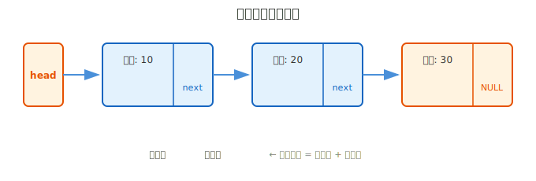

**链式存储的核心取舍**：牺牲了随机访问（想找第 N 个？必须从头数过去），换来了插入删除的灵活性（只改指针，不搬数据）。需要频繁增删的场景下，这个取舍是值得的。

### 2.2 链式存储与连续存储的根本区别

数组和链表的一切差异，都源于一个根本问题：**数据在内存中怎么放。**

- **连续存储（数组）**：所有元素紧挨着放在一块连续的内存中。知道首地址和元素大小，任意元素的位置可以精确算出来——`首地址 + 下标 × sizeof(元素)`。这是数组 O(1) 随机访问的物理基础。
- **链式存储（链表）**：每个节点独立 `malloc`，散落在内存各处。节点之间靠指针串联——就像一条线把散落的珠子串起来。正因为节点地址没有规律，找第 N 个必须从头走 N 步。但也正因为不要求连续，插入和删除只需改指针，不需要搬移任何数据。

**连续存储带来了随机访问，也带来了搬移代价。链式存储失去了随机访问，却换来了插入删除的灵活。** 这就是数组和链表所有差异的根源。

链表的变体取决于**节点记录多少关系信息**。接下来逐一讲解最主流的两种：**单链表**（节点只记后继）和**双链表**（节点同时记前驱和后继）。

### 2.3 单链表


单链表的特点总结：

| 特点                     | 说明                                         |
| ------------------------ | -------------------------------------------- |
| **动态大小**       | 需要几个节点就创建几个，不预先占用一大块内存 |
| **非连续存储**     | 节点可以分散在内存各处，通过指针串联         |
| **定位后增删灵活** | 不需要移动其他元素，只需修改相关指针         |
| **无法随机访问**   | 想找第 N 个元素，必须从头一个个找过去        |
| **额外空间开销**   | 每个节点除了存数据，还要多存一个指针         |

---

#### 节点结构定义

在写任何操作之前，第一步是定义"节点长什么样"。我们已经知道节点包含**数据域**和**指针域**，就用结构体来描述它：

```c
typedef struct Node
{
    int data;           // 数据域：存放数据（这里以 int 为例）
    struct Node *next;  // 指针域：指向下一个同类型的节点
} Node;
```

逐行讲解：

- **第 1 行 `typedef struct Node`**：定义一个新的结构体类型，`typedef` 的作用是给它起一个简短的别名 `Node`，省得以后每次都写 `struct Node`。
- **第 3 行 `int data;`**：数据域。这里用 `int` 存整数，实际开发中根据需要可以换成 `float`、`char` 数组、甚至另一个结构体。
- **第 4 行 `struct Node *next;`**：指针域。注意这里写的是 `struct Node *`，而不是 `Node *`——因为此时 `typedef` 还没生效，编译器不认识 `Node` 这个简称。`next` 存的是"下一个节点的地址"，如果没有下一个节点，就让它指向 `NULL`。
- **第 5 行 `} Node;`**：花括号后面的 `Node` 就是别名。从此以后，`struct Node` 和 `Node` 可以互换使用。

> **💡 为什么指针域的类型是 `struct Node *`？**
>
> 因为 `next` 要指向的是**另一个同类型的节点**。一个节点内部包含一个指向同类型节点的指针——这在 C 语言中称为**自引用结构**。编译器在处理 `struct Node *next;` 时，不需要知道 `struct Node` 的全部细节，只需要知道"这是一个指针"就行。所以这种自引用语法是合法的。

用图来直观地看，一个节点在内存中的样子：

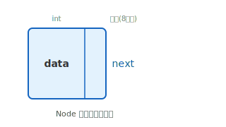

---

#### 创建节点

有了节点类型，下一步就是“造节点”。创建节点的过程是：通过 `malloc` 向 C 运行库的内存分配器申请一块内存，再填写数据和指针。

```c
Node *createNode(int data)
{
    // (1) 申请内存
    Node *newNode = malloc(sizeof *newNode);
    // (2) 检查是否申请成功
    if (newNode == NULL)
    {
        fprintf(stderr, "内存分配失败\n");
        exit(EXIT_FAILURE);
    }
    // (3) 填写数据域
    newNode->data = data;
    // (4) 指针域初始化为 NULL
    newNode->next = NULL;
    // (5) 返回这个新节点的地址
    return newNode;
}
```

逐行讲解：

- **函数签名 `Node *createNode(int data)`**：这个函数接收一个整数 `data`，返回一个 `Node *`（指向新创建节点的指针）。
- **`malloc(sizeof *newNode)`**：向内存分配器申请一块刚好能容纳一个 `Node` 的内存。按变量本身写 `sizeof *newNode`，即使以后修改变量类型，也不容易漏改这里。
- **不强制转换 `malloc` 的返回值**：在 C 语言中，`void *` 可以自动转换为其他对象指针类型；保留 `#include <stdlib.h>` 才是关键。
- **`if (newNode == NULL)`**：`malloc` 在内存不足时会返回 `NULL`，必须检查。如果为 `NULL`，打印错误信息并退出程序——实际情况中很少有内存不够的情况，但养成检查的习惯是专业程序员的基本素养。
- **`newNode->data = data`**：把参数 `data` 的值写入节点的数据域。`->` 运算符用于通过指针访问结构体的成员。
- **`newNode->next = NULL`**：新节点刚创建时还没有"下家"，指针域暂时设为 `NULL`。
- **`return newNode`**：返回新节点的地址，调用者拿到这个地址后就可以把它串入链表。

---

#### 插入操作

单链表的插入有两种基本方式：**头插法**（插在链表最前面）和**尾插法**（插在链表最后面）。两种方式的实现思路和使用场景不同，逐一来看。

##### 头插法——每次插在链表最前面

头插法的思路很简单：让新节点指向当前的头节点，然后新节点自己成为新的头节点。

**过程图解：**

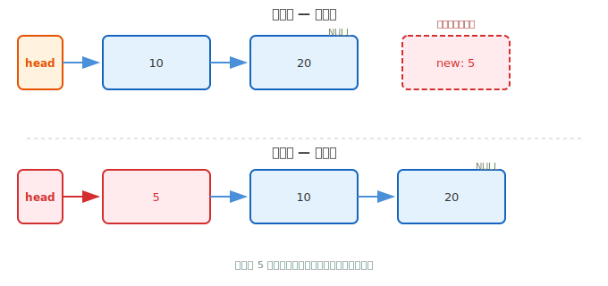

```c
Node *insertAtHead(Node *head, int data)
{
    // (1) 创建一个新节点
    Node *newNode = createNode(data);
    // (2) 新节点的 next 指向当前的头节点
    newNode->next = head;
    // (3) 返回新节点，它成为新的头节点
    return newNode;
}
```

**步骤分解：**

| 步骤 | 代码                                  | 分类               | 说明                                      |
| ---- | ------------------------------------- | ------------------ | ----------------------------------------- |
| ①   | `Node *newNode = createNode(data);` | 创建               | 调用 createNode，新节点 data=5，next=NULL |
| ②   | `newNode->next = head;`             | **指针操作** | 让新节点的 next 指向当前头节点            |
| ③   | `return newNode;`                   | 返回               | 新节点成为新的头节点                      |

- **参数 `Node *head`**：传入当前链表的头指针。如果链表为空，`head` 的值就是 `NULL`，此时步骤②等价于 `newNode->next = NULL`，结果正确。

**步骤②图解 —— 这是唯一涉及指针操作的一步：**

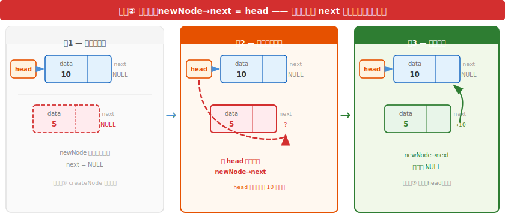

上图三帧展示了：帧1 操作前 `newNode->next == NULL` → 帧2 把 `head` 的值写入 `newNode->next` → 帧3 `newNode->next` 指向原头节点。

**调用方式**（非常重要）：

```c
Node *head = NULL;                  // 空链表
head = insertAtHead(head, 20);      // 链表: 20
head = insertAtHead(head, 10);      // 链表: 10 → 20
head = insertAtHead(head, 5);       // 链表: 5 → 10 → 20
```

注意：**每次调用都必须用 `head = insertAtHead(head, ...)` 来更新头指针**。初学者最常犯的错误就是写成 `insertAtHead(head, 10);` 而不接收返回值，这样 `head` 还是指向原来的节点，链表就断掉了。

---

##### 尾插法——每次插在链表最后面

尾插法的思路是：先找到链表的最后一个节点（`next` 指向 `NULL` 的那个），然后把新节点挂在它后面。

**过程图解：**

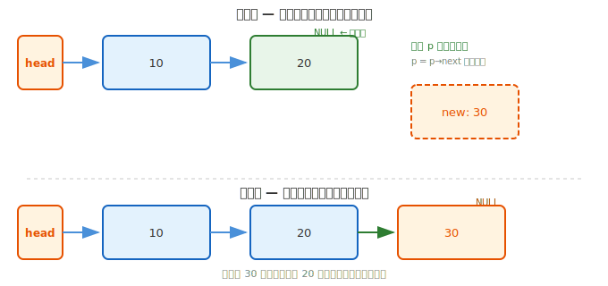

```c
Node *insertAtTail(Node *head, int data)
{
    // (1) 创建新节点
    Node *newNode = createNode(data);

    // (2) 如果链表为空，新节点就是头节点
    if (head == NULL)
    {
        return newNode;
    }

    // (3) 遍历找到最后一个节点
    Node *p = head;
    while (p->next != NULL)
    {
        p = p->next;
    }

    // (4) 将最后一个节点的 next 指向新节点
    p->next = newNode;

    // (5) 头节点没变，返回原来的 head
    return head;
}
```

逐行讲解：

**步骤分解：**

| 步骤 | 代码                                     | 分类               | 说明                                 |
| ---- | ---------------------------------------- | ------------------ | ------------------------------------ |
| ①   | `Node *newNode = createNode(data);`    | 创建               | 同头插法，新节点 next=NULL           |
| ②   | `if (head == NULL) return newNode;`    | 判空               | 空链表直接返回新节点                 |
| ③   | `while (p->next != NULL) p = p->next;` | **指针操作** | p 从头走到尾，找到最后一个节点       |
| ④   | `p->next = newNode;`                   | **指针操作** | 尾节点的 next 从 NULL 改为指向新节点 |
| ⑤   | `return head;`                         | 返回               | 头节点不变                           |

**步骤③图解 —— p 指针如何一步步走到末尾：**

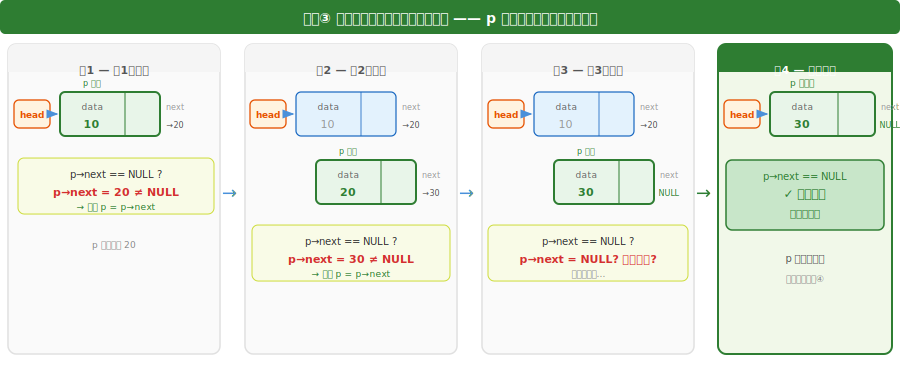

上图四帧展示了 p 从 head 出发，每轮检查 `p->next == NULL?`，不为 NULL 就 `p = p->next` 前进一步，直到 `p->next == NULL` 时停下——此时 p 就在最后一个节点上。

**步骤④图解 —— 尾节点如何接上新节点：**

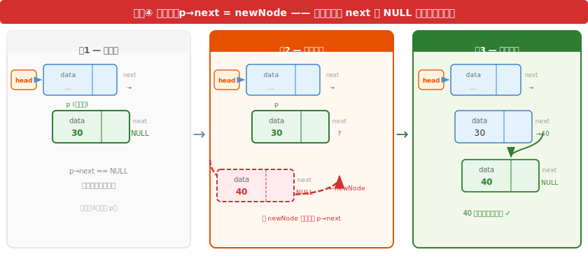

上图三帧展示了：帧1 `p->next == NULL`（末尾） → 帧2 `p->next = newNode`（把新节点地址写入 p->next）→ 帧3 新节点成为新的尾节点。

> **💡 头插法 vs 尾插法的选择**
>
> 头插法的优点是快——不需要遍历，时间复杂度 O(1)。缺点是插入的顺序和数据出现的顺序是**反的**：你先插 10 再插 20，链表是 20→10。
>
> 尾插法的优点是保持顺序——先插 10 再插 20，链表是 10→20。但每次都要遍历到末尾，时间复杂度 O(n)（n 是当前链表长度）。如果频繁尾插，可以考虑维护一个尾指针来避免遍历——后面的双链表和链式队列就会采用这个思路。

---

#### 删除操作

删除节点的思路是：找到要删除的节点，让它的**前一个节点**绕过它直接指向它的**后一个节点**，然后释放它的内存。

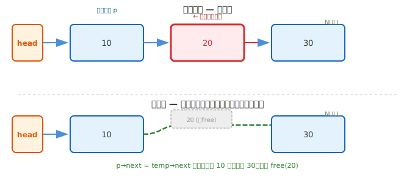

```c
Node *deleteNode(Node *head, int data)
{
    // (1) 空链表，无需删除
    if (head == NULL) return NULL;

    // (2) 要删除的恰好是头节点
    if (head->data == data)
    {
        Node *temp = head->next;   // 暂存第二个节点的地址
        free(head);                // 释放头节点
        return temp;               // 第二个节点成为新头节点
    }

    // (3) 找到目标节点的前一个节点
    Node *p = head;
    while (p->next != NULL && p->next->data != data)
    {
        p = p->next;
    }

    // (4) 找到了，执行删除
    if (p->next != NULL)
    {
        Node *temp = p->next;           // 暂存要删除的节点
        p->next = temp->next;           // 绕过它
        free(temp);                     // 释放内存
    }

    // (5) 返回头指针（一般情况下头指针不变）
    return head;
}
```

逐行讲解（分为"删头节点"和"删非头节点"两种情形）：

**情形 A：要删除的恰好是头节点**

| 步骤 | 代码                         | 分类 | 说明                 |
| ---- | ---------------------------- | ---- | -------------------- |
| ①   | `Node *temp = head->next;` | 暂存 | 记下第二节点地址     |
| ②   | `free(head);`              | 释放 | 释放原头节点内存     |
| ③   | `return temp;`             | 返回 | 第二节点成为新头节点 |

> ⚠️ **必须先暂存再释放**，否则 `free(head)` 后就找不到后面的节点了。

**步骤图解 —— 释放头节点，第二节点上位：**

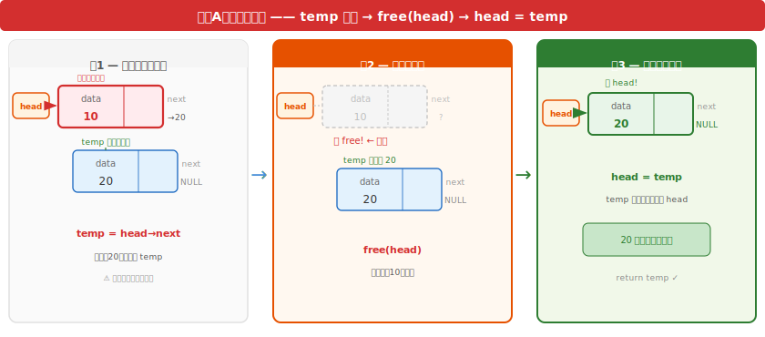

上图三帧展示了：帧1 `temp = head->next`（暂存20地址）→ 帧2 `free(head)`（释放10）→ 帧3 `head = temp`（20成为新head）。

**情形 B：要删除的不是头节点**

代码的核心逻辑是：找到目标节点的**前一个节点 p**，修改 `p->next` 让它绕过目标。

| 步骤 | 代码                              | 分类               | 说明                      |
| ---- | --------------------------------- | ------------------ | ------------------------- |
| ①   | `if (head == NULL)`             | 判空               | 空链表直接返回            |
| ②   | `while (p->next->data != data)` | **指针操作** | p 停在目标节点的"前面"    |
| ③   | `Node *temp = p->next;`         | 暂存               | 记下要删除的目标节点      |
| ④   | `p->next = temp->next;`         | **指针操作** | p 绕过 temp，直接指向后继 |
| ⑤   | `free(temp);`                   | 释放               | 释放目标节点内存          |
| ⑥   | `return head;`                  | 返回               | 头节点一般不变            |

**步骤②图解 —— 为什么检查 p→next→data 而不是 p→data：**


上图用左右对比展示：❌ 检查 `p->data` 会让 p 停在目标节点上，无法删除；✅ 检查 `p->next->data` 让 p 停在目标前面，可以通过修改 `p->next` 来绕过目标。

**步骤④图解 —— 前驱如何"绕过"目标节点：**

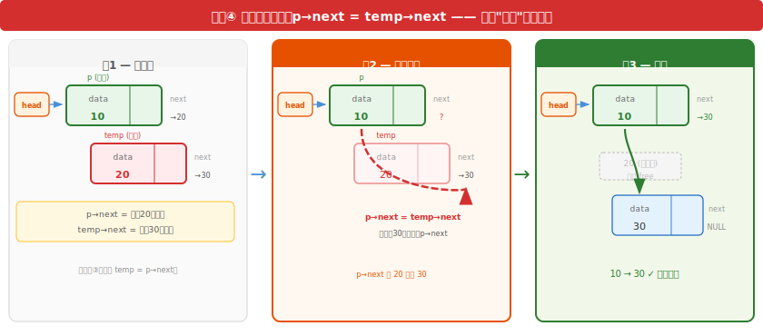

上图三帧展示了：帧1 `p->next` 指向20，`temp->next` 指向30 → 帧2 `p->next = temp->next`（把30的地址写入 p->next）→ 帧3 p 直接指向30，20 从链上脱落，最后 `free(temp)` 释放。

---

#### 遍历操作

遍历就是沿着指针把每个节点都访问一遍。最常见的使用场景是打印链表内容和释放整个链表。

##### 打印链表

```c
void printList(Node *head)
{
    Node *p = head;              // (1) 从第一个节点开始
    while (p != NULL)            // (2) 只要没有走到末尾
    {
        printf("%d → ", p->data); // (3) 打印当前节点的数据
        p = p->next;              // (4) 移动到下一个节点
    }
    printf("NULL\n");             // (5) 打印结尾标志
}
```

逐行讲解：

- **`Node *p = head;`**：用一个"行走指针" `p` 从 `head` 出发。不能直接用 `head` 遍历，因为一旦修改 `head`，就永远丢失了链表的入口。
- **`while (p != NULL)`**：遍历的终止条件。当 `p` 走到链表末尾时，它指向 `NULL`，循环结束。
- **`printf("%d → ", p->data);`**：打印当前节点的数据域。
- **`p = p->next;`**：这是遍历的核心——沿着 `next` 指针走到下一个节点。就像沿着线索找下一个地点。
- **`printf("NULL\n");`**：最后打印 `NULL` 表示链表结束。

##### 释放整个链表

链表是 `malloc` 创建的，用完后必须逐个释放，否则造成内存泄漏。

```c
void freeList(Node *head)
{
    Node *p = head;
    while (p != NULL)
    {
        Node *temp = p;     // (1) 记住当前节点
        p = p->next;        // (2) 先前进到下一个节点
        free(temp);         // (3) 再释放之前记住的节点
    }
}
```

逐行讲解：

- **第 5 行 `Node *temp = p;`**：用 `temp` 暂存当前要释放的节点。
- **第 6 行 `p = p->next;`**：**先**移动到下一个节点，再释放当前节点。这个顺序至关重要——如果反过来，先 `free(p)`，那 `p->next` 就变成了访问已释放的内存，属于未定义行为，后果不可预料。
- **第 7 行 `free(temp);`**：安全地释放。
- 循环结束后，所有节点占用的内存都被归还给操作系统。

---

#### 时间复杂度分析

学完了单链表的全部操作，现在逐一分析每个操作的效率。不要只记结论——跟着代码看清楚"为什么是这个复杂度"。

**（1）创建节点 —— O(1)**

```c
Node *createNode(int data)
{
    Node *newNode = malloc(sizeof *newNode);       // 一次内存分配
    if (newNode == NULL) { fprintf(stderr, "内存分配失败\n"); exit(EXIT_FAILURE); }
    newNode->data = data;                          // O(1)：一次赋值
    newNode->next = NULL;                          // O(1)：一次赋值
    return newNode;                                // O(1)
}
```

在常见的数据结构分析模型中，一次固定大小的 `malloc` 记作 O(1)，所以此函数相对于链表长度是 **O(1)**。实际分配器的耗时由实现决定，语言标准不保证 `malloc` 必然是常数时间。

**（2）头插法 —— O(1)**

```c
Node *insertAtHead(Node *head, int data)
{
    Node *newNode = createNode(data);   // O(1)
    newNode->next = head;               // O(1)：改一个指针
    return newNode;                     // O(1)
}
```

关键在 `newNode->next = head` 这一行——只改了一个指针的指向，不涉及任何遍历或搬移。链表有 10 个节点还是 10 万个节点，头插的工作量完全一样——**O(1)**。

对比数组在头部插入：所有元素要向后移一格，**O(n)**。

**（3）尾插法 —— O(n)**

```c
Node *insertAtTail(Node *head, int data)
{
    Node *newNode = createNode(data);   // O(1)
    if (head == NULL) return newNode;   // O(1)

    Node *p = head;
    while (p->next != NULL)             // ← 这里决定了复杂度
        p = p->next;                    // 每走一步 O(1)，总共走 n 步
    p->next = newNode;                  // O(1)
    return head;
}
```

`while` 循环从 `head` 一直走到最后一个节点：链表有 n 个节点就走 n 步。因此尾插是 **O(n)**。如果像后面的链式队列那样维护一个尾指针，尾插也可以做到 O(1)——多存一个指针，省掉每次遍历。

对比数组在尾部插入（有空间余裕时）：直接写 `arr[size] = x`，**O(1)**。

**（4）删除节点 —— O(n)**

```c
Node *deleteNode(Node *head, int data)
{
    if (head == NULL) return NULL;

    // 删头节点：O(1)
    if (head->data == data)
    {
        Node *temp = head->next;
        free(head);
        return temp;
    }

    // 删非头节点：while 循环是 O(n)
    Node *p = head;
    while (p->next != NULL && p->next->data != data)  // ← 遍历查找
        p = p->next;                                   // 最坏走 n 步

    if (p->next != NULL)                               // 找到了
    {
        Node *temp = p->next;
        p->next = temp->next;                          // O(1)：绕过
        free(temp);                                    // O(1)：释放
    }
    return head;
}
```

删除分两阶段：**查找**目标 → **执行**删除。查找需要遍历，最坏走 n 步（O(n)）；找到后改一个指针、一次 `free`（O(1)）。总复杂度 **O(n)**，瓶颈在查找。

> **关键洞察**：删除的指针操作本身是 O(1)（不搬数据），但前提是已经取得所需链接信息。单链表删除非头节点时，需要目标节点的前驱；如果遍历时同时保留了前驱，删除动作就是 O(1)。数组删除即使知道下标，也要把后面所有元素前移——还是 O(n)。

**（5）遍历和释放 —— O(n)**

```c
void printList(Node *head)
{
    Node *p = head;
    while (p != NULL) { printf("%d ", p->data); p = p->next; } // 走 n 步，O(n)
}

void freeList(Node *head)
{
    Node *p = head;
    while (p != NULL) { Node *t = p; p = p->next; free(t); }  // 走 n 步，O(n)
}
```

两个函数都是从头走到尾，每节点访问一次——**O(n)**。

**小结：**

| 操作      | 复杂度 | 瓶颈在哪                    |
| --------- | ------ | --------------------------- |
| 创建节点  | O(1)   | —                          |
| 头插      | O(1)   | —                          |
| 尾插      | O(n)   | 遍历找尾节点                |
| 删除      | O(n)   | 遍历找目标（删除动作 O(1)） |
| 遍历/释放 | O(n)   | 必须访问每个节点            |

和数组的核心区别：数组的 O(n) 来自**搬移数据**，链表的 O(n) 来自**遍历寻址**。尾部操作的全面对比（包括和双链表的三方对比）见[第十九章 总结与对比](第十九章-通用抽象数据结构.md)。

---

#### 完整示例

将以上所有代码组合成一个可以编译运行的程序，验证单链表的各项操作：

```c
#include <stdio.h>
#include <stdlib.h>

// ========== 节点类型定义 ==========
typedef struct Node
{
    int data;
    struct Node *next;
} Node;

// ========== 创建节点 ==========
Node *createNode(int data)
{
    Node *newNode = malloc(sizeof *newNode);
    if (newNode == NULL)
    {
        fprintf(stderr, "内存分配失败\n");
        exit(EXIT_FAILURE);
    }
    newNode->data = data;
    newNode->next = NULL;
    return newNode;
}

// ========== 头插法 ==========
Node *insertAtHead(Node *head, int data)
{
    Node *newNode = createNode(data);
    newNode->next = head;
    return newNode;
}

// ========== 尾插法 ==========
Node *insertAtTail(Node *head, int data)
{
    Node *newNode = createNode(data);
    if (head == NULL)
    {
        return newNode;
    }
    Node *p = head;
    while (p->next != NULL)
    {
        p = p->next;
    }
    p->next = newNode;
    return head;
}

// ========== 删除节点 ==========
Node *deleteNode(Node *head, int data)
{
    if (head == NULL) return NULL;
    if (head->data == data)
    {
        Node *temp = head->next;
        free(head);
        return temp;
    }
    Node *p = head;
    while (p->next != NULL && p->next->data != data)
    {
        p = p->next;
    }
    if (p->next != NULL)
    {
        Node *temp = p->next;
        p->next = temp->next;
        free(temp);
    }
    return head;
}

// ========== 打印链表 ==========
void printList(Node *head)
{
    Node *p = head;
    while (p != NULL)
    {
        printf("%d → ", p->data);
        p = p->next;
    }
    printf("NULL\n");
}

// ========== 释放链表 ==========
void freeList(Node *head)
{
    Node *p = head;
    while (p != NULL)
    {
        Node *temp = p;
        p = p->next;
        free(temp);
    }
}

// ========== 主函数 ==========
int main(void)
{
    Node *head = NULL;

    // 测试尾插法
    head = insertAtTail(head, 10);
    head = insertAtTail(head, 20);
    head = insertAtTail(head, 30);
    printf("尾插后：");
    printList(head);    // 输出: 10 → 20 → 30 → NULL

    // 测试头插法
    head = insertAtHead(head, 5);
    printf("头插后：");
    printList(head);    // 输出: 5 → 10 → 20 → 30 → NULL

    // 测试删除
    head = deleteNode(head, 20);
    printf("删除20：");
    printList(head);    // 输出: 5 → 10 → 30 → NULL

    // 删除头节点
    head = deleteNode(head, 5);
    printf("删除5：");
    printList(head);    // 输出: 10 → 30 → NULL

    // 释放链表
    freeList(head);

    return 0;
}
```

运行输出：

```
尾插后：10 → 20 → 30 → NULL
头插后：5 → 10 → 20 → 30 → NULL
删除20：5 → 10 → 30 → NULL
删除5：10 → 30 → NULL
```

---

### 2.4 双链表

#### 什么是双链表

单链表有一个明显的局限：**只能单向行走**。每个节点只有指向"后面"的指针，没有指向"前面"的指针。如果你已经走到了某个节点，突然想回退一步看看前一个节点——对不起，单链表做不到。删除某个节点时，也必须先找到它的前驱节点——因为你需要修改前驱节点的 `next`。

**双链表**在单链表的基础上给每个节点增加了一个**前驱指针**，指向它的前一个节点。这样一来：

- 从任意一个节点，既可以向前走（`next`），也可以向后走（`prev`）。
- 给定一个节点的地址，可以直接删除它，不需要遍历找前驱。
- 维护头、尾指针时，可以在链表两端高效地插入和删除；本节只保存头指针，因此尾插仍需遍历。

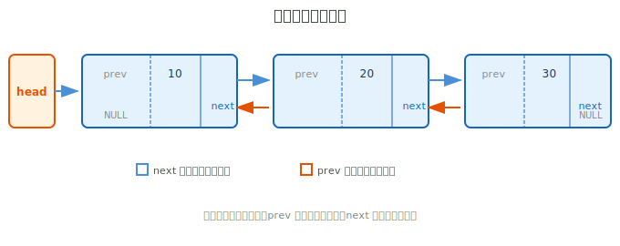

双链表的特点：

| 特点                          | 说明                                        |
| ----------------------------- | ------------------------------------------- |
| **双向遍历**            | 既能从头走到尾，也能从尾走到头              |
| **删除更方便**          | 已知节点地址可直接删除，不需要找前驱        |
| **额外空间开销更大**    | 每个节点比单链表多存一个`prev` 指针       |
| **插入/删除操作更复杂** | 每次要同时维护`prev` 和 `next` 两个指针 |

---

#### 节点结构定义

双链表的节点在单链表基础上增加了 `prev` 指针域：

```c
typedef struct DNode
{
    int data;            // 数据域
    struct DNode *prev;  // 前驱指针：指向前一个节点
    struct DNode *next;  // 后继指针：指向后一个节点
} DNode;
```

逐行讲解：

- **第 3 行 `int data;`**：数据域，和单链表一样。
- **第 4 行 `struct DNode *prev;`**：前驱指针。指向"前一个"节点。如果当前节点是第一个节点（头节点），`prev` 指向 `NULL`。
- **第 5 行 `struct DNode *next;`**：后继指针。和单链表的 `next` 一样，指向"后一个"节点。最后一个节点的 `next` 指向 `NULL`。

单链表用一个指针串起一条链，双链表用两个指针串起一条"双向链"——正着走用 `next`，反着走用 `prev`。

---

#### 创建节点

```c
DNode *createDNode(int data)
{
    DNode *node = malloc(sizeof *node);
    if (node == NULL)
    {
        fprintf(stderr, "内存分配失败\n");
        exit(EXIT_FAILURE);
    }
    node->data = data;
    node->prev = NULL;   // 新节点暂时没有前驱
    node->next = NULL;   // 新节点暂时没有后继
    return node;
}
```

逐行讲解：

- 和单链表的 `createNode` 几乎一样，唯一的区别是多了一句 `node->prev = NULL;`。新创建的节点还没有"邻居"，所以 `prev` 和 `next` 都初始化为 `NULL`。

---

#### 插入操作

双链表的插入同样分为头插法和尾插法。双链表因为可以双向遍历，维护一个尾指针会让尾插变得高效。但为了降低学习曲线，这里先介绍不维护尾指针的基本版本。

##### 头插法

头插法需要维护两个方向的指针：新节点 → 旧头节点（`next`），以及旧头节点 → 新节点（`prev`）。

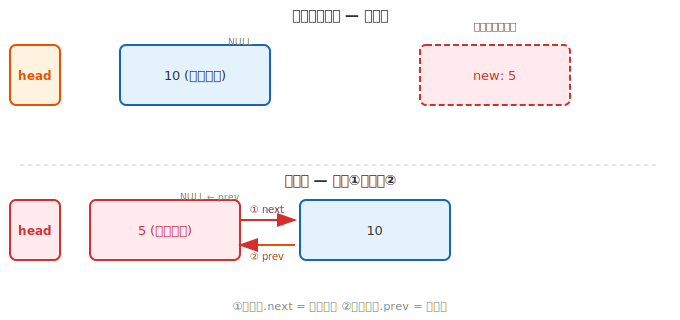

```c
DNode *insertAtHead(DNode *head, int data)
{
    DNode *newNode = createDNode(data);  // (1) 创建新节点

    if (head == NULL)                     // (2) 空链表，直接返回新节点
    {
        return newNode;
    }

    newNode->next = head;                 // (3) 新节点后继指向旧头节点
    head->prev = newNode;                 // (4) 旧头节点前驱指向新节点
    return newNode;                       // (5) 新节点成为新的头节点
}
```

逐行讲解：

- **第 3 行**：同单链表，创建新节点。
- **第 5~7 行**：处理空链表情况。
- **第 10 行 `newNode->next = head;`**：让新节点的后继指针指向原来的头节点。这建立了正向链接。
- **第 11 行 `head->prev = newNode;`**：让原来头节点的前驱指针指向新节点。这建立了反向链接。**这一步是双链表独有的**——单链表只需要改一个指针，双链表需要改两个。
- **第 12 行 `return newNode;`**：头指针更新为新节点。

---

##### 尾插法

```c
DNode *insertAtTail(DNode *head, int data)
{
    DNode *newNode = createDNode(data);  // (1) 创建新节点

    if (head == NULL)                     // (2) 空链表
    {
        return newNode;
    }

    // (3) 遍历找到最后一个节点
    DNode *p = head;
    while (p->next != NULL)
    {
        p = p->next;
    }

    // (4) 建立双向连接
    p->next = newNode;                    // 旧尾节点的后继指向新节点
    newNode->prev = p;                    // 新节点的前驱指向旧尾节点

    return head;                          // (5) 头节点没变
}
```

逐行讲解：

- **第 11~14 行**：和单链表尾插法一样，遍历到最后一个节点。
- **第 17 行 `p->next = newNode;`**：旧尾节点的 `next` 从 `NULL` 改为指向新节点。
- **第 18 行 `newNode->prev = p;`**：新节点的 `prev` 指向旧尾节点，建立反向链接。

---

#### 删除操作

双链表删除的一个巨大优势是：**找到了目标节点后，可以直接删除它**，不需要再遍历找前驱——因为前驱就记录在 `prev` 里。

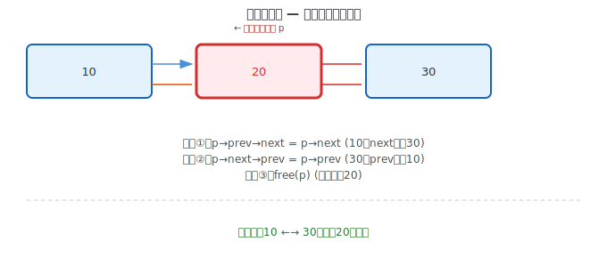

```c
DNode *deleteNode(DNode *head, int data)
{
    if (head == NULL) return NULL;          // (1) 空链表

    DNode *p = head;
    while (p != NULL && p->data != data)    // (2) 遍历查找目标节点
    {
        p = p->next;
    }

    if (p == NULL) return head;             // (3) 没找到，直接返回

    // (4) 显式处理头节点，保证释放后返回的 head 仍然有效
    if (p == head)
    {
        head = p->next;
        if (head != NULL) head->prev = NULL;
    }
    else
    {
        p->prev->next = p->next;            // 前驱跳过 p
        if (p->next != NULL)
            p->next->prev = p->prev;        // 后继反向跳过 p
    }

    // (6) 释放目标节点
    free(p);
    return head;
}
```

逐行讲解：

- **第 5~8 行**：遍历链表，找到数据等于 `data` 的节点 `p`。注意这里直接找目标节点本身，而不是找它的前驱——因为删除时需要的是目标节点的 `prev` 和 `next`。
- **第 10 行**：如果遍历到末尾（`p == NULL`）都没找到，说明链表中没有这个值，直接返回。
- **删除头节点时**：先把 `head` 更新为后继，再把新头的 `prev` 设为 `NULL`。
- **删除非头节点时**：让前驱的 `next` 和后继的 `prev` 分别绕过 `p`；删除尾节点时后继为空，无须更新反向链接。
- **`free(p);`**：所有仍需读取的链接都处理完后，才释放目标节点。

> **💡 和单链表删除对比**
>
> 单链表删除非头节点时，需要找到目标节点的**前驱**（`while (p->next != NULL && p->next->data != data)`）。双链表因为每个节点都存了前驱的地址，所以直接找到目标节点本身即可，然后通过 `prev` 拿到前驱。这使得代码逻辑更清晰。

---

#### 遍历操作

双链表支持两种遍历方式：正向（从头到尾）和反向（从尾到头）。

```c
// 正向遍历（和单链表完全一样）
void printForward(DNode *head)
{
    DNode *p = head;
    printf("NULL ←→ ");
    while (p != NULL)
    {
        printf("%d ←→ ", p->data);
        p = p->next;
    }
    printf("NULL\n");
}

// 反向遍历（先走到尾，再往回走）
void printBackward(DNode *head)
{
    if (head == NULL)
    {
        printf("NULL\n");
        return;
    }

    // 先走到最后一个节点
    DNode *p = head;
    while (p->next != NULL)
    {
        p = p->next;
    }

    // 从尾向头遍历
    printf("NULL ←→ ");
    while (p != NULL)
    {
        printf("%d ←→ ", p->data);
        p = p->prev;    // 沿着 prev 往回走
    }
    printf("NULL\n");
}
```

逐行讲解 `printBackward`：

- **第 16~19 行**：先沿着 `next` 走到链表的末尾。和单链表尾插法找最后一个节点的方法完全相同。
- **第 22~26 行**：从最后一个节点开始，沿着 `prev` 指针往回走。`p = p->prev` 每次让 `p` 退回到前一个节点。当 `p` 变成 `NULL`（退出了头节点）时，循环结束。

释放操作和单链表完全相同——沿着 `next` 逐个 `free` 即可，不必关心 `prev`。

#### 时间复杂度分析

双链表的大部分操作和单链表相同（创建 O(1)、头插 O(1)、尾插 O(n)、遍历 O(n)），这里重点分析它和单链表的**两个关键差异**。

**差异一：删除不再依赖前驱**

单链表删除非头节点时，必须找到目标节点的**前驱**：

```c
// 单链表删除 —— while 检查 p->next->data，为了停在"目标前面"
Node *p = head;
if (p != NULL)
{
    while (p->next != NULL && p->next->data != data) // O(n)
        p = p->next;                                  // p 停在目标前面
    if (p->next != NULL)
    {
        Node *temp = p->next;
        p->next = temp->next;                       // 绕过目标
        free(temp);
    }
}
```

双链表每个节点都存了 `prev`，可以直接定位到目标本身：

```c
// 双链表删除 —— while 检查 p->data，找到目标本身即可
DNode *p = head;
while (p != NULL && p->data != data)               // O(n)：查找
    p = p->next;

if (p != NULL)                                     // 找到了
{
    if (p->prev != NULL)
        p->prev->next = p->next;                   // O(1)：前驱绕过
    else
        head = p->next;                            // 删的是头节点
    if (p->next != NULL)
        p->next->prev = p->prev;                   // O(1)：后继回指
    free(p);                                       // O(1)
}
```

两者的查找都是 O(n)，但双链表找到后直接通过 `p->prev` 获取前驱，不需要像单链表那样"提前停在前面"。**在已知节点地址的前提下**（比如遍历过程中顺手删除），双链表删除是真正的 O(1)——连遍历找前驱都省了。

**差异二：支持反向遍历**

```c
// 反向遍历：先处理空链表，再走到末尾并沿 prev 往回走
if (head != NULL)
{
    DNode *p = head;
    while (p->next != NULL) p = p->next; // O(n)：走到末尾
    while (p != NULL)
    {
        printf("%d ", p->data);
        p = p->prev;                      // 沿 prev 往回走
    }
}
```

单链表只能单向走，双链表可以双向走。需要从后往前处理的场景（如撤销操作的历史记录），双链表是自然的选择。

**双链表 vs 单链表 vs 数组的总览：**

| 维度                 | 数组 | 单链表       | 双链表         |
| -------------------- | ---- | ------------ | -------------- |
| 随机访问             | O(1) | O(n)         | O(n)           |
| 头插                 | O(n) | O(1)         | O(1)           |
| 尾插                 | O(1) | O(n)         | O(n)           |
| 删除（已知节点地址） | O(n) | 还需前驱信息 | **O(1)** |
| 反向遍历             | 支持 | 不支持       | 支持           |
| 每节点指针开销       | 0    | 1 个指针     | 2 个指针       |

**空间开销**：双链表每个节点存 `prev` 和 `next` 两个指针，比单链表多一个指针。指针的具体字节数取决于平台，不能固定写成 8 字节。额外空间换来了“删除不依赖遍历找前驱”和“双向遍历”——值不值得，要看场景。

> 三方完整的操作效率对比（包括查找、空间、缓存等所有维度）见[第十九章 总结与对比](第十九章-通用抽象数据结构.md)。

---

### 2.5 链式存储的本质

#### 单双链表只是实现，不是本质

学完单链表和双链表，很容易产生一个印象：链表就是"有一个 next 指针"或者"有 next 和 prev 两个指针"的结构。但这是一个常见的误解——

> **单链表和双链表只是链式存储的两种具体实现，链式存储的本质不在"有几个指针"，而在"记录节点之间的关系信息"。**

#### 本质是什么

链式存储的核心思想只有一句话：**每个节点除了存数据，还携带"其他节点在哪"的信息。**

这个"信息"是什么形式，取决于你需要什么：

| 实现形式           | 记录的"关系信息"                                  | 能做什么                       |
| ------------------ | ------------------------------------------------- | ------------------------------ |
| **单链表**   | 只记"下一个节点是谁"（1 个后继指针）              | 单向遍历、头插头删             |
| **双链表**   | 记"前一个和后一个分别是谁"（前驱+后继，2 个指针） | 双向遍历、已知节点时 O(1) 删除 |
| **十字链表** | 记"上下左右四个邻居是谁"（4 个指针）              | 二维表格的快速行列遍历         |
| **跳表**     | 记"下一个是谁" + "跳 n 步后是谁"（多层索引指针）  | O(log n) 查找、类似平衡树      |

它们形式各异，但底层逻辑完全一致——**节点携带指针，指针表达关系。** 单链表和双链表只是这个思想最常用的两种形态。

#### 不被"单"和"双"框住

如果把思维框死在"链表只有单链表和双链表"里，就会错过链式存储的真正威力。链式存储的自由度非常高：

- **可以只记后继**（单链表）——最简单，够用就好。
- **可以前驱后继都记**（双链表）——每节点多花一个指针的空间，换来双向能力和已知节点时的 O(1) 删除。
- **可以记多个后继**——这就是**树**（一个节点指向多个子节点）。
- **可以记任意节点的关系**——这就是**图**（节点之间任意连线）。

沿着这条线索看，**树和图本质上也是链式存储思想的延伸**——只不过从"一对一的关系"（每个节点一个后继），变成了"一对多"（树）甚至"多对多"（图）。数据结构从线性到非线性的跨越，正是在指针记录的关系信息上做了扩展。

> **核心认知**：不要把链表等价于"单链表"或"双链表"。链式存储的本质是**用指针记录节点间的关系**，几个指针、指向谁，都是可以根据需求自由组合的。单/双链表只是这种思想在"一对一线性关系"下的两种最常用实践。

---

## 三、本章小结

本章围绕**物理存储层**——数据在内存中到底怎么放——深入学习了两种最基本的存储方式：

| 存储方式           | 代表 | 核心优势                         | 核心代价                      |
| ------------------ | ---- | -------------------------------- | ----------------------------- |
| **连续存储** | 数组 | O(1) 随机访问                    | 插入删除 O(n)，需连续大块内存 |
| **链式存储** | 链表 | 定位后增删不搬移数据，可动态增长 | 无随机访问，需额外指针开销    |

**数组**——连续存储的代表。CRUD 分析表明：按下标访问 O(1) 是其最大优势；插入和删除因搬移数据而 O(n)。适合"数据量确定、主要操作为读取和遍历"的场景。

**单链表**——链式存储的基础形态，只记后继。头插 O(1)，但随机访问和尾插需要遍历 O(n)。适合"频繁增删、数据量不确定"的场景。

**双链表**——在单链表基础上增加前驱指针。指针字段的开销增加，换来双向遍历和已知节点地址时 O(1) 删除；如果只知道值，仍要先用 O(n) 查找。

**链式存储的本质**——单链表和双链表只是实现形式。核心思想是"每个节点携带其他节点的位置信息"，用指针表达节点间的关系。这个思想延伸出去就是树和图——数据结构从线性到非线性的跨越。

从下一章开始，我们将在连续存储和链式存储的基础上"加规则"，构造出功能各异的抽象数据结构——栈、队列和环形队列。

---
