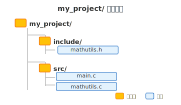

# 第十六章 C语言头文件与代码文件组织

## 本章要点

从学习 C 语言第一天起，我们写的程序都塞在单个 `.c` 文件里。几十行的练习没问题，但真实项目动辄成百上千个函数、数万行代码——全堆在一个文件里，阅读、维护、协作都会崩溃。

本章介绍 C 语言拆分代码的核心理念——**头文件（`.h`）与源文件（`.c`）的分工协作**：

- 库的概念与 C 标准库——你一直在用的 `stdio.h` 到底是什么
- 头文件基础：声明接口 vs 隐藏实现、`#include` 的工作机制
- 防止重复包含：`#pragma once` 与头文件保护符
- 多文件项目组织：`include/` + `src/` 目录结构
- 用 Clang 一次性编译多个源文件

掌握这些技术，你就具备了从示例代码迈向结构化项目的关键能力，也为下一章学习 CMake 构建系统做好准备。

---

## 一、头文件基础

### 1. 单文件编程的局限

将全部代码写在一个文件中，在小型练习阶段完全可行，但随着代码规模增长，若干问题会逐渐暴露出来：

- **文件过长**，定位一个函数定义需要反复翻阅，严重影响阅读效率。
- **代码无法复用**。如果实现了一个好用的 `getMax` 函数并想在另一个程序中使用，就必须手动复制粘贴一份，既繁琐又容易引入不一致。
- **多人协作困难**。所有代码集中于一个文件，两人同时修改时冲突频繁，版本管理代价高昂。
- **编译耗时增加**。每次修改哪怕一行代码，整个文件都需要重新编译，无法利用增量编译的优势。

正如一篇长文需要划分章节，一个程序也应当拆分为**多个文件**。C 语言的做法是将代码分为**头文件**（`.h`）与**源文件**（`.c`），二者各司其职：头文件对外描述模块的接口，源文件对内完成具体实现。

---

### 2. 为什么需要头文件

在讨论文件拆分之前，先回顾一个我们已经熟悉的机制：当函数定义位于 `main` 函数之后时，必须在调用前给出**函数声明**，让编译器预先知晓该函数的存在。

```c
#include <stdio.h>

// 函数声明
int add(int a, int b);

int main(void)
{
    int r = add(3, 5);
    printf("%d\n", r);
    return 0;
}

// 函数定义
int add(int a, int b)
{
    return a + b;
}
```

函数声明的职责是告知编译器：后面会有一个与此签名匹配的函数，参数类型和返回值类型已确定，请先通过编译。现在，如果把 `add` 的定义移至**另一个 `.c` 文件**中，`main` 所在的文件便无法直接看到它的实现。但只要在 `main` 的文件中保留一句声明，编译器就能继续工作——真正的“合体”由**链接器**在最后一步完成，将分散在各文件中的符号一一对接。

然而，如果每次使用某个模块都要在调用处手写一遍该模块中所有函数的声明，不仅重复劳动，而且极易出错。正确的做法是：**将所有声明集中放入一个 `.h` 文件，任何需要使用该模块的源文件只需 `#include` 这个头文件即可。**

这便是头文件的本质：

> **头文件相当于一份说明书的目录页**。它列出了模块对外提供的函数（声明）、类型和常量；源文件则是说明书的具体正文（函数的实现）。使用者只需翻阅目录即可了解模块能力，无需深入实现细节。

---

### 3. 库的概念与 C 标准库

从第一章开始，你每写一个程序都会写 `#include <stdio.h>`，然后就能用 `printf` 和 `scanf`。你有没有想过：`printf` 的代码在哪？你并没有写过它，但它确实在为你工作。

`printf` 不是凭空出现的。它来自 **C 标准库**（C Standard Library）。在实际工具链中，编译器、标准库实现和操作系统 SDK 可能由不同组件提供；安装好的开发环境会把它们组合起来供程序使用。

**库**（library），通常是别人已经写好并以源码或编译产物形式提供的一组代码。C 标准库的接口和行为属于 C 标准的一部分；完整的输入输出等设施由**宿主实现**提供，而面向裸机等环境的自由宿主实现只需提供标准规定的子集。

标准库里有一批头文件，每个负责一类功能。你已经在用的：

| 头文件 | 主要提供 |
|--------|---------|
| `<stdio.h>` | 输入输出：`printf`、`scanf`、`fopen`、`fgets` |
| `<stdlib.h>` | 通用工具：`malloc`、`free`、`atoi`、`rand` |
| `<string.h>` | 字符串操作：`strlen`、`strcpy`、`strcat`、`strcmp` |
| `<math.h>` | 数学函数：`sqrt`、`pow`、`sin`、`cos` |
| `<ctype.h>` | 字符判断：`isalpha`、`isdigit`、`isspace` |
| `<time.h>` | 时间日期：`time`、`clock` |

> **`<stdio.h>` 和 `"mathutils.h"` 的区别**
>
> `#include` 有两种写法：尖括号通常用于实现或工具链提供的头文件；双引号通常先按实现规定搜索当前源文件附近或项目路径，找不到时再采用尖括号的搜索规则。具体目录顺序由编译器规定。实践中“标准库用尖括号、项目头文件用双引号”仍是清晰可靠的约定。

库的概念不止于标准库。你刚才写的 `mathutils.h` + `mathutils.c`，已经具备了一个小模块的接口与实现。第十七章先学习用 CMake 构建可执行程序；真正生成静态库、动态库以及导入第三方库属于后续的 CMake 进阶内容。

---

### 4. 头文件里放什么，源文件里放什么

头文件与源文件的职责划分非常清晰。**头文件（`.h`）通常包含：**

- 函数声明（函数头加分号）
- 结构体、共用体、枚举的类型定义
- 宏定义（`#define`）
- 全局变量的外部声明（`extern`，初学阶段可以暂时略过）

**源文件（`.c`）通常包含：**

- 函数的完整定义（函数体）
- 仅在当前文件内部使用的辅助函数和静态变量
- `#include` 对应的头文件以及必要的系统头文件

下面通过一个简单的数学工具模块来展示这一分工。

`mathutils.h` —— 头文件（接口说明书）

```c
// mathutils.h
#ifndef MATHUTILS_H
#define MATHUTILS_H

// 函数声明
int add(int a, int b);
int subtract(int a, int b);

#endif
```

`mathutils.c` —— 源文件（具体实现）

```c
// mathutils.c
#include "mathutils.h"

int add(int a, int b)
{
    return a + b;
}

int subtract(int a, int b)
{
    return a - b;
}
```

`main.c` —— 使用模块的文件

```c
// main.c
#include <stdio.h>
#include "mathutils.h"

int main(void)
{
    int x = 10, y = 5;
    printf("%d + %d = %d\n", x, y, add(x, y));
    printf("%d - %d = %d\n", x, y, subtract(x, y));
    return 0;
}
```

`main.c` 只需一行 `#include "mathutils.h"` 便获得了 `add` 和 `subtract` 的完整调用信息，完全不需要接触它们的实现细节。接口与实现的分离，正是模块化编程的基石。

---

### 5. 编写一个完整的头文件

在上一节 `mathutils.h` 的代码中，头文件的开头和结尾出现了三行此前没见过的指令：

```c
#ifndef MATHUTILS_H
#define MATHUTILS_H
// ... 声明 ...
#endif
```

这三行是普通头文件通常都应该具备的**包含保护**（include guard）。少数特殊文件（例如有意多次展开的 X-macro 文件）会例外，但面向初学者编写常规头文件时，应默认加上保护。

假设项目里有两个头文件：`a.h` 定义了结构体 `Point`，`b.h` 需要使用 `Point` 所以包含了 `a.h`。而 `main.c` 同时需要 `a.h` 和 `b.h`：

```c
// a.h
struct Point { int x; int y; };

// b.h
#include "a.h"
void print_point(struct Point p);

// main.c
#include "a.h"
#include "b.h"
```

预处理器展开 `#include` 后，`main.c` 实际看到的是：

```c
// 从 #include "a.h" 展开
struct Point { int x; int y; };

// 从 #include "b.h" 展开
//   → 展开 #include "a.h"
struct Point { int x; int y; };   // 重复定义！编译报错
void print_point(struct Point p);
```

`struct Point` 被定义了两次，编译器会报"重复定义"错误。这是多文件项目中必然遇到的问题——头文件被直接或间接包含多次，导致同一个声明重复出现。

解决方式就是在每个头文件里加上包含保护。回到 `mathutils.h`，逐行看这三条指令做了什么：

```c
#ifndef MATHUTILS_H   // ① 如果 MATHUTILS_H 还没有被定义过……
#define MATHUTILS_H   // ② 那就立即定义它，然后……
// ... 头文件内容 ...
#endif                // ③ 结束 #ifndef 的控制范围
```

`#ifndef` 是 "if not defined" 的缩写——如果后面的宏名尚未被 `#define` 定义过，则条件成立，预处理器保留它和 `#endif` 之间的内容；否则整段跳过。`#ifndef`、`#define`、`#endif` 都是预处理指令，在[第十四章](第十四章-宏.md)中已学过 `#define` 的基础，这里把它们组合成一个固定模式。

回到上面的 `a.h`，加上包含保护之后：

```c
// a.h —— 加保护后
#ifndef A_H
#define A_H
struct Point { int x; int y; };
#endif
```

现在预处理器处理 `main.c` 时：

1. 展开 `#include "a.h"`：检查 `A_H`——尚未定义，条件成立。定义 `A_H`，展开 `struct Point`。
2. 展开 `#include "b.h"`：
   - 展开 `b.h` 中的 `#include "a.h"`：再次检查 `A_H`——**已经定义过了**，条件不成立，跳过全部内容。
   - 展开 `b.h` 剩余的 `void print_point(...)`。

最终 `main.c` 看到的是：

```c
struct Point { int x; int y; };   // 只出现一次
void print_point(struct Point p);
```

**`#ifndef` / `#define` / `#endif` 是普通头文件的标准骨架。** 宏名习惯取项目名与头文件名的大写加下划线形式，关键是避免与其他头文件的保护宏重名。

> 另一种等价写法 `#pragma once` 更为简洁，大多数现代编译器都支持。本书推荐先掌握经典写法——它不依赖编译器扩展，且能帮助你巩固对预处理机制的理解。

---

有了头文件的基础概念，接下来需要面对一个实际问题：当项目文件逐渐增多时，如何将它们有条理地组织起来，而不是让 `.h` 和 `.c` 文件杂乱地堆放在同一目录中。下面将介绍一种经过广泛验证的目录结构，以及配套的编译方法。

---

## 二、多文件项目组织

### 1. 用目录组织代码：`src` 和 `include`

将所有 `.c` 和 `.h` 文件混杂在同一目录中，随着文件数量的增长同样会变得难以管理。业界普遍采用的方案是将接口与实现按目录分开存放：



- **`include/`**：存放本项目的头文件，这是模块对外暴露的公共接口。
- **`src/`**：存放源文件，包含接口的具体实现。

更复杂的项目可能会在 `src/` 下进一步按功能模块划分子目录，但对于初学者而言，从上述最简结构入手便足以应对大多数练习场景。

---

### 2. 用 Clang 编译多文件项目

沿用上节的目录结构，假设当前工作目录为 `my_project/`（即与 `src/`、`include/` 同级），在命令行中执行以下命令即可完成编译。

**一次性编译所有源文件：**

```bash
clang src/main.c src/mathutils.c -Iinclude -o program.exe
```

各参数含义如下：

| 参数                | 含义                                   |
| ------------------- | -------------------------------------- |
| `src/main.c`      | 第一个源文件                           |
| `src/mathutils.c` | 第二个源文件                           |
| `-Iinclude`       | 让编译器去 `include/` 目录寻找头文件 |
| `-o program.exe`  | 指定输出文件名                         |

关于 `-I` 参数有两点说明：

- `-I`（大写字母 i）后紧跟目录名，写成 `-Iinclude` 或 `-I include` 均可，前者更为规范
- 源文件较多时可以依次列出。在 Linux 或 macOS 下也可利用通配符 `src/*.c` 一次性指定，但 **Windows 的 Clang 环境下通配符可能不生效**，建议逐个列出

**运行：**

```bash
program.exe
```

输出：

```
10 + 5 = 15
10 - 5 = 5
```

至此，一个完整的多文件项目从编写到编译运行的全部流程已经走通。整个过程无需任何额外的构建工具，直接使用 Clang 即可完成。

---

概念和流程已经讲解完毕，但编程技能终究需要亲手实践才能真正内化。下面的练习将引导你从零搭建一个多文件项目，并鼓励你主动制造一些错误来深化理解。

---

## 三、动手练习

```c
#pragma once

// 计算平方
int square(int x);

// 计算立方
int cube(int x);
```

`src/calc.c`：

```c
#include "calc.h"

int square(int x)
{
    return x * x;
}

int cube(int x)
{
    return x * x * x;
}
```

`src/main.c`：

```c
#include <stdio.h>
#include "calc.h"

int main(void)
{
    int n = 5;
    printf("%d 的平方 = %d\n", n, square(n));
    printf("%d 的立方 = %d\n", n, cube(n));
    return 0;
}
```

在 `practice/` 目录下执行：

```bash
clang src/main.c src/calc.c -Iinclude -o practice.exe
practice.exe
```

预期输出：

```
5 的平方 = 25
5 的立方 = 125
```
