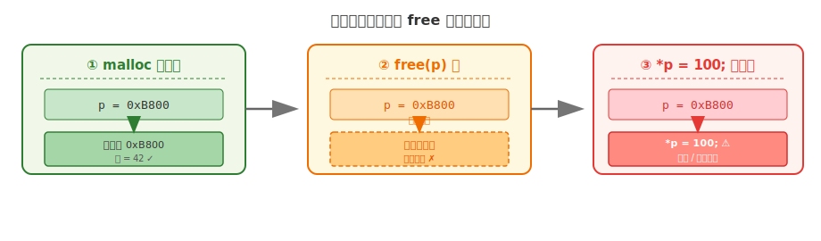
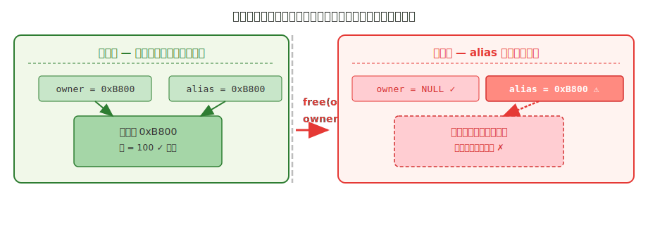

# 第十章 堆内存使用与内存分配

## 本章要点

[第六章](../入门/第六章-C语言的内存模型.html)讲过，栈内存由编译器自动管理——函数进入时分配，返回时释放。但栈有两个局限：大小必须在编译时确定，函数返回后数据就消失。

当你需要**运行时决定内存大小**或**让数据活得比函数更久**时，栈就无能为力了。这正是**堆内存**（heap memory）的用武之地。本章涵盖以下内容：

- 堆与栈的区别——自动管理 vs 手动管理
- 四个核心函数：`malloc`（申请）、`free`（释放）、`calloc`（申请并清零）、`realloc`（调整大小）
- 内存安全：内存泄漏、悬空指针、常见错误及其规避
- 实践：动态数组与动态结构体

堆内存是 C 语言从"小程序"迈向"实用程序"的分水岭。没有它，你无法处理用户输入的不定长文本、无法构建链表和树、无法写出真正灵活的程序。

---

## 一、堆内存概念

[第六章](../入门/第六章-C语言的内存模型.html)介绍过常见宿主实现的调用栈、动态分配区、静态数据和代码映射。本章聚焦 C 标准库提供的动态内存管理接口。

- **自动对象**：生命周期通常随所在块的执行自动开始和结束
- **动态分配对象**：由 `malloc` 等函数创建，并由程序在合适时机调用 `free`；实现内部可能复用已有内存，也可能向操作系统请求更多资源

操作堆内存靠四个声明在 `<stdlib.h>` 中的函数：**`malloc`**、**`calloc`**、**`realloc`**、**`free`**。下面逐一学习。

## 二、内存分配函数

### 1. `malloc` —— 申请堆内存

`malloc` 是 "memory allocation"（内存分配）的缩写。它向 C 运行库的分配器请求一块指定大小、满足基本对齐要求的连续存储，并返回指向该区域开头的指针。其函数原型为：

```
void *malloc(size_t size);
```

参数 `size` 表示要申请的字节数。返回值是一个 `void *` 类型的指针：申请成功时，该指针指向分配好的内存开头；如果系统内存不足导致申请失败，则返回 `NULL`。在 C 语言中，`void *`（无类型指针）可以自动转换为其他对象指针类型，因此通常无需显式的强制类型转换，直接将返回值赋给对应类型的指针变量即可。

下面是一个完整的使用示例：

```c
#include <stdio.h>
#include <stdint.h> // SIZE_MAX
#include <stdlib.h>  // malloc, free

int main(void)
{
    int n;
    printf("请输入学生人数：");
    if (scanf("%d", &n) != 1 || n <= 0 || (size_t)n > SIZE_MAX / sizeof(int))
    {
        printf("人数无效或所需空间过大\n");
        return 1;
    }

    // 在堆上申请存放 n 个 int 的空间
    int *scores = malloc((size_t)n * sizeof(int));

    // 使用返回值前必须检查是否申请成功
    if (scores == NULL)
    {
        printf("内存分配失败！\n");
        return 1;  // 异常退出
    }

    // 把这块空间当作数组来用
    for (int i = 0; i < n; i++)
    {
        printf("请输入第 %d 个学生的成绩：", i + 1);
        if (scanf("%d", &scores[i]) != 1)
        {
            fprintf(stderr, "第 %d 个成绩不是有效整数。\n", i + 1);
            free(scores);
            return 1;
        }
    }

    printf("\n你输入的成绩：");
    for (int i = 0; i < n; i++)
    {
        printf("%d ", scores[i]);
    }
    printf("\n");

    // 用完后必须释放
    free(scores);
    scores = NULL;

    return 0;
}
```

这段代码展示了几个值得注意的细节：

- **`n * sizeof(int)` 计算字节数**：例如 `n = 50`、`sizeof(int)` 为 4 时，申请 200 字节。`sizeof` 确保在不同平台上都能算出正确的值，不要手写数字。
- **`malloc` 返回 `void *`，自动转为 `int *`**：`scores` 可以像普通 `int` 数组一样通过 `scores[i]` 访问——这正是动态内存最直观的用法。
- **必须检查返回值**：如果 `scores == NULL`，说明分配失败（系统内存不足等），此时直接使用该指针将导致程序崩溃。
- **用完后必须 `free` 释放**：和普通数组最大的区别——堆内存的生命周期由你控制，不用了要手动归还，否则造成内存泄漏。

### 2. `free` —— 释放堆内存

堆内存的生命周期完全由程序员控制。当你不再需要某块通过 `malloc`、`calloc` 或 `realloc` 获得的动态内存时，必须调用 `free` 将其归还给系统，否则这块内存将一直被占用直到程序结束。`free` 的函数原型为：

```
void free(void *ptr);
```

`ptr` 必须是空指针，或仍指向此前由兼容分配函数返回且尚未释放的分配对象开头；传入内部地址或重复释放都会产生未定义行为。调用 `free` 后对象生命周期结束，原指针及其别名都不能再用于访问该对象。将当前所有者指针置为 `NULL` 有助于避免本变量被误用，但不会自动清除其他别名。

```c
free(scores);
scores = NULL;   // 现在 scores 明确表示不指向任何有效内存
```

此后如果再对 `scores` 解引用，就是对空指针解引用，仍然属于未定义行为；但它通常比悬空指针更容易被调试器、运行时检查或崩溃现场定位出来。

### 3. `calloc` —— 申请并清零

`calloc` 与 `malloc` 功能相似，但有两个重要区别：

1. **参数形式不同**：`calloc` 接受两个参数，分别表示元素个数和每个元素的大小，其原型为：

   ```
   void *calloc(size_t num, size_t size);
   ```
2. **`calloc` 会将分配区域的所有位清零**：而 `malloc` 返回的区域没有初始化，不能在写入前读取。对本章常见平台上的整数计数器，全零位表示数值 0；但 C 标准并不承诺全零位对所有类型都等于其语义上的零值或空指针，因此不要把 `calloc` 当成任意对象的通用初始化器。

> `calloc` 具有清零语义，但它与 `malloc` 的实际性能取决于分配器和操作系统实现；不要在未测量时断言哪一个一定更快。

```c
#include <stdio.h>
#include <stdlib.h>

int main(void)
{
    int n = 5;

    // calloc 申请并清零
    int *arr = calloc((size_t)n, sizeof(int));

    if (arr == NULL)
    {
        printf("内存分配失败！\n");
        return 1;
    }

    // 由于 calloc 清零，所有元素初始为 0
    printf("calloc 分配后的数组：");
    for (int i = 0; i < n; i++)
    {
        printf("%d ", arr[i]);  // 输出 0 0 0 0 0
    }
    printf("\n");

    free(arr);
    arr = NULL;

    return 0;
}
```

两种函数的对比如下：

|        | `malloc`           | `calloc`                |
| ------ | ------------------ | ----------------------- |
| 参数   | 总字节数           | 元素个数 + 每个元素大小 |
| 初始化 | 不初始化，写入前不可读取 | 所有位清零            |
| 性能   | 取决于实现与使用方式 | 取决于实现与使用方式    |

> 需要全零位初始状态时选 `calloc`；马上逐元素写入时通常选 `malloc`。性能差异应以目标平台测量结果为准。

### 4. `realloc` —— 调整已分配内存的大小

在实际编程中，经常遇到需要调整已分配内存大小的情况——比如一开始申请了 10 个元素的空间，后来发现需要扩展到 20 个。`realloc` 函数正是为此设计的，它可以在保留原有数据的前提下调整内存块的大小。其原型为：

```
void *realloc(void *ptr, size_t new_size);
```

其中 `ptr` 是此前通过 `malloc`、`calloc` 或 `realloc` 获得的指针，`new_size` 是新的总字节数。

**关键结论：成功返回的地址可能与原来的 `ptr` 不同。** `realloc` 会保留新旧大小中较小范围内的原数据，但标准不规定分配器必须采用原地扩展还是搬迁策略，因此不能假设地址不变。`new_size == 0` 的历史规则较复杂，本教程只传入正数。

使用 `realloc` 时有一个极其重要的安全规则：**必须用一个临时指针接收返回值，确认非 `NULL` 后再赋值给原指针**。如果直接写 `ptr = realloc(ptr, new_size)`，当扩展失败时 `realloc` 返回 `NULL`，原指针的值就被覆盖了——原有的内存地址既无法继续使用，也无法释放，造成内存泄漏。安全的模式如下：

```c
int *temp = realloc(ptr, new_size);
if (temp == NULL)
{
    // 扩展失败，但 ptr 仍然有效，可以继续用原数据或释放
}
else
{
    ptr = temp;
}
```

下面是一个完整的扩展示例：

```c
#include <stdio.h>
#include <stdlib.h>

int main(void)
{
    int n = 3;

    // 先申请 3 个 int
    int *arr = malloc((size_t)n * sizeof(int));
    if (arr == NULL) return 1;

    arr[0] = 10; arr[1] = 20; arr[2] = 30;

    printf("原始数组：%d %d %d\n", arr[0], arr[1], arr[2]);

    // 扩大到 5 个 int
    n = 5;
    int *temp = realloc(arr, (size_t)n * sizeof(int));
    if (temp == NULL)
    {
        printf("内存扩展失败，原数据仍保留在 arr 中\n");
        free(arr);  // 还是要释放
        return 1;
    }
    arr = temp;  // 用新指针更新 arr

    // 新增的两个元素手动赋值
    arr[3] = 40;
    arr[4] = 50;

    printf("扩展后数组：");
    for (int i = 0; i < n; i++)
    {
        printf("%d ", arr[i]);
    }
    printf("\n");

    free(arr);
    arr = NULL;

    return 0;
}
```

至此，我们已经介绍了操作堆内存的四个核心函数。掌握了它们的用法，就拥有了灵活管理内存的能力。然而，这份灵活性也伴随着不可忽视的风险——动态内存管理中最困难的不是如何使用这些函数，而是如何安全地使用它们。接下来，我们将讨论两个最常见也是最危险的内存管理陷阱。

## 三、内存安全

动态内存赋予了你极大的灵活性，但也引入了两个需要时刻警惕的陷阱：内存泄漏和悬空指针。下面逐一拆解。

### 1. 内存泄漏（Memory Leak）

内存泄漏是指申请了堆内存但用完后没有释放。

> **打个比方**：你向仓库租了一个储物间存放物品，项目结束后你离开了，却没有办理退租手续。仓库管理员以为你还要继续使用，这间房就一直被你占着。久而久之，仓库里堆满了无人使用的"幽灵房间"，真正有需求的租客却无房可租。

在程序中，内存泄漏的后果：

- **轻则**：进程占用内存持续增长，拖慢系统性能
- **重则**：耗尽可用内存，导致程序甚至整个系统崩溃

```c
void leakExample(void)
{
    int *p = malloc(100 * sizeof(int));
    // 忘记 free(p);  若同时丢失最后一个指针，这块内存在本次进程中将无法再释放
}
```

### 2. 悬空指针（Dangling Pointer）

悬空指针是另一个维度的危险：你已经把租用的储物间退还了（调用了 `free`），但通讯录上还记着那个房间的门牌号。下次你按着门牌号去使用那个房间时，它可能已经被分配给了别人，里面存放着完全不同的物品——甚至房间本身已经被拆除。

根据产生方式的不同，悬空指针可以分为以下两种情况。

#### 情况一：同一指针 `free` 后继续使用

这是最简单的情形——自己申请、自己释放、释放之后忘了这回事又去用：

```c
int *p = malloc(sizeof(int));
*p = 42;
free(p);       // 房间已退租
*p = 100;      // 危险！悬空指针，操作已释放的内存
```



这种情形相对容易察觉——毕竟 `p` 是自己亲手 `free` 的，代码相邻，排查时多扫一眼就能发现。

#### 情况二：多个指针指向同一块内存，其中一个释放后另一个悬空

这才是悬空指针最隐蔽、最危险的形态。你通过指针 A 释放了内存，但指针 B 毫不知情，仍然持有着那片已经归还的地址：

```c
#include <stdio.h>
#include <stdlib.h>

int main(void)
{
    // 申请一块堆内存
    int *owner = malloc(sizeof(int));
    if (owner == NULL) return 1;
    *owner = 100;

    // 另一个指针也指向同一块内存
    int *alias = owner;

    printf("owner 指向：%p，值 = %d\n", (void *)owner, *owner);
    printf("alias 指向：%p，值 = %d\n", (void *)alias, *alias);

    // owner 决定释放这块内存
    free(owner);
    owner = NULL;   // owner 自己安全了

    // 但是 alias 完全不知情！
    // alias 现在是一个悬空指针——它指向的内存已经被回收
    printf("owner = %p（已置 NULL）\n", (void *)owner);
    printf("alias = %p（悬空！仍指向已释放的内存）\n", (void *)alias);

    // 如果接下来对 alias 解引用，行为不可预测：
    // *alias = 200;   // 危险！可能崩溃，也可能默默破坏其他数据

    // 正确做法：要么在 free 前同步通知所有指向者，
    // 要么在一开始就明确"谁拥有这块内存的所有权"

    return 0;
}
```



运行这段代码，`owner` 和 `alias` 打印出的地址值相同——它们指向同一分配对象。`free(owner)` 执行后，该对象的生命周期结束，分配器可以复用这块存储；`alias` 随即成为悬空指针。它通常仍保存旧的地址表示，但不能再解引用、参与指针运算或传给 `free`。仅用 `if (alias)` 不能判断对象是否仍然有效。

这个例子揭示了一条重要的设计规则：**在存在多个指针指向同一块堆内存时，必须明确谁是这块内存的"所有者"，只有所有者有权 `free`**。其他指针都是"借用者"，在所有者释放之后，借用者必须被同步置为 `NULL`，或者从逻辑上保证不再使用。这条规则在链表、树等数据结构中尤为重要——一个节点被删除时，所有指向它的"前驱"指针都需要被正确更新。

对悬空指针的解引用可能导致程序崩溃，也可能不崩溃但产生诡异的数据错误——后者往往更难排查。防御悬空指针的核心策略是：`free` 后立即将指针置为 `NULL`（`free(p); p = NULL;`）。如果多个指针指向同一块内存，释放后必须将所有指向它的指针都置为 `NULL`，这在实际项目中需要非常小心的设计。

### 3. 常见错误一览

除了上述两大核心陷阱之外，在实际编程中还有若干细节容易出错。下表归纳了最常见的几种情况，建议在每次使用动态内存时对照检查：

| 错误                    | 描述                          | 后果                   |
| ----------------------- | ----------------------------- | ---------------------- |
|
| 忘记检查`malloc` 返回值 | 分配失败却继续使用`NULL` 指针 | 程序崩溃               |
| 忘记`free`              | 不再使用的内存不释放          | 内存泄漏               |
| 重复`free`              | 同一指针释放两次              | 程序崩溃或不可预测行为 |
| `free` 后继续使用       | 悬空指针                      | 不可预测，严重安全隐患 |
| `realloc` 不检查返回值  | 扩展失败却把原指针覆盖        | 内存泄漏 + 数据丢失    |
| 越界访问动态内存        | 写入超出分配范围的地址        | 破坏堆结构，程序崩溃   |

这些规则背后有一条根本原则：**堆内存的生命周期由程序员全权负责**。它不会在函数返回时自动释放，不会在超出作用域时自动清理——从 `malloc` 的那一刻起，直到 `free` 的那一刻止，你手中的每一块动态内存都必须有明确且唯一的"归宿"。理解了这一点，就抓住了动态内存管理的核心。

## 四、动手练习

### 1. 动态数组与动态结构体

动态内存最常见的应用场景是创建**动态数组**和**动态结构体**。动态数组允许程序在运行时根据用户输入或其他条件决定数组的实际大小，其典型模式如下：

```c
int n;
if (scanf("%d", &n) != 1 || n <= 0 ||
    (size_t)n > SIZE_MAX / sizeof(int)) return 1;
int *arr = malloc((size_t)n * sizeof(int));
if (arr == NULL) return 1;
// 在 [0, n) 范围内使用 arr[i] ...
free(arr);
```

结构体本身也可以动态创建，这在处理数量不确定的记录时非常实用。下面的例子展示了如何动态分配一个结构体数组，并通过指针访问其成员：

```c
#include <stdio.h>
#include <stdint.h>
#include <stdlib.h>

struct Student
{
    char name[20];
    int age;
    float score;
};

int main(void)
{
    int n;
    printf("请输入学生人数：");
    if (scanf("%d", &n) != 1 || n <= 0 ||
        (size_t)n > SIZE_MAX / sizeof(struct Student))
    {
        fprintf(stderr, "人数无效或所需空间过大。\n");
        return 1;
    }

    // 动态分配一个结构体数组
    struct Student *students = malloc((size_t)n * sizeof(struct Student));
    if (students == NULL)
    {
        printf("内存分配失败！\n");
        return 1;
    }

    // 使用结构体指针访问成员
    for (int i = 0; i < n; i++)
    {
        printf("请输入第 %d 个学生的姓名：", i + 1);
        if (scanf("%19s", students[i].name) != 1)
        {
            free(students);
            return 1;
        }
        printf("年龄：");
        if (scanf("%d", &students[i].age) != 1)
        {
            free(students);
            return 1;
        }
        printf("成绩：");
        if (scanf("%f", &students[i].score) != 1)
        {
            free(students);
            return 1;
        }
    }

    printf("\n===== 学生信息 =====\n");
    for (int i = 0; i < n; i++)
    {
        printf("%s，年龄 %d，成绩 %.1f\n",
               students[i].name, students[i].age, students[i].score);
    }

    free(students);
    students = NULL;

    return 0;
}
```

### 2. 综合练习

下面的程序综合运用了 `malloc`、`calloc` 和 `realloc`，展示了动态数组的创建、求和、求平均值以及动态扩展等操作。

```c
#include <stdio.h>
#include <stdint.h>
#include <stdlib.h>

int main(void)
{
    // 练习1：动态数组求和与平均值
    int n;
    printf("请输入数字个数：");
    if (scanf("%d", &n) != 1 || n <= 0 ||
        (size_t)n > SIZE_MAX / sizeof(double))
    {
        printf("数字个数必须大于 0\n");
        return 1;
    }

    double *arr = malloc((size_t)n * sizeof(double));
    if (arr == NULL) return 1;

    double sum = 0.0;
    printf("请输入 %d 个数字：\n", n);
    for (int i = 0; i < n; i++)
    {
        if (scanf("%lf", &arr[i]) != 1)
        {
            free(arr);
            return 1;
        }
        sum += arr[i];
    }

    printf("总和 = %.2f\n", sum);
    printf("平均值 = %.2f\n", sum / n);

    free(arr);
    arr = NULL;

    // 练习2：动态扩展数组
    int cap = 3;
    int *nums = malloc((size_t)cap * sizeof(int));
    if (nums == NULL) return 1;

    nums[0] = 1; nums[1] = 2; nums[2] = 3;
    printf("当前数组大小 %d，内容：%d %d %d\n", cap, nums[0], nums[1], nums[2]);

    int new_cap = 6;
    int *temp = realloc(nums, (size_t)new_cap * sizeof(int));
    if (temp == NULL)
    {
        printf("扩展失败\n");
        free(nums);
        return 1;
    }
    nums = temp;
    cap = new_cap;
    nums[3] = 4; nums[4] = 5; nums[5] = 6;
    printf("扩展后大小 %d，内容：", cap);
    for (int i = 0; i < cap; i++) printf("%d ", nums[i]);
    printf("\n");

    free(nums);
    nums = NULL;

    return 0;
}
```
