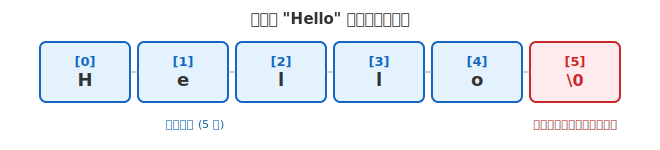

# 第四章 字符和字符串

## 本章要点

在第一章中，我们学习了 `char` 类型——它可以存储一个字符，并在 [3.3.1 双引号与字符串初识](第一章-C语言核心基础语法.md#331-双引号与字符串初识) 中初步接触了双引号包裹的字符串。本章从这两个起点出发，先深入理解**单个字符**在计算机中的表示和运算，再过渡到**一串字符（字符串）**的存储与操作。具体涵盖以下内容：

- 字符——`char` 类型回顾、ASCII 编码、字符与整数的转换
- 字符串的本质：以 `'\0'` 结尾的字符数组
- 字符串的输出（`printf`）与输入（`scanf`、`fgets`），以及输入中的安全陷阱
- 标准库中的字符串处理函数：`strlen`、`strcpy`、`strcat`、`strcmp`
- 字符串数组——用二维字符数组管理多个字符串
- 字符与字符串的区别（单引号与双引号）——在第一章初步感知的基础上做系统对比

本章的所有内容都建立在第一章的 `char` 类型和第三章的数组概念之上，建议读者在阅读本章之前，确保对数组的声明、索引和内存布局有清晰的理解。

---

## 一、字符

第一章中我们学过：`char` 类型占 1 个字节，用单引号包裹，比如 `'A'`、`'#'`、`'7'`。本节在此基础上深入两个问题：字符在计算机内部到底是怎么存的？字符和整数之间是什么关系？

### 1.1 字符的"身份证"：ASCII 编码

计算机只认识 0 和 1，不认识 `'A'` 或 `'#'` 这样的符号。为了让计算机能处理文字，必须给每个字符分配一个数字编号。这套编号规则就是 **ASCII**（American Standard Code for Information Interchange，美国信息交换标准代码），它定义了 128 个字符与数字 0~127 之间的一一对应。

以下是编程中最常打交道的几组 ASCII 码：

| 字符              | 十进制   | 说明                     |
| ----------------- | -------- | ------------------------ |
| `'\0'`          | 0        | 空字符（字符串结束标志） |
| `' '`           | 32       | 空格                     |
| `'0'` ~ `'9'` | 48 ~ 57  | 数字字符                 |
| `'A'` ~ `'Z'` | 65 ~ 90  | 大写字母                 |
| `'a'` ~ `'z'` | 97 ~ 122 | 小写字母                 |

从这个 ASCII 表可以立刻看出几个很有用的规律：

- **`'\0'` 的值就是 0**——这就是它为什么叫"空字符"。
- **数字字符 `'0'` 的值是 48，不是 0**——`'0'` 和整数 `0` 是两个完全不同的东西。
- **在 ASCII 中，大写字母和小写字母相差 32**——`'A'` 是 65，`'a'` 是 97。所以 `'a' - 32` 等于 `'A'`。
- **在 ASCII 中，字母和数字各自连续排列**——`'A'`~`'Z'` 是 65~90，`'0'`~`'9'` 是 48~57。这意味着可以用 `>= 'A' && <= 'Z'` 判断大写字母。

> **💡 提示**：ASCII 只需记住四个关键值——`'0'`=48，`'A'`=65，`'a'`=97，`'\0'`=0。其余用到时查表即可。

### 1.2 字符与整数的转换

由于 `char` 本质上就是一个 1 字节的小整数，字符和整数之间可以直接相互转换，不需要任何额外操作。

**字符 → 整数：用 `%d` 输出即可看到字符对应的 ASCII 码。**

```c
char c = 'A';
printf("字符 %c 的 ASCII 码是 %d\n", c, c);  // 输出：字符 A 的 ASCII 码是 65
```

**整数 → 字符：把整数赋给 `char` 变量，用 `%c` 输出即可看到对应的字符。**

```c
char c = 65;
printf("ASCII 码 %d 对应的字符是 %c\n", c, c);  // 输出：ASCII 码 65 对应的字符是 A
```

这种字符与整数的等价性，带来了三个非常实用的编程技巧：

**技巧一：数字字符转整数。** `'5'` 的 ASCII 码是 53，要得到真正的整数 5，只需减去 `'0'`（即 48）：

```c
char digit = '7';
int num = digit - '0';   // num = 7，因为 55 - 48 = 7
printf("%d\n", num);     // 输出 7
```

**技巧二：大小写转换。** 在 ASCII 兼容环境中，大写字母和小写字母相差 32，加减 32 即可切换大小写：

```c
char upper = 'G';
char lower = upper + 32;   // 'G'(71) + 32 = 103 = 'g'
printf("%c → %c\n", upper, lower);  // 输出：G → g

char c = 'm';
char C = c - 32;           // 'm'(109) - 32 = 77 = 'M'
printf("%c → %c\n", c, C);          // 输出：m → M
```

**技巧三：判断字符类别。** 利用 ASCII 的连续性，用区间判断即可识别字母、数字、大小写：

```c
char c = 'K';

if (c >= 'A' && c <= 'Z')       printf("大写字母\n");
else if (c >= 'a' && c <= 'z')  printf("小写字母\n");
else if (c >= '0' && c <= '9')  printf("数字\n");
```

这三个技巧在后续处理字符串时会频繁用到——遍历字符串中的每个字符、判断类型、做大小写转换，它们的原理就来自本节所说的"字符就是整数"。

> 注意：上面的大小写差值和字母区间判断建立在 ASCII 兼容编码的前提上。日常 Windows、macOS、Linux 的 C 开发环境基本都满足这个前提；但更通用、更规范的写法是使用 `<ctype.h>` 中的 `toupper`、`tolower`、`isalpha`、`isdigit` 等函数。

---

## 二、字符串

理解了单个字符的存储和运算之后，下一步就是把多个字符串在一起。这正是第一章 [3.3.1](第一章-C语言核心基础语法.md#331-双引号与字符串初识) 中双引号所做的事情。

### 2.1 字符串的本质：字符数组 + 结束标志

> **C 语言没有专门的"字符串类型"。字符串的本质，就是一个以 `'\0'` 结尾的字符数组。**

这句话有两个要点：(1) 字符串就是字符数组，(2) 末尾必须有 `'\0'`。两者缺一不可：

```c
// 方式一：逐个字符写，手动加 '\0'（繁琐，不常用）
char str1[6] = {'H', 'e', 'l', 'l', 'o', '\0'};

// 方式二：用双引号（编译器自动在末尾加 '\0'，推荐）
char str2[] = "Hello";
```

两种写法在内存中产生的效果**完全相同**，都是 6 个字节的连续空间：



显然，`""` 才是日常写法——不用数字符个数，不用手动补 `'\0'`，编译器全部代劳。

> **核心结论**：`""` 的本质就是创建了一个末尾带 `'\0'` 的字符数组。数组的实际大小 = 可见字符数 + 1（那个隐藏的 `'\0'`）。

### 2.2 字符串的输出与输入

#### 用 `printf` 输出字符串

格式占位符 `%s` 专门用来输出字符串：

```c
#include <stdio.h>

int main(void)
{
    char name[] = "Xiao Ming";
    printf("你好，%s！\n", name);  // 你好，Xiao Ming！

    // 也可以直接输出字符串常量
    printf("欢迎学习C语言\n");

    return 0;
}
```

**执行细节**：`printf` 从给定地址的第一个字符开始，一直输出，直到遇到 `'\0'` 才停止。如果字符数组末尾忘了放 `'\0'`，`printf` 就会越过数组边界继续读取内存，直到在内存中碰巧遇上一个 `'\0'` 为止——输出的结果将是一堆无法预料的乱码。这个行为再次印证了 `'\0'` 作为字符串结束标志的关键地位。

#### 用 `scanf` 输入字符串

可以用 `%s` 让用户从键盘输入一个字符串：

```c
#include <stdio.h>

int main(void)
{
    char name[20];  // 预留 20 个字符的空间

    printf("请输入你的名字：");
    if (scanf("%19s", name) != 1)
    {
        fprintf(stderr, "没有读到有效名字。\n");
        return 1;
    }

    printf("你好，%s！\n", name);

    return 0;
}
```

**两个需要特别注意的地方**：

**第一，`scanf` 读取字符串时，变量名前不加 `&`。**
因为数组名本身代表的就是数组的起始地址，所以不需要再用 `&` 取地址。这一点与读取 `int` 或 `float` 类型的变量时不同。

**第二，`%s` 输入有两个常见缺陷：它遇到空格或回车就停止；如果不限制最大宽度，还可能写出数组边界。**
如果你输入 `Xiao Ming`，`scanf("%19s", name)` 只会读入 `Xiao`，`Ming` 会被留在输入缓冲区中。更危险的是，如果写成 `scanf("%s", name)` 且用户输入超过数组能容纳的长度，`scanf` 不会阻止——它会继续往内存里写，覆盖掉数组后面的其他数据。这就是所谓的**缓冲区溢出**，是 C 语言中最常见的安全漏洞之一。

#### 更安全的输入方式：`fgets`

为了避免 `scanf` 的这些问题，推荐使用 `fgets` 来读取字符串：

```c
#include <stdio.h>

int main(void)
{
    char name[20];

    printf("请输入你的全名：");
    if (fgets(name, sizeof name, stdin) == NULL)
    {
        fprintf(stderr, "读取失败。\n");
        return 1;
    }

    printf("你好，%s\n", name);

    return 0;
}
```

**`fgets` 的三个参数**：

| 参数   | 含义                                       | 本例中的值 |
| ------ | ------------------------------------------ | ---------- |
| 第一个 | 字符数组的名字（存储输入的地方）           | `name`   |
| 第二个 | 目标数组容量；最多存入容量减一的 `char`，再补 `'\0'` | `sizeof name` |
| 第三个 | 输入流；`stdin` 通常连接终端，也可能被重定向 | `stdin`  |

> `fgets` 会保留用户按下的**回车符**。如果你不想要最后的换行，需要手动去掉它（本章 [4.3 节](#43-去除-fgets-读入的换行符) 会讲到具体方法）。

---

## 三、字符串处理函数

掌握了字符串的输入输出之后，下一个自然的问题是：拿到一个字符串，我们能对它做什么？最常见的需求：

- **测量长度**：这个字符串有多长？
- **复制内容**：把字符串拷贝到另一个地方
- **拼接**：把两个字符串合并成一个
- **比较**：判断两个字符串是否相等

C 语言的标准库已经准备好了这些函数，它们全部声明在 `<string.h>` 头文件中。使用之前记得 `#include <string.h>`。

### 3.1 获取字符串长度：`strlen`

```c
#include <stdio.h>
#include <string.h>

int main(void)
{
    char str[] = "Hello";
    size_t len = strlen(str);

    printf("字符串 \"%s\" 的长度是：%zu\n", str, len);  // 5

    return 0;
}
```

**注意**：`strlen` 返回的是 `'\0'` **之前的字节数**，不包括 `'\0'` 本身，返回值类型是 `size_t`，输出时使用 `%zu`。对 ASCII 字符串 `"Hello"` 来说，一个字符恰好占一个字节，所以结果是 5；对 UTF-8 中文字符串，字节数通常大于人眼看到的字符数。分配字符串副本时仍要在 `strlen` 的结果上加 1，为 `'\0'` 留出位置。

### 3.2 复制字符串：`strcpy`

将一个字符串的内容复制到另一个字符数组中：

```c
char dest[20];
char src[] = "Hello, World!";

strcpy(dest, src);  // 把 src 的内容复制到 dest 中
```

**危险提示**：`strcpy` 不会检查目标数组的大小。如果 `dest` 放不下 `src` 的内容，同样会发生缓冲区溢出。实际开发中可以使用带长度限制的写法（如 `snprintf`，或谨慎使用 `strncpy`），核心原则是：目标数组必须有足够空间，并且最终要保证字符串以 `'\0'` 结尾。

### 3.3 拼接字符串：`strcat`

把一个字符串追加到另一个字符串的末尾：

```c
char str1[30] = "Hello";   // 必须足够大，能容纳拼接后的内容
char str2[] = " World";

strcat(str1, str2);  // str1 变成 "Hello World"
```

**规则**：

- `str1` 必须有足够的空间容纳两个字符串的总长度 + 1（`'\0'`）
- `strcat` 从 `str1` 的 `'\0'` 位置开始，把 `str2` 的内容（包括 `'\0'`）拷贝过去

### 3.4 比较字符串：`strcmp`

两个字符串是否相等，**不能**用 `==` 来判断！必须用 `strcmp` 函数：

```c
#include <stdio.h>
#include <string.h>

int main(void)
{
    char str1[] = "apple";
    char str2[] = "banana";

    if (strcmp(str1, str2) == 0)
    {
        printf("两个字符串相等\n");
    }
    else
    {
        printf("两个字符串不相等\n");
    }

    return 0;
}
```

**`strcmp` 的返回值**：

| 比较结果                   | 返回值            |
| -------------------------- | ----------------- |
| str1 等于 str2             | `0`             |
| str1 小于 str2（按字典序） | 负数（如 `-1`） |
| str1 大于 str2             | 正数（如 `1`）  |

> **为什么不能用 `==` 比较字符串？**
> 数组名 `str1` 和 `str2` 代表的是两个不同的内存地址。`str1 == str2` 是在比较两个**地址**是否相同，而不是比较内容。就像两间不同的房子，即使里面的家具一模一样，门牌号也是不同的。

---

## 四、进阶话题

前三节分别介绍了字符、字符串的基本概念以及标准库函数。但在实际编程中，还会遇到一些稍复杂但非常常见的场景：

- 一次性管理多个字符串（字符串数组）
- 混淆了字符和字符串的类型区别
- `fgets` 留下的那个多余的换行符该怎么处理

本节逐一讨论这些问题。

### 4.1 字符串数组——存储多个字符串

如果有很多个字符串需要处理——比如一个班级的学生名单、一份菜单的项目列表——可以用**二维字符数组**，也就是"字符串数组"。

```c
#include <stdio.h>

int main(void)
{
    // 存储 3 个水果名称，每个最多 20 个字符
    char fruits[3][20] = {
        "apple",
        "banana",
        "orange"
    };

    for (int i = 0; i < 3; i++)
    {
        printf("水果 %d：%s\n", i + 1, fruits[i]);
    }

    return 0;
}
```

**理解方式**：

- `fruits` 是一个二维数组：3 行，20 列
- 每一行就是一个独立的字符串（字符数组）
- `fruits[i]` 可以当作一个一维字符数组来用，也就是第 `i` 个字符串

**输出**：

```
水果 1：apple
水果 2：banana
水果 3：orange
```

这种组织方式本质上是把多个一维字符数组叠在一起。声明时第一个方括号（行数）表示有多少个字符串，第二个方括号（列数）表示每个字符串最多能容纳多少个字符（包括 `'\0'`）。

### 4.2 字符串与字符：单引号与双引号的区别

很多初学者会混淆**字符**和**字符串**——它们看起来只差一个引号，但在内存中是完全不同的存在：

```c
char c = 'A';        // 字符：单引号，占 1 字节
char str[] = "A";    // 字符串：双引号，占 2 字节（'A' + '\0'）
```

|                | 写法   | 包含内容                     | 大小   |
| -------------- | ------ | ---------------------------- | ------ |
| 字符 `'A'`   | 单引号 | 只包含字符 A 本身            | 1 字节 |
| 字符串 `"A"` | 双引号 | 包含字符 A 和结束符 `'\0'` | 2 字节 |

你可以把 `"A"` 赋值给字符数组，但不能赋值给单个字符变量——类型不匹配：

```c
char c = "A";     // 错误！类型不匹配
char str[] = "A"; // 正确
```

一个记忆的诀窍是：单引号括住的是"一个字符的值"，双引号括住的是"一个以 `'\0'` 结尾的字符序列"。即使这个序列里只有一个可见字符，它仍然带有隐藏的 `'\0'`。

### 4.3 去除 `fgets` 读入的换行符

前面提到 `fgets` 会保留用户输入的回车符。如果不需要它——比如你想把用户的名字和一句问候语拼接在同一行输出——可以手动把末尾的 `'\n'` 换成 `'\0'`：

```c
#include <stdio.h>
#include <string.h>

int main(void)
{
    char name[20];

    printf("请输入名字：");
    if (fgets(name, sizeof(name), stdin) == NULL)
    {
        printf("读取输入失败\n");
        return 1;
    }

    // 找到最后一个字符（换行符的位置）
    size_t len = strlen(name);
    if (len > 0 && name[len - 1] == '\n')
    {
        name[len - 1] = '\0';  // 把换行符替换成结束符
    }

    printf("你好，%s！\n", name);

    return 0;
}
```

**原理**：`fgets` 会把用户按下的回车（`\n`）也存入数组，并在其后添加 `\0`。比如用户输入 `Li Hua` 并回车，数组内容是 `"Li Hua\n\0"`。我们找到 `\n` 的位置，把它改成 `\0`：

- 修改前：`"Li Hua\n\0"`
- 修改后：`"Li Hua\0"`

多余的回车符从逻辑上"消失"了。

> **关键理解**：这里并没有真正删除任何字节——只是提前放置了结束符 `\0`，让后续的字符串操作函数在处理到 `\n` 的位置之前就停下来。

---

## 五、动手练习

```c
#include <stdio.h>
#include <string.h>

int main(void)
{
    // 练习1：反转字符串
    char str[] = "abcdef";
    size_t len = strlen(str);

    printf("原字符串：%s\n", str);

    // 首尾交换
    for (size_t i = 0; i < len / 2; i++)
    {
        char temp = str[i];
        str[i] = str[len - 1 - i];
        str[len - 1 - i] = temp;
    }

    printf("反转后：  %s\n\n", str);

    // 练习2：统计字符串中数字、字母和其他字符的个数
    char text[] = "Hello 123 World!";
    int letters = 0, digits = 0, others = 0;

    for (int i = 0; text[i] != '\0'; i++)
    {
        if ((text[i] >= 'A' && text[i] <= 'Z') || 
            (text[i] >= 'a' && text[i] <= 'z'))
        {
            letters++;
        }
        else if (text[i] >= '0' && text[i] <= '9')
        {
            digits++;
        }
        else
        {
            others++;
        }
    }

    printf("字符串 \"%s\" 中：\n", text);
    printf("  字母：%d 个\n", letters);
    printf("  数字：%d 个\n", digits);
    printf("  其他：%d 个\n\n", others);

    // 练习3：比较用户输入的两个字符串
    char word1[20], word2[20];

    printf("请输入第一个单词：");
    if (scanf("%19s", word1) != 1) return 1;
    printf("请输入第二个单词：");
    if (scanf("%19s", word2) != 1) return 1;

    int result = strcmp(word1, word2);
    if (result == 0)
    {
        printf("两个单词相同\n");
    }
    else if (result < 0)
    {
        printf("\"%s\" 在 \"%s\" 的前面\n", word1, word2);
    }
    else
    {
        printf("\"%s\" 在 \"%s\" 的后面\n", word1, word2);
    }

    return 0;
}
```
